# Remember that the Gear is always on the user's wrist

The Gear delivers timely information when users need it. Consider the key information that users will want from your app, and how to deliver the information within seconds.

## Examples

-   **Samsung Health**

    Samsung Health monitors the user's fitness and activity using the the Gear's built-in sensors. It sends an alert to move when the user has been inactive for too long.

    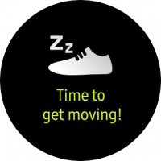 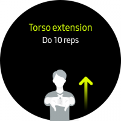 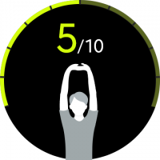  
    *Users can monitor their health with the Gear's built-in sensors.*

-   **Uber**

    Uber helps users find a nearby ride and provides an estimated time of arrival. An alert notifies users when their Uber has arrived, so they don't have to spend time checking on status.

    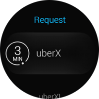 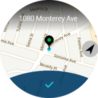 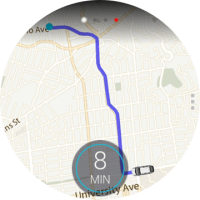   
    *Users receive an alert when their car is near.*

-   **Starbucks**

    Starbucks lets customers place an order from anywhere. Users can pay easily from their Gear.

      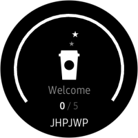 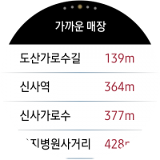   
    *Users can order coffee from anywhere and pay with the Gear.*

-   **Reminder**

    Reminder sends notifications for tasks in to-do lists before their completion deadline.

    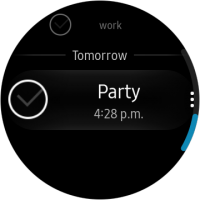 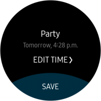 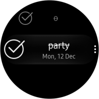 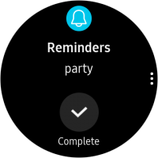  
    *With reminders, users can check whether they've completed a task on their to-do list.*

## Things to check

-   Is your app's function relevant to the user's current state or context?
-   How can your app utilize the user's physical states that it monitors?
-   Can the user process information at a glance? Did you make sure your screens don't provide too much information all at once?
