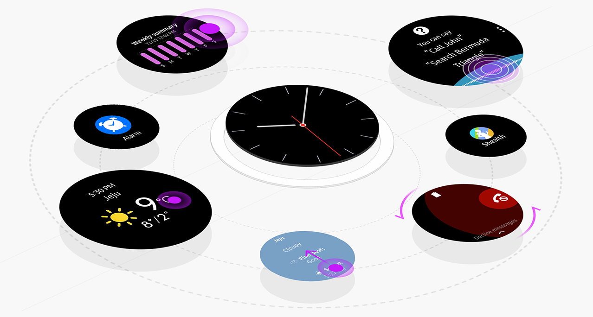

# Interaction

The Gear receives user input through touch, rotary actions, gestures, and voice, and returns feedback through haptic, sound, and visual responses.

-   **Make your interactions coherent**

    Your non-verbal interactions should be understandable.

-   **Respond with appropriate feedback**

    Your app should let users know that their actions are being responded to by providing appropriate feedback.

-   **Be consistent with basic interactions**

    Your app's interactions should be consistent with the system interactions. Don't confuse users by inventing entirely new patterns.

  
*Rotating the bezel to the right takes users to the content on the right. Don't take them in the opposite direction.*
