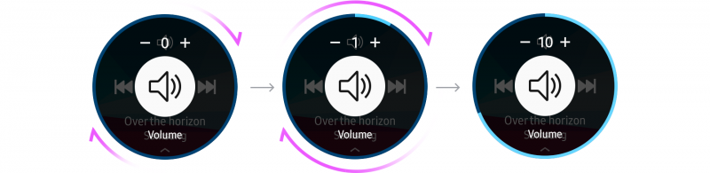
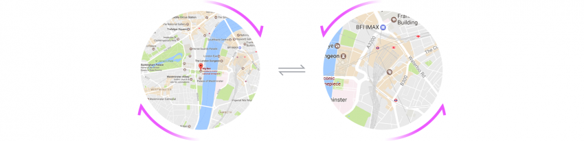
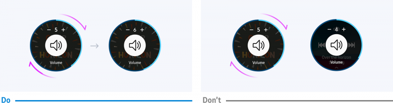

# Bezel Interactions

Bezel interactions refer to rotating the bezel to explore the screen. Users can view information by rotating the bezel clockwise or counterclockwise. Bezel interactions can also adjust values, answer or end calls, or check alerts.

|Interaction |    | Example |
|------------|----|--------|
|Turn the bezel clockwise|| Scroll right Down Increase value Accept Zoom in|
|Turn the bezel counterclockwise||Scroll left Up Reduce value Reject Zoom out |

## Basics

The bezel is a physical controller that rotates around the edge of the Gear's display. Understanding the physical characteristics of the bezel helps you design better interactions.

-   **Directional interactions**

    The bezel can rotate to the right and the left. These 2 directions have consistent meanings in all Gear interactions, and you should retain these meanings in your app.

**Turning the bezel to the right** means an increase, a positive response, or a move to the content on the right or below.

**Turning the bezel to the left** means a decrease, a negative response, or a move to the content on the left or above.

-   **24 detents**

    Rotating the bezel by one detent moves it by 15 degrees. This is the distance that users feel when they rotate the bezel. There should be a reasonable connection between the bezel interaction and the movement of screen components. The component should move only as much as feels natural when users rotate the bezel by one detent.

      
    *Rotating the bezel by 1 detent moves it by 15 degrees.*

-   **Hand grip and range of one motion**

    Users can rotate the bezel up to 4-5 detents in one motion. Design interactions such that users can complete actions without readjusting their grip on the bezel.

      

-   **Speed-to-angle ratio**

    The Gear's display is 1.2-1.3", which is small. You can use bezel interaction to control a moving target on the Gear's small display. For example, the bezel can control a character in a game. For smoother control, settle on the correct ratio between the speed of the target's movement and the bezel's angle and consider how fast the target should move when users move the bezel by one detent.

      
    *Assign an appropriate ratio between the speed of the target's movement and the bezel's angle.*

-   **Feedback**

    Users feel a slight vibration and hear a click when they rotate the bezel. You can adapt this to create a user experience that includes haptic and sound feedback together. It's recommended that you provide enough visual feedback to show how the screen elements change when the bezel is rotated.

## Navigate

Turning the bezel can navigate between screens or elements.

-   **Content browsing**

 Turn the bezel to browse content within one hierarchy level. Turning the bezel can scroll a page up and down or left and right. Do not use bezel turning for navigation among hierarchies. You should also provide visual feedback on the rotary action with a circular scroll bar or with page indicators.

    

  *A rotary action browses content across the same hierarchy level.*

-   **Indicator control**

    Turn the bezel in anchored views to bring the next item into focus. Visually enforce this action by using an indicator.

      
    *A rotary action moves an indicator.*

-   **Selecting more options**

    Turn the bezel to move among items in a More options menu. The title of an option is displayed in the center of the screen when it is highlighted.

      
    *A rotary action allows users to move between more option items.*

## Control

Bezel interaction can adjust values such as the volume, date, and time.

-   **Assign consistent meanings to each direction**

    Rotating the bezel clockwise indicates an increase, and rotating it counterclockwise indicates a decrease.

-   **Define the value of one increment considering the whole range of values**

    The bezel is physically divided into 24 detents, and rotating it by one detent adjusts values by one increment.

-   **Show the change in values with visual feedback**

    Indicate the change in values visually on a circular indicator and provide text when users rotate the bezel. You can reinforce changes by using colors on the indicator. For example, you can apply a different color to a recommended volume range.

## Use cases

-   **Single value control: Volume**

    When there's just one value to control, users can adjust values by tapping +/ - buttons or rotating the bezel.

    
    *Rotating the bezel by one detent adjusts values by one increment, and rotating it quickly increases the speed of the value change.*

-   **Multi value control: Date and time**

    In apps such as alarms or scheduling apps, some screens have multiple sets of adjustable values. In this case, allow users to switch between input fields with a tap, and adjust values with the bezel to avoid confusion between interactions. Indicate which input field the user is adjusting by highlighting it.

      
    *A tap switches input fields when adjusting multiple sets of values.*

> **Tip**  
> Each screen should have only one element that's controlled by the rotary action. If you need more than one element to be controlled by the bezel, let users tap the element to enter a separate screen first, and then control it with the rotary action.

## Confirm

Use the bezel to accept or reject an alert. When an alert comes in, it shows options on the right and left side of the screen. Rotating the bezel clockwise selects the option on the left and vice versa. Users can hover over the options by rotating the bezel by one detent, and select one of the options by rotating it quickly.

  
*Rotating the bezel quickly selects an option on either side.*

## Zoom

Use the bezel to zoom in to or out from content on the screen. Zooming is particularly useful when viewing a large image like a map. Users zoom in on an image by rotating the bezel clockwise, and zoom out of it by rotating the bezel counterclockwise. To pan the screen, use touch interactions instead.

  
*A rotary action zooms in to/out of content on the screen.*

## Customizing bezel interactions for your app

You can customize the bezel interactions in your app to create a unique experience. For example, the game Monster Vampire lets users control the bat catcher by rotating the bezel.

-   **Use clockwise rotation for an increase in value, and counterclockwise rotation for a decrease in value**

 

-   **Provide appropriate visual indicators**  
<table>
 <tr>
  <td width="300"><video controls width="300">    <source src="media/7.2.6.visual_indicators_do.mp4" type=video/mp4> </video> </td>
  <td> <video controls width="300">    <source src="media/7.2.6.visual_indicators_dont.mp4" type=video/mp4> </video> </td>  
 </tr>
 <tr>
  <td width="300">  </td>
  <td>  </td>
 </tr>
</table>

-   **Select only one item to control with the bezel**

    Each screen should have only one element controlled with the bezel. If you need more than one, consider making the element tappable instead.

      
    *If a rotary action adjusts the time of an alarm, it should not be used to control other input fields.*

-   **Customize where your indicator starts**

    An indicator normally starts from the 12 o'clock position, but you can choose to start from somewhere else if it's better for your app.

      
    *An indicator can start from a different position than the default 12 o'clock position.*
