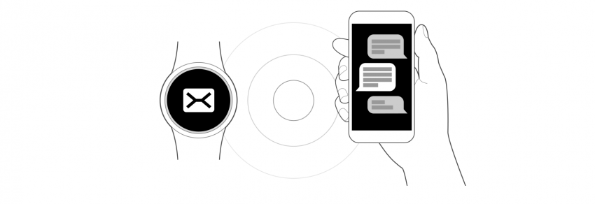

# Gesture Interaction

Gesture interaction takes the user's gestures as input. Users can make a hand movement or change the position of their arm, and the Gear's accelerometer and gyro sensor will provide a sensitive and quick response.

## Smart relay

The smart relay feature opens Gear notifications on the user's phone if:

-   the phone is within a certain distance of the Gear
-   the user lifts the phone at a certain angle.

  
*When the Gear and the paired-phone are within a certain range, users can open information from the Gear on the phone.*

## Wrist up and down

The wrist up gesture turns on the screen to the active state when users raise their arm to view the watch. The opposite down movement turns the screen off.

  
*The screen turns on to the active state when users lift their wrist.*

## Press the Home key and swipe the screen

To take a screen shot, press the Home key and swipe the screen from left to right. The captured screen will move upward to indicate that you have successfully taken the screenshot. The screenshot is saved to Gallery.

## Palm touch

Touching your Gear's display with the palm of your other hand turns off the screen. It can be turned on again by pressing the Home or Back keys. When a call comes in, a palm touch mutes the sound and turns off the screen. It also snoozes and turns off alerts.

  
*The screen turns off when users place their hand on it.*
