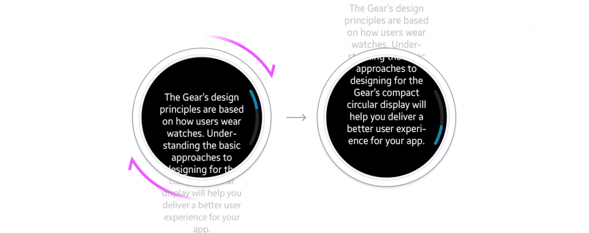
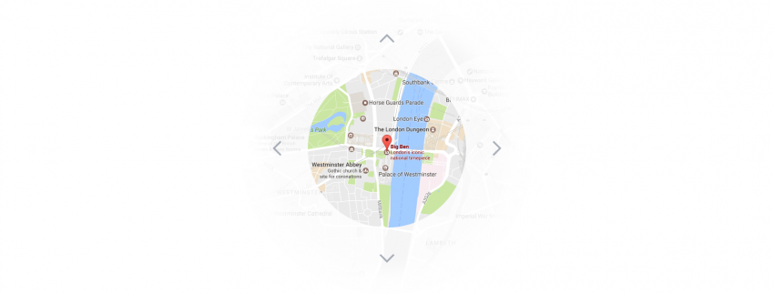

# Screen Views

You can accommodate more information on the Gear's small display by choosing a view that shows the content most effectively. You can choose from 5 view types:

-   vertical
-   horizontal
-   anchored
-   freeform
-   temporary

| Vertically oriented screens | Horizontally oriented screens | Screens with stacked layers | Screens with large content | Screens with a temporary overlay |
|:--:|:--:|:--:|:--:|:--:|
|  | |  | | |
| Vertical view | Horizontal view | Anchored view | Freeform view | Temporary view |  

*Basic structures of 5 screen views*

## Vertical view

Vertical views are read from top to bottom, so are best used for lists and longer pieces of text. They scroll up or down or by rotating the bezel. A clockwise rotation scrolls down the screen while a counterclockwise rotation scrolls back to the top.

-   **Lists**

    As users scroll through a list of items in a vertical view, the item in focus is highlighted with a larger font. A circular scroll bar on the screen indicates where the user is in relation to the list as a whole.

      
-   **Cards**

    Simple information can also be presented on a set of individual cards. As the user navigates up or down, the next or previous card snaps onto the screen. A circular scroll bar indicates which card in the whole series is currently being viewed.

      
-   **Body text**

    Body text presents information in a long form format. A circular scroll bar on the screen indicates where the user is in relation to the body text as a whole.

      
*Body text type screens display long text that users can scroll through.*

## Horizontal view

Users navigate the horizontal view by swiping to the right and left. Use horizontal views for a series of thumbnails or a series of screens that tell one continuous narrative. Screens scroll horizontally and move content to the right or left.

Like vertical views, they scroll by rotating the bezel. A clockwise rotation scrolls the screen right, while a counterclockwise rotation scrolls left.

-   **Pages**

    Pages are ideal for providing a series of images or text across a number of screens. Page indicators at the top of the screen show which page is currently being viewed.

      
    *Images are presented on individual cards.*  

      
    *Text information is presented on individual pages.*

-   **Continuous**

    Continuous screens are well suited for presenting information that has a time flow, such as a trend graph or a progress report. Users can scroll right or left to move forward or backward through the time flow. A circular scroll bar indicates which part of the content is currently being viewed.

      
    *Continuous type screens can display a wide graph or image.*

## Anchored view

Anchored views display content on screen layers, which users can navigate by rotating the bezel. These layers can contain varying depths of content. For example, an app using anchored views can consist of independent data and functions, such as a pedometer, heart rate monitor, and a workout tracker. This is a major difference from the horizontal and vertical views that contain only related content.

-   **Dials**

    Dial screens are well suited for displaying information that can't be arranged evenly. When users rotate the bezel, the indicator moves around the screen bringing items and information into focus. The index indicator selects and displays specific information in a simple and easy way.

      
    *The Samsung Health app displays the time of the user's activities along with detailed records.  
    Since the activities are recorded at irregular time intervals when the user actually moves, using a dial is effective for displaying random periods of time.*

## Freeform view

Freeform displays content that can be panned or zoomed, like a large map. These views are panned by touch and zoomed with the bezel. A clockwise rotation zooms into an image, while a counterclockwise rotation zooms out.

  
*Freeform is only recommended for large images like maps.*

## Temporary view

Temporary view windows interrupt the user's workflow by appearing over the current screen, forcing users to close them before they can continue what they were doing. Use temporary views to ask the user to make a decision, get their confirmation, and provide more functionality.

-   **Pop-up**

    Dialog pop-ups ask the user to make a decision about a task or inform them about the result of a task. They have buttons, such as Confirm or Cancel, but a scroll bar is generally not provided.

      
    *A dialog is presented with buttons so users can select or confirm.*

-   **Toasts**

    Toast pop-ups inform the user about a task result or relay information briefly.

      
    *A toast pop-up displays simple information and disappears after a few seconds.*

-   **More options**

    More options provides access to functions that are related to an item in a list.

      
    *More options are accessed through the dots on the right side of the screen.*

-   **Pickers**

    Pickers allow users to set a value like a number, a date, or time.

      
