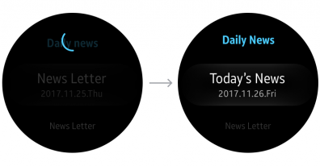
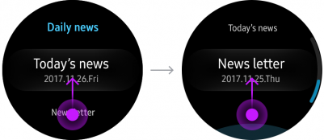
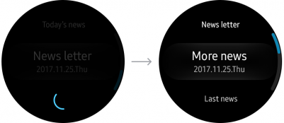

# Swipe to Refresh

This gesture is used when users want to load more content than is currently displayed in an app. It comes in handy when an app's content is updated in real-time, or when an app provides content to browse through.

Users swipe down from the top of content or rotate the bezel counterclockwise to refresh the screen. They can also swipe up or rotate the bezel clockwise when they've reached the bottom of content to refresh. Refer to [Swipe](../interaction/touch.md#swipe) for more details.

While content is refreshing, provide feedback such as a progress bar to indicate that content is loading.

## Update content

Users can refresh to load new emails in a mailing app or update the news feed in a news app. Of course it's best if the app updates automatically, but users should also be able to choose to manually trigger an update when they want.

|  |  |  |
|:--:|:--:|:--:|
| Displaying overscroll effect | | Load more or read more content |

|  |  |  |
|:--:|:--:|:--:|
| Displaying overscroll effect | | Load more or read more content |  

*Swiping down or rotating the bezel counterclockwise updates content.*

## Load more content

Refreshing can also load more content than is currently displayed. Content is loaded when users swipe up or rotate the bezel clockwise at the bottom of content collections.

|  |  |  |
|:--:|:--:|:--:|
| Displaying overscroll effect | | Load more or read more content |  

|    |    |    |
|:--:|:--:|:--:|
| Displaying overscroll effect | | Load more or read more content |  

> **Tip**  
> -  Home screen, widgets, and pop-ups can't load more content through refreshing.
> -  Display a progress bar at the center of the empty space where the refreshed content will appear. It should remain there until the new content is fully loaded.
