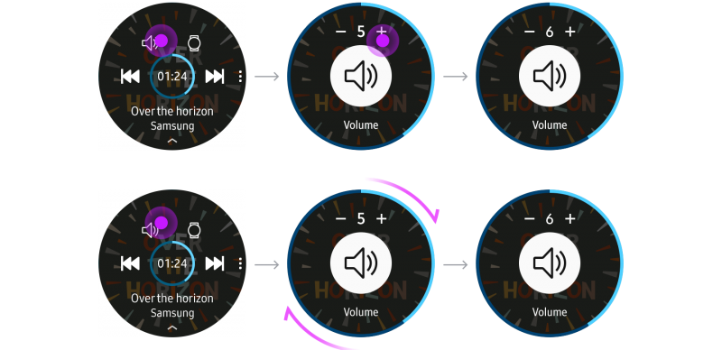

# Volume Controls

Use volume controls if your app incorporates volume adjustment. Volume controls appear when users tap an icon on the screen. Users can adjust the volume by rotating the bezel or tapping the -/+ buttons, and can toggle between Silent and Vibration mode by tapping the center button.

  
*Volume is adjusted by rotating the bezel or tapping the -/+ buttons.*
