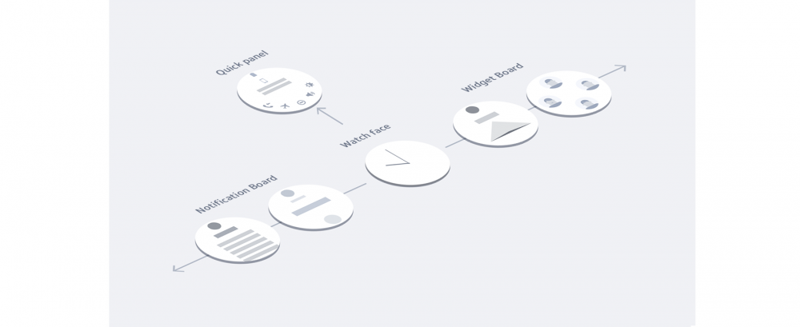

# Structure

Understanding the Gear's home structure is the key to designing engaging apps. The Gear's simple home structure provides easy access to useful features. From the watch face that forms the center of this structure, users can access notifications, widgets, and the quick panel by swiping or rotating the bezel, and bring up the app list by pressing the Home key.

-   **Watch face**

    The watch face presents useful information as well as the current time. It is displayed whenever users turn on the Gear's screen or press the Home key. Since users see the watch face most often, it should both provide useful information and satisfy the user's design tastes. While only one watch face can be used at a time, users can switch their watch face regularly.

-   **Widgets**

    Widgets deliver the key features of your app to users on a single screen. Users can check information or perform simple tasks on widgets without opening an app. They access widgets by swiping to the left or rotating the bezel to the right on the watch face. You can have multiple widgets for different features of your app.

-   **Notifications**

    Notifications inform users of your app's events in a quick and glanceable way. Users can receive notifications to stay updated even when they aren't directly interacting with the Gear. They access notifications by swiping to the right or rotating the bezel to the left. You can customize elements of notifications to match your app's content.

-   **Quick panel**

    The quick panel displays the current status and basic settings icons of Gear. Users access the quick panel from any screen by swiping down from the top of the screen, and adjust the settings by tapping the icons. The settings included in the quick panel are fixed by default.

-   **Apps**

    The apps screen shows a list of all installed apps, and an access point to download more. Users access the apps screen from the watch face by pressing the Home key. While it provides a path to launch every app installed on the Gear, users don't often take this path. It's recommended that you provide widgets to make your app's features readily available, and provide notifications to deliver event information effectively.
