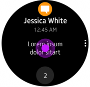
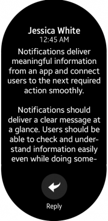
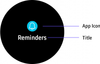
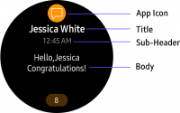
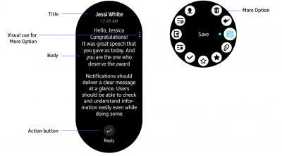
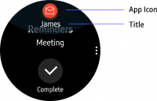

# Notifications

Notifications deliver meaningful information from an app and connect users to the next required action smoothly.

-   **Make your notifications glanceable**

    Notifications should deliver a clear message at a glance. Users should be able to check and understand information easily even while doing something else.

-   **Connect users to the next step smoothly**

    Remember that users should be able to easily continue with any task suggested by a notification. For example, provide a link to the relevant app's menu or allow user input on the notification itself.

## Notification pop-up alerts

There are 2 types of alerts:

-   Full pop-ups are displayed when a notification arrives when the Gear is turned off. They lead to a corresponding notification card depending on a user's settings(Auto show details should be turned On in the Gear Manager (mobile) -> Notifications -> Auto show details.). Users can view details or perform a task on the notification card.
-   Small pop-ups appear at the top of the screen when the Gear is turned on. These smaller pop-ups minimize interruptions to the user's workflow and take them to a corresponding notification card when tapped.

|  |   |
|:--:|:--:|
| Full pop-up alert  |   Small pop-up alert |  

*A notification can be either a full or small pop-up.*

## Notification board

Notifications received on the Gear appear on the notification board, located to the left of the watch face. Users can look through notification panels one by one, starting from the most recent. When they tap one of the panels, it expands into a notification card to show more details.

**Notification board**  

| Notification panel | | Notification card expanded |
|:--:|:--:|:--:|
|  |  | |  

*The notification board consists of notification panels, which expand into notification cards.*

-   **Notification panels**

    Notification panels display the title, part of the content, and the total number of notifications received from an app. The panels should provide appropriate information to help users decide whether to view notifications in full or do other things. Customize icons and other design elements of your app's notification panels. Group notifications from the same app into a single panel, as the total number of notifications will be shown at the bottom of the screen.

-   **Notification cards**

    Each notification panel expands into a notification card that shows more details and body text. You can also include an action button that performs a related task and a More options button. More options include Block app and Clear by default, and you can add more functions like Share or Select App.

## Designing notifications

All elements of notifications can be customized to deliver information in the most effective way.

-   **Design elements**

    Information is configured differently on notification pop-ups, notification panels, and notification cards.  

    <table>
     <tr>
       <th> Notification pop-up alert </th>
       <th> Notification panel </th>
       <th> Notificaiton card </th>
     </tr>
     <tr>
       <td> Full pop-up alert  </td>
       <td rowspan="2">  </td>
       <td rowspan="2">  </td>
     </tr>
     <tr>
       <td> Small </td>
     </tr>
    </table>

-   **App icons**

    App icons show which app the notification corresponds to. You can design separate icons for the notification board to optimally brand your app. If you don't provide an icon design for the notification board, an app icon will appear at the top center of the notification panel.

||||
  |:--:|:--:|:--:|
  |Original app icon|When a separate icon is designed for the notification board.| When no separate icon is designed for the notification board.|

-   **Title**

    Use the most important word or phrase in the card as the title. For instance, the sender's name in a messaging app.

-   **Body text**

    Body text forms the main content of a notification. You can choose to fill the body solely with text or include images or attached files.

-   **Action buttons**

    Action buttons give access to related functions or tasks, like sending a message or opening an app. Provide action buttons below the body text of a notification or in a More options menu.

      
    *Actions can be surfaced in More options menus.*
