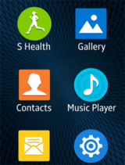

# Styles

This section provides essential information about the wearable app design in terms of the basic actions, color schemes, icons, typographic factors, and the design elements that can be incorporated into the wearable apps.

## Iconography

Tizen wearable iconography consists of a few requirements to achieve a simple but elegant design. These rules cover all the icons used in the wearable device and the manager app on the mobile device. Refer to the following for information about icon sizes and other style properties.

#### Icon Size

Icons in the same style are used for different design elements. Although icons in many different sizes are used based on the situation, you don’t have to worry about all the different icon sizes. Simply design your icons in 170 x 170 pixels. The icons will be automatically resized for the wearable device and the manager app on the mobile device.

#### Icon Styles

When you design icons for Tizen wearable apps, ensure that they conform to the following style. Since white icons will be placed against the background, solid colored backgrounds are recommended to maximize visibility and glanceability.

Refer to the [iconography section](../introduction/styles/iconography.md) of The Tizen Design Guidelines (Introduction and Styles) for detailed information.

| |  |  |
|:---:|:---:|:---:|
| App icons on a circular type wearable device | App icons on a rectangular type wearable device |    App icons on a manager app |

> Only circular app icons can be used on the circular type wearable devices.

## Colors

Tizen wearable devices have used elegant black and orange tones as the main theme. Then, dark brown theme colors have been added to the main color palette for rectangular type wearable devices, and dark blue theme colors, for circular type wearable devices.

#### System Theme Colors

You may design your apps based on the default themes to make them consistent with the wearable device's system.

The following are examples of the Tizen wearable default color themes.

 

  

#### Color Selection for Wearable App Design

The themes applied to the system do not affect 3rd party apps installed by the user. Your app may not look consistent with the system theme if users apply custom themes to the system. Therefore, we recommend that you identify your apps using the major colors that fit best while sticking to the dimensions provided in the UI framework.

> When the background has muted colors, you can choose a different font color to increase readability. Brown tones are also applied to the color elements of the buttons.
>
> Using your own brand identity color is a good idea as well. Use color sets that not only reflect your brand image but also colors that match the color tone and characteristics of the wearable device as a whole.

## Wearable Writing Style Guidelines

The compact nature of wearable device requires clear and concise writing.

Users should be able to glance at on-screen text and immediately understand the meaning without scrolling.

#### Find the Main Idea of Your Message

Determine the key message and remove unnecessary information.

The clarity of your message is determined by its place in the UI flow. Make sure you understand :

-   what sort of text it is (Pop-up? Description? Warning? Confirmation?)
-   what appears around it on the same screen
-   what action a user has taken to display this text
-   what will happen in the UI flow on the screens that follow

> **Mobile version**  
> Your device is now looking for the wearable device. This may take several minutes. It may be difficult to locate your wearable device if it is indoors.

> **Wearable version**  
> Finding %s (Device name)...

#### Remove Nonessential Information

Determine the essential part of your message and remove unnecessary information.

Unnecessary information can include :

-   advice and guidance for the user
-   further details about why a problem is occurring
-   extra details about a particular item

Try to create the shortest text possible while retaining the text's original meaning.

> **Nonessential**  
> Alarm set for %d hours and %d minutes from now.

> **Essential**  
> Alarm set.

> **Nonessential**  
> Switching from wireless charging to cable charging...

> **Essential**  
> Switching to cable charging...

#### Reduce Grammar

Use reduced grammar whenever possible in the wearable UI. Articles and other grammar can be removed if it does not lead to a loss of meaning.

The types of words that can be removed include articles (a, an, the), determiners (this, that, their), and forms of the verb "to be."

> **Full**  
> A subscription may be required to allow your mobile device to use this feature. This may result in additional charges.

> **Reduced**  
> Subscription may be required. Extra charges may apply.

#### Understand the Context

Check the context and ensure you have all the necessary information. For example :

-   Stating "Swipe left" or "Swipe right" becomes unimportant if an obvious visual cue appears alongside it.
-   Can the text appear in more than one place? If so keep it generic or create a slightly different text for each situation.
-   Does the text appear on a wearable device or on a mobile device? In some instances, it may be important to clarify which device a notification or pop-up is referring to.

#### Stay Positive

Avoid using negative words. Wearable devices should be fun to use. They should not blame or accuse the user of making a mistake.

Do not emphasize negative aspects of interaction with the wearable device. Instead, use language that lets users know that they are dealing with a capable, reliable, and powerful device that is good to own.

> **Negative**  
> Don't disconnect your charger before the installation is finished. This might result in the installation failing.

> **Positive**  
> Before unplugging your charger, wait for the installation to finish.

#### Be Active

Use the active voice whenever possible. It saves space and is easier to understand.

#### Please, Sorry and Thanks

Only include "Please" if omitting the word from the text makes it sound rude or demanding.

"Sorry" should not be used on a wearable device. It may only appear as part of the S Voice app or in message templates that the user can send to their contacts.

"Thanks" should be avoided.

#### Contractions

Contractions are recommended.

> **Bad**  
> Unable to show email for security reasons. You can view the email on your phone.

> **Good**  
> Can't show email for security reasons. View it on your phone.

#### Device Naming

Refer to the wearable device itself as the model name.

Always use "phone" to refer to the smartphone that your wearable device syncs with and connects to.

#### Enable/Disable

'Enable' and 'Disable' should only be used as verbs. If you need to describe the state of a particular function once it has been enabled or disabled, use 'On' and 'Off' instead.

> **Bad**  
> Turn on call forwarding?

> **Good**  
> Enable call forwarding?

> **Bad**  
> Call forwarding is enabled.

> **Good**  
> Call forwarding on.

#### Shortened Terms

Wearable devices use a number of shortened terms :

| Full version  |         Wearable version |
|-------|-------|
|  Application  |               App|
|  SIM card    |                 SIM|
|   With         |                w/ |
|  And      |                    & |
|  Kilometer, Centimeter, Mile |  km, cm, mi |
|  Minutes, Hours, Seconds  |     min, hr, sec |
|  Currencies  |                  ISO currency code |
|   Days of the week    |   Mon, Tue, Wed, Thu, Fri, Sat, Sun |

#### Other Tips

If you are still struggling for space, some of these quick fixes can save space:

-   Use a dash without spaces when indicating ranges (17-20cm)
-   Always use digits to represent a number (6s ago)
-   Remove the space between digits and units of measurement (2MB)
-   Remove commas from all text
