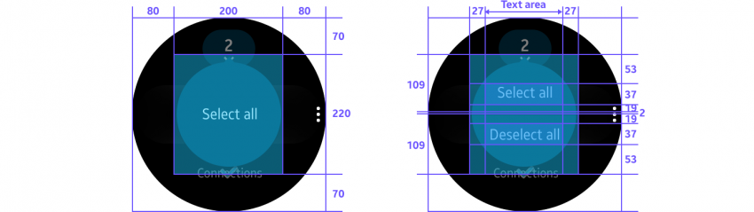
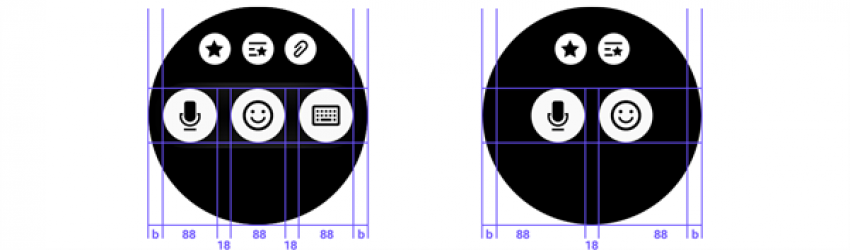

# Buttons

Tapping a button performs an action. Buttons can appear on almost any screen, should be easy to tap, and are designed according to the purpose of an action.

## Usage

-   **Use a bottom button when providing one important action on a screen**

    We recommend using a bottom button when you only provide one major function on a screen. If you don't have enough space for a bottom button, use a text button instead.

-   **Use more options when providing multiple actions**

    If you need multiple buttons on one screen, move any less important actions to [More options](../patterns/more-options.md).

## Behavior

-   **Tapping a button performs an action or opens a link**

    A button should look tappable so users know intuitively to tap it.

-   **Buttons should be disabled if they can't be tapped**

    Disable a button if it's not in a condition to perform an assigned action. For example, if no item was selected from a list, any Share or Delete buttons should be dimmed to indicate that they're not active.

## Types

**Bottom buttons**

  A bottom button provides one main action. It remains fixed and non-scrollable at the bottom of the screen. Text should be in all capital letters. Only use an icon when you can't fit long text in the button field.

|**Bottom button** in developer's guides|          |
|----------------|----------------|
|  **Native**|    Button|
|    **Web**|  Bottom Button|

    
    *A bottom button is provided for one main action.*

-   **Text buttons**

    Text buttons are used to show major functions when a bottom button isn't available due to insufficient space or a decline in graphic quality. They're also useful when you have more than one major function on the same screen. (We recommend against providing more than 2 functions per screen.)

    Text buttons can appear anywhere in the body of a page. If the button triggers a screen transition when tapped, include a visual cue (>) next to the text unless the text is too long.

      
    *Present a text button with a visual cue (>) next to the text if the button causes a screen transition.*

-   **Select mode buttons**

    These buttons appear when users select items from a list. Disable these buttons if there's a limit in the number of items users can select, or no item was selected.

|**Selection mode action button** in developer's guides||
|---------------|--------------------|
|    **Native** |(Circle) UI Components (+ SDK : Ctxpopup)|
|    **Web**|    -|

    
    *Users select/deselect all items in the select mode with the select mode action buttons.*

-  **List buttons**

  List buttons present action options for an item in a list through an icon. Display an icon with text when there's only one list button for one list item, but remove the text when there are 2-3 buttons for a list item.

    
    *A list button consists of either only icons or of an icon and text, depending on how many buttons there are.*

## Design specs

Text Icon

-   **Bottom button**

    

-   **Text button**

    

-   **Select mode action button**

    

-   **List button**

    
