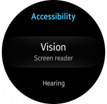
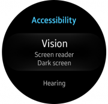
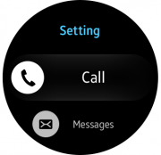

# List

A list arranges multiple items in a single column.

|**List** in developer's guides|  |
|--------|---------|  
|**Native**|enlist|
|**Web**|List / Virtual List (+ Snap List view, Marquee)|

## Usage

A list shows multiple items belonging to a single category. Users can select an item from a list to view more details or perform tasks.

## Elements

-   **List items**
    -   **Text only**

        Text that's longer than one screen slides in and fades out at the right-hand edge. Subtext strings can be added; they need to be center-aligned and limited to 2 lines.

    -   **Icon with text**

        List items can be supplemented with an icon.

    -   **Icon only**

        Lists can consist solely of icons when providing [list buttons](buttons.md#list_button).

    -   **Additional controls**

        You can provide an [on/off switch](selection-controls.md#switches), [checkbox](selection-controls.md#checkboxes), or [radio button](selection-controls.md#radio_buttons) along with the main text.

    **Group index**

Indexes help users quickly find the item they want by dividing a long list into groups. Groups can be browsed more easily and can be indexed in alphabetical order, by category, date, or time.

|**Group index** in developer's guides|              |  
|---------------|--------------|
|**Native**|Genlist >  Groupindex|
|**Web**|-|

A group index should fit on a single line and come before the first item of each group. Because they function as a visual divider, they can't be selected. [Fast scroll indexes](scroll-bars.md#fast_scroll_index) can also be used to facilitate quick browsing.

  
*Group indexes divide list items into groups.*

## Behavior

-   **Focus**

    An item comes into focus when it's brought to the center of the screen. Other items above and below the focus are demagnified.

-   **Rotary action**

    The bezel can be used to browse a list. Turning the bezel by one detent scrolls the list by one item.

      
    *Users can browse lists with the rotary action.*

-   **Select mode**

    Users can select multiple items by touching and holding one list item.

## Types

You can design list pages using one of the following formats. The default height for a list item is fixed to 130 px, but you can customize it if your list items have subtext.

|  |  |  |
| -- | -- | -- |
| Basic list view |  List view with subtext | List view with multiple subtexts |

|  |  |  |
|-----|-----|-----|
|  List view with an icon | List view with check boxes | List view with radio buttons |

## Design specs

 
-   **Basic list view**

      

-   **List view with subtext**  

    
 

-   **List view with multiple subtexts**

    
 

-   **List view with an icon**

    
 
