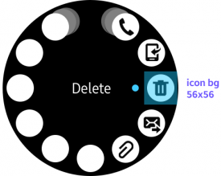
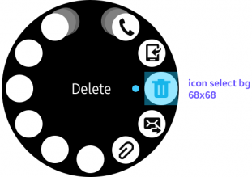
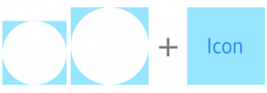
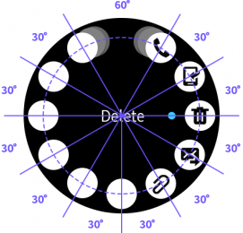
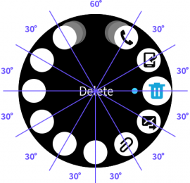
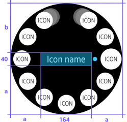
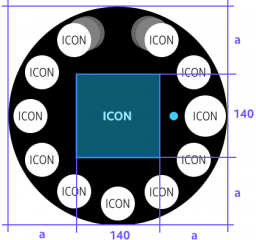
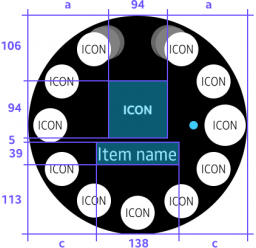
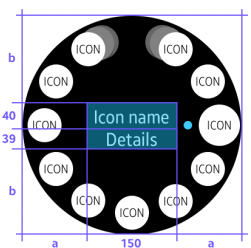
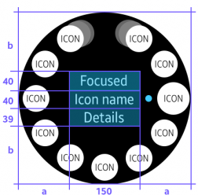

# Rotary selectors

The rotary selector arranges multiple items around the circular edge of the screen, and switches the focus between items as users rotate the bezel.

|**Rotary selector** in developer's guides|                 |
|---------------|-----------------|
|**Native**     |Rotary selector  |
|**Web**        |Selector         |

  
*The rotary selector displays multiple items in a circle.*

## Usage

-   **Present multiptle items to be selected**

    The rotary selector can be used on any screen that includes multiple items. The title of an item is only displayed when the item is in focus.

-   **Provide more options**

    [More options](../patterns/more-options.md) are revealed with the rotary selector when users tap the visual cue on the right side of the screen. More options appear as a [temporary view](../navigation/screen-views.md#temp_view) over the current screen and provide additional functions available for a list item.

## Elements

-   **Option icon**

    The rotary selector can present up to 11 option icons on a page. Option icons are ordered clockwise from the top.

-   **Option detail**

    When an option item comes into focus as users rotate the bezel, its title, subtext, and icon are shown in the center of the screen. If the item is a toggle button, the current state is displayed as subtext.

-   **Previous/Next icon**

    Previous/next icons are shown when the rotary selector has more than 11 option items to display. Moving in a clockwise direction from the top, the previous icon is placed at the left of the first button and the next icon is placed at the right of the last.

## Behavior

-   **Focus**

    Rotating the bezel by one detent brings the next option on the list into focus. An indicator shows which option is currently in focus.

      
    *The rotary selector switches the focus to the next item as the bezel rotates by one detent.*

-   **Select**

    An option performs its assigned task when users tap it, regardless of whether or not it's in focus. A tap on the center of the screen triggers the task of the item in focus. If an item is a toggle button, tapping the item or its option detail switches its state.

## Design specs

-   **Icon**

    

| Normal | Selected |
  |:--:|:--:|
  |  |  |

| 2nd layer icon | 3rd layer icon |
|:--:|:--:|
|     |    |
| **The 2nd layer icon rotates 7° from the 1st layer icon.** | **The 3rd layer icon rotates 3° from the 2nd layer icon** |

|  | 
|:--:|:--:|
| The center of an icon is used as coordinates. | A normal icon is reduced to 56x56 from the selected icon size of 68x68. |

| Normal | Selected |
|:--:|:--:|
|  |  |

| Touch Area |
|:--:|
|    |

| Rotary selector icon color More options icon color |
|:--:|
|   |

-   **Title**

|  |  |  |
|:--:|:--:|:--:|
| 1 line text | 2 line text | Icon only |

|  |   |   |
|:--:|:--:|:--:|
| Icon + Text |  1 line text + Subtext   |  2 line text + Subtext |

-   **More options**

    
