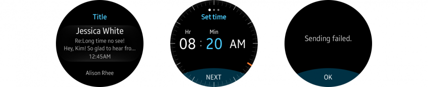

# Colors

Appropriate use of color makes your screens more glanceable. Use colors effectively and consider the Gear's characteristics as a wearable device and its system colors.

## Basic color guidelines

-   **Use dark-colored themes**

    App screens should be visible both under direct sunlight and in lower light settings. Using dark colors for the background enhances the readability of your content without disturbing people with too much light. Dark-colored themes also consume less battery power and blur the boundary between the bezel and the screen.

      
    *A dark colored background enhances readability.*

-   **Use a strong contrast**

    Information should be easily visible to users on the Gear's small screen. A strong color contrast distinguishes text and icons from the background.

      
 

-   **Use consistent colors**

    Users should be able to recognize your app. You can design your own theme, and apply it to your app to differentiate it from others. Use consistent color swatches to enhance visual communication with users.

     
    *Consistent use of color gives your app an identity.*

## System theme colors

The Gear's default theme color is dark blue. The following are examples of how default theme colors are applied.

  
*The Gear's default theme color is dark blue.*
