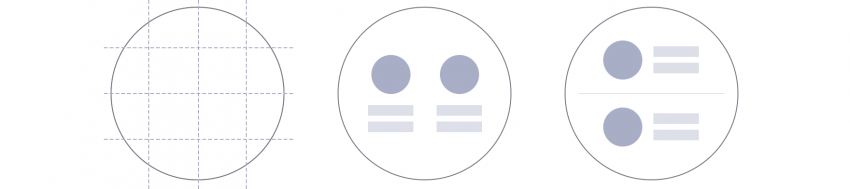
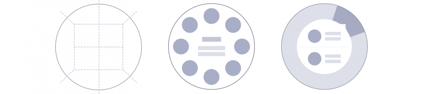

# Layout Patterns

Successful layouts suggest where users should look first and guide them from there. Considering the characteristics of the circular display can help design a better layout for the Gear.

  
*A balanced layout should take the characteristics of the circular display into account.*

## Layout types

-   **Radial**

    Radial layouts divide the screen into pie-shaped areas. Content is placed along the edge of the circle to guide the viewer's eye along a circular path. This type of layout is useful when your content has a flow or when your elements are at similar levels in the hierarchy. Since elements are evenly spaced along the edge, you can fully utilize the space of the circular screen while also maintaining the balance of your design.

      
    *Radial layouts are useful for displaying content with a flow or with elements at similar hierarchical levels.*

-   **Grid**

    Grids divide the screen into vertical and horizontal zones. They are more commonly used on square and rectangle screens and are useful when you display multiple sets of content. Without the corners of a square screen however, you can only place content in the grid within the boundaries of the circle. Considering this limitation, optimize the space as you place your text and images.

      
    *The grid layout is useful to display multiple sets of information in a balanced manner.*

-   **Center**

    A centered approach places the main piece of content in the middle of the screen. This is the most commonly used type in the Gear since it maximizes readability. It delivers a simple message to users at a glance.

      
    *The centered layout is useful when expressing a single, clear message.*

-   **Hybrid**

    Different layout types can be used together in one screen. This hybrid layout is useful when you need to express 2 sets of content hierarchies on one screen. Consider which content to show in the central area and along the circular edge. Avoid providing too much content in the central area. Refer to [Anchored view type](../navigation/screen-views.md#anchored) for more details.

      
    *The hybrid layout is useful for displaying content from different hierarchies or for providing bezel interactions.*

## Text alignment

Centrally-aligned text creates a visual balance on the circular screen. Text aligned to the left helps users read long texts like news or emails by providing the same starting point for each line of text.

  
*Aligning text in the center is recommended when the text is short.*

  
*Aligning text to the left or in the center is recommended when the text is long.*

## Touchable area

The touchable area is where users can touch components. A touchable area that is smaller than the component is difficult to select. Ensure that there is enough space between nearby components so the touchable areas don't overlap.

  
*Touchable areas should be large enough between components to ensure each component can be easily selected.*
