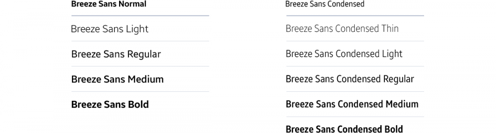
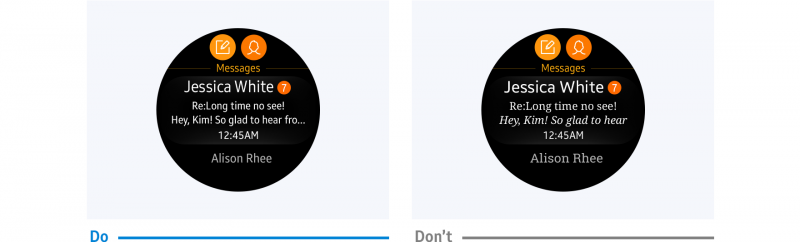

# Typography

The way you present text greatly affects your app's readability. There is no limit to the fonts you can use, but choose a size and style that maintains readability and goes well with the system font.

## System font

The Gear uses Breeze Sans as the system font. Breeze Sans comes in light, regular, medium, bold, and condensed. The condensed option also comes in thin, light, regular, medium, and bold types. You can download Breeze Sans typeface [here](../../introduction/styles/typography.md).

 

  
*The Breeze Sans font family*

## Font size

-   **Avoid drastic changes in font size**

    You can use different font sizes to distinguish different types of content, but avoid any drastic variations.

 

  
*Font sizes should reflect the hierarchy of on-screen text.*

## Font style

Your app's font style should be consistent with its visual identity and present text effectively on the small display.

-   **Keep to one font throughout**

    A consistent use of one font strengthens your brand identity. To communicate the hierarchy of content, use different styles or weights in the same font family. For example, use a bold weight titles and a regular weight for body text. This allows for text-oriented designs that are consistent and distinctive.

      
    *Use of one font family ensures consistency.*

-   **Use the condensed type**

    Condensed fonts allow you to display more text on the screen. Use the condensed type to present text effectively on the Gear's small display.
