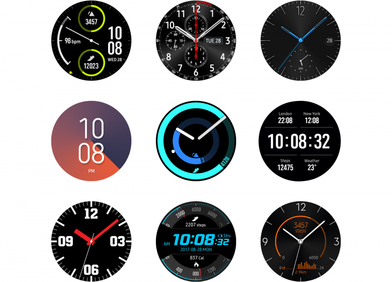

# Watch Face

An adaptable watch face is one of the greatest advantages of a smartwatch. Users can choose different watch faces for different purposes, and can interact with Gear in diverse ways. Because a watch face creates the first impression of the watch, it also holds value as a fashion accessory.

  

*The watch face not only tells time, but also provides useful functions and works as a fashion accessory.*

-   **Design for the circle**

    Watch faces should complement the Gear's circular screen. For example, you can design a watch face that looks like a classic wristwatch.

-   **Be clear in your goal**

    Watch faces should be tailored to a particular situation or need, as users can choose from a wide range of watch faces.

-   **Make it fashionable**

    A well-designed watch face transforms the Gear into a fashionable timepiece, just like a classic watch.
