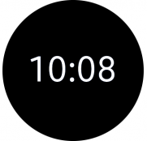
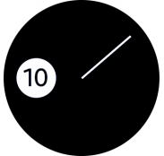

# Design Types of Watch Faces

Watch faces can take the shape of a traditional watch or have an entirely different look. Watch faces are normally categorized as either *analog* or *digital*, depending on how they display time, but you can also create your own custom style.

| Analog | Digital | Custom |
|:---:|:---:|:---:|
| |    |  |

*Watch faces can take varying forms, depending on how they display time.*
