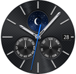
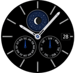
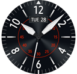
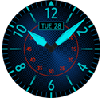
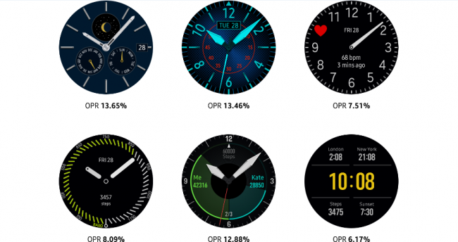
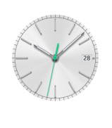
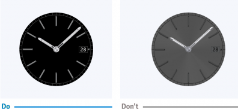
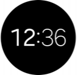
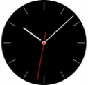

# Watch Face States

Watch faces have 2 different display states: "active" and "always-on." An active watch face is revealed when a user lifts their wrist as if they're looking at the watch(When Wake-up gesture is on in Gear Setting). An always-on watch face (also known as ambient mode) is always shown on the screen; it never fades away or becomes dormant(When Watch always-on is on in Gear Setting). These two states consume different amounts of battery power, so what each state can display is different. Make sure to consider and respect each state in your design.

## Active states

Active watch faces can freely express concepts and moods using diverse colors. You can extend watch functionality and usefulness using complications.

## Always-on states

Always-on states should only include key watch face components like the hour and minute hands to minimize battery consumption. Because the display updates once every minute, showing real-time information (e.g. seconds ticking by) in always-on states isn't recommended.

-   **Color mode**

    Depending on the capability of the Gear's display, two different color schemes are available for always-on states: Low-bit color and high color.

-   **Low-bit color mode**

    In low-bit color mode, always-on states only use cyan, magenta, yellow, red, green, blue, and white colors at full brightness, with no grayscale or gradients. Images might be pixelated, as low-bit color mode doesn't support anti-aliasing.

-   **High color mode**

    High color mode has no color restrictions and can replicate elaborate designs of active states more closely than low-bit color mode. It's recommended to design for high color mode to create a visually compelling watch face, but note that high color designs will be displayed in low-bit color if a device doesn't support high color.

<table align="center">
 <tr>
  <th> Active states </th>
  <th colspan="2"> Always-on states </th>
 </tr>
 <tr>
  <td>  </td>
  <td>  </td>
  <td>  </td>
 </tr>
 <tr>
  <td> </td>
  <td> High color </td>
  <td> Low bit color </td>
 </tr>
</table>

<table align="center">
 <tr>
  <th> Active states </th>
  <th colspan="2"> Always-on states </th>
 </tr>
 <tr>
  <td>  </td>
  <td>  </td>
  <td>  </td>
 </tr>
 <tr>
  <td> </td>
  <td> High color </td>
  <td> Low bit color </td>
 </tr>
</table>  

*The appearance of watch face designs may vary depending on the color mode and state.*

-   **On Pixel Ratio (OPR)**

    As always-on states aim to consume power at a low rate, the OPR (on pixel ratio) is limited to a maximum of 15%. OPR is the ratio of the sum of each on-pixel's RGB values compared to the value when all pixels on the screen are white. The OPR increases when more pixels are on and when the sum of RGB values is higher. OPR represents the percentage of each pixel's RGB values. For example, a white pixel has the RGB value of R (255), G (255), and B (255) and an OPR of 100%. A red pixel's RGB value is R (255), G (0), and B (0) and an OPR of 33.3%. A black pixel has the RGB value of R (0), G (0), and B (0), with an OPR of 0%.

  
*In always-on states, OPR is limited to 15% to save the battery power.*

Don't simply lower the brightness level of an active state to create an always-on state. This may degrade the visibility and quality of your work.

  > **Tip**  
  > You can check the OPR value with always-on states when **Settings -> Developer options -> On Pixel Ratio** is on. [Developer options screen](http://developer.samsung.com/gear/develop/testing-your-app-on-gear) is hidden by default. To make it visible, open the Gear's Settings menu, select About Gear and click the Software version five times.  
  >  

| Active states | Always-on states |
|:--:|:--:|
|  |  |  

*When adjusting the OPR for always-on states, take visibility into account rather than simply lowering the overall brightness.*

-   **Screen burn**

    When the Gear uses an always-on state, the watch face regularly moves around the screen by just a few pixels to prevent a burn-in effect from occurring on the OLED display. Be aware that design elements near the edge of a watch face can be pushed out of the display when this happens. Replace bright colors with black for the background, and avoid applying high brightness and high chroma to a large block of pixels. For an analog watch face, leave the center empty or dark.

| Active states | Always-on states |
  |:--:|:--:|
  |   |   |  

*Lower the brightness and chroma of the pivot and other fixed elements to prevent a screen burn-in.*

- **Always-on state default screens**

    The Gear provides different default screens for always-on states according to watch face type and color mode. If a watch face does not have a corresponding always-on state, the system provides a default one.

<table>
 <tr>
  <th colspan="2"> Low bit color mode (Gear S2) </th>
  <th colspan="2"> High color mode (Gear S3) </th>
 </tr>
 <tr>
  <td>  </td>
  <td>  </td>
  <td>  </td>
  <td>  </td>
 </tr>
 <tr>
  <td> Analog </td>
  <td> Digital </td>
  <td> Analog </td>
  <td> Digital </td>
 </tr>
</table>  

*The default screen is applied to always-on states unless a separate screen is designed.*
