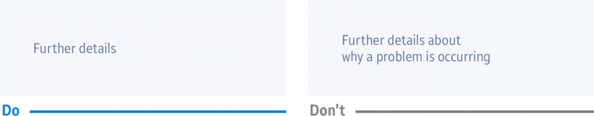

# Writing Style

Keep on-screen text simple and clear, but retain a sense of informality. Users should be able to navigate through your app quickly without having to read long passages of explanatory text.

## Messages

Ask yourself what the purpose of a message is and what information you need to convey.

-   **Remove non-essential words.**

    

-   **Don't state the obvious**.

    

-   **Don't include a message that overlaps with a visual cue.**

    For example, you don't need to state "Swipe right" or "Swipe left" when visual cues on the screen suggest the action clearly.

    

## Expression

Use the active voice whenever possible to save space and make messages easier to understand. Avoid using negative words or expressions that blame the user. Use positive expressions that promote the Gear as a capable, reliable, and powerful device.

-   Only include "Please" when omitting the word from the text makes it sound rude or demanding.
-   Don't use "Sorry". Avoid using "Thanks".

## Capital Letters

Buttons are fully capitalized to distinguish them from text elsewhere on the screen.

## Plural/singular

Use the plural/singular form according to whether the noun is countable or uncountable (e.g. No contacts, No music).

## Terms

Use the following terms when referring to a specific device/state, or indicating results/progress.

-   **Phone**

    Always use *phone* to refer to the smartphone that the user's device syncs with and connects to, instead of *smartphone* or *Samsung Galaxy*.

-   **No data search results**

    Default: "No (item's name) found"

    Device scan: "No devices found"

    Network scan: "No networks found"

    Text search: "No results found"

    CP related: "Content being prepared"

## Shortened Words

Abbreviate words when the full version is too long to fit the screen.

| Full | Abbreviated | | Full | Abbreviated |
|-----|-----|-----|-----|-----|
| Application | App | | Kilometer, centimeter, mile |  km, cm, mi |
| SIM card |  SIM | |  Minutes, hours, seconds | min, hr, sec |
| Days of the week |  Mon, Tue, Wed, Thu, Fri, Sat, Sun | | Currencies |  ISO currency code |

## Date and Time

The styles below are used to display the date and time.

<table>
     <tr>
       <th> Type </th>
       <th> Values </th>
       <th> Min. </th>
       <th> NMax. </th>
       <th> Initial position </th>
       <th> Remarks </th>
     </tr>
     <tr>
       <td rowspan="3"> Date </td>
       <td> Month </td>
       <td> Jan (1) </td>
       <td> Dec(12) </td>
       <td rowspan="3"> Today(for date of birth,12/31/2016) </td>
       <td rowspan="2"> <i>Max. Day: It depends on the month.</i> </td>
     </tr>
     <tr>
       <td> Day </td>
       <td> 1 </td>
       <td> 28 ~ 31 </td>
     </tr>
     <tr>
       <td> Year </td>
       <td> 1900 </td>
       <td> 2050 </td>
       <td> <i>Year: The indicator is reset every 100 years. (It can be stopped according to app's limitation.)</i> </td>
     </tr>
     <tr>
       <td rowspan="4"> Time </td>
       <td rowspan="2"> Hour </td>
       <td> 1 </td>
       <td> 12 </td>
       <td rowspan="4"> Current Time </td>
       <td rowspan="4"> <i>Can be customized to show seconds.</i> </td>
     </tr>
     <tr>
       <td> 1 </td>
       <td> 24 </td>
     </tr>
     <tr>
       <td> Minute </td>
       <td> 0 </td>
       <td> 59 </td>
     </tr>
     <tr>
       <td> AM/PM </td>
       <td colspan="2"> Toggle button </td>
     </tr>
    </table> 
