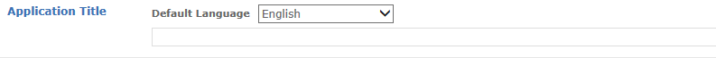
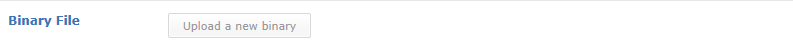
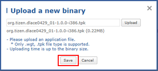
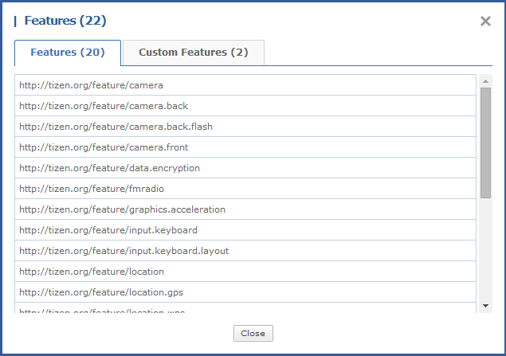
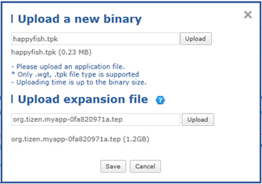
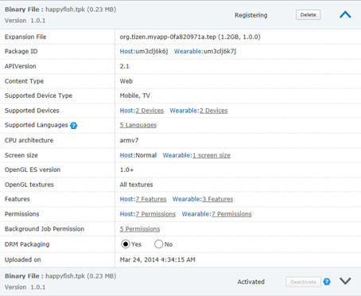

# Binary

This is the first stage of registering an application in Tizen Store Seller Office. If you register your application's title and a binary file, you can save application information temporarily. When you update an application which is on sale after the registration, you can register multiple binaries. Refer to the 'Registering Multiple Binaries' guide for details on how to register and manage multiple binaries.

## Application Title (in Default Language)

1. Select the Default Language to be used in Tizen Store. If you want to sell your application in multiple countries, English is recommended.
2. Enter the application's title in the Default Language.

## Binary File & Supported Device

1. Click the [Upload a new binary] button to upload a binary file. The format of the binary file must be ".tpk" or ".wgt". 

   - Before selecting a file to upload

     

   - After selecting a file to upload

     

2. Click the [Save] button to complete the upload of the binary.

3. If an information message appears when you click the [Save] button, upload the file again after making the necessary modifications. If an error occurs while uploading the file, modify the binary file according to the error message before you try again; if the same error persists after the modification, contact us via My Q&A.

   | Message Type                             | Cause                                    | Modification Method                      |
   | ---------------------------------------- | ---------------------------------------- | ---------------------------------------- |
   | This Package ID is already being used by another application. You can get another Package ID from IDE. Please contact "Support" to resolve the problem. | During the upload of a binary file, another application is using the same Package ID. | If you are uploading a new application, use a different Package ID.If you want to sell an application under another account or if you want to sell your application using a previously registered Package ID again, delete the original application.If this is an update of a previously registered application, use the [Update Application] menu. |
   | The Package ID is not the same as that of the binary you registered previously. If you are creating a new project, you need to complete the registration process again; if you are updating an old project, use the same Package ID as before. | If you are trying to revise or re-register a binary file, register one whose Package ID is different from that of the initial binary file. | If you are trying to register a new application, use the [Add New Application] menu.If you are trying to update an existing application, use the Package ID used for the initial binary file. |

   

4. If saving is properly processed after the [Save] button is clicked, the information of the uploaded binary are automatically detected from the manifest.xml or config.xml file. If you click the text link in Features, Permissions, or Screen size, the window as below will pop up and you can check detailed information.

   

5. Content Type: The Content Type of a binary is automatically detected and displayed

6. If there is language information in the uploaded binary file, supported languages are automatically detected and sellers can manually add supported languages. (The Supported Language of the currently on sale binary file cannot be modified.)

   

7. When you click the number of supported devices shown in Supported Devices at the top, a pop-up window which shows the details of all devices available for release will appear. From this pop-up window, you can select or deselect supported devices based in their suitability for the application. However, the number of devices selected and the number of devices that the application can actually be sold on may differ depending on the result of validation, so you must check the list of devices from the Application Details Page. The countries where the application can be sold are automatically configured based on the supported device settings.

   

   - Example of device settings
     - If 10 devices are recommended at the time of initial registration and 5 devices are selected for application registration, then additional devices may be added after the start of sales (distribution) or after update, and deletion of devices is possible (if a device is deleted, re-download by users who previously purchased the application from that device is not possible).
     - If an application is submitted for validation and "Rejected" before sales begin, it is possible to both add to and delete devices from the list of 5 devices for which validation is requested. Also, if the application is only "Rejected" for validation on some devices, approval will be granted for re-registration after the rejected devices are excluded.
     - "Rejected" will be displayed in the Supported Y/N column for unsupported devices of which binaries did not pass the validation.

8. For multiple binaries, click the number of supported devices in Supported Devices in the auto detection area of each binary file, and you can check the devices supported by each binary in a pop-up window.

9. If you want to apply the DRM option for your binary, select 'Yes' as the DRM option when you register an application.

## Expansion File Upload

Expansion files are supported only in API 2.4 or higher versions. After uploading binary files, you can upload up to 2 GB of expansion files.

- After registering binary files, before registering expansion files.

  

- After registering binary files and expansion files

  

- Binary files and expansion files have been uploaded

  

## Validation Information

Enter any notes that should be considered when the application is validated. You can add a file attachment or a URL to be used for reference during validation.

  

