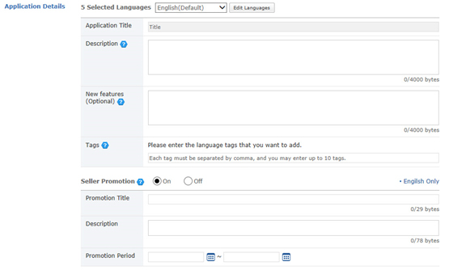
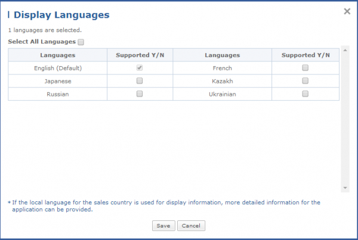
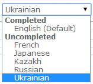
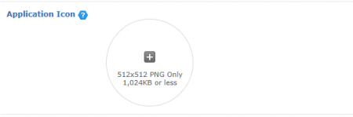
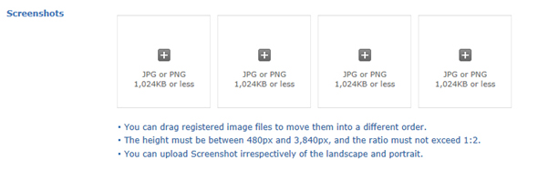
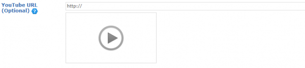
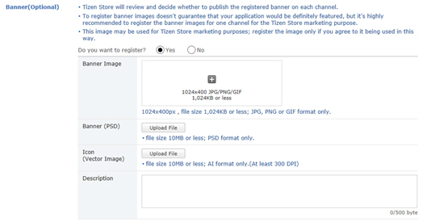
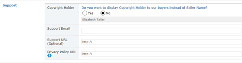

# Display

Enter the application's display information to be shown on Tizen Store.

## Application Details

Enter details such as Application Title, Description and Tags.

If you are running or planning to run a promotion, Seller Promotion must be entered in English only.

  1. Application Title: At first, the application title entered in the Default Language will be displayed. If you click the [Edit Languages] button and add a language, you can enter the title in that language. You can only enter 200 bytes or less. 
  2. Description: Enter a description of the application. The size of the description must be equal to or less than 4,000 bytes.
  3. Tag: Enter any tags that you wish to add. Each tag must be separated by comma, and you may enter up to 10 tags. However, certain words are not allowed to be used as tags in Tizen Store.
  4. If you want to enter application details in languages other than the Default Language, click the [Edit Languages] button and add/modify languages in the Display Languages pop-up window.

     

  5. You must enter the Application Title, Description and Tags in the selected language in order to submit the application. The languages in which you provided such information will be displayed in Completed as below.

     - Display Language list

       

## Icon Image

1. You can click the '+' icon to upload an icon image of your application.
2. The image size must be 512x512 pixels and the file size must be less than 1,024 KB; in PNG format only.
3. The main icon represents the application and it is recommended to be a circular shape.

   

## Screenshots

1. Click the '+' icon to register 4 screenshot images. 
2. The resolution for screenshot images must be between 480px and 3,840px in height, and the ratio must not exceed 1:2. The file size must be less than 1,024 KB; in PNG format only.
3. You can upload both landscape and portrait images.
4. You can drag registered image file to move them into a different order.

   

## YouTube URL

- If there is any video file related to the application, Pre-View and Play options will be provided when you enter a valid YouTube URL.

	

## Banner

- You can register banners and icons, which you can use to promote your application. But please note that not all registered banners are displayed on Tizen Store.

	

1. If you want to register a banner or an icon to promote your application on Tizen Store, select 'Yes'.
2. If you select 'Yes', an area where you can enter the banner will be displayed at the bottom.
3. Click the '+' icon and the [Upload Image] button to register the banner image.
4. If the banner image is a PSD file, it must not exceed 10 MB. If it is a JPG, PNG or GIF file, it must be 1024X400 pixels and must not exceed 1,024 KB.
5. If you are using an icon vector image, it must be at least 300 dpi and must not exceed 10 MB in size.
6. The description of the banner image must be 500 bytes or less.

## Support

1. Copyright Holder: This entry is required only when the copytight holder differs from the seller name, and you want to show the copyright holder's name other than the Seller Name to the Buyer. The Copyright Holder will be displayed instead of the Seller Name on ODC if there is any entry. If you select 'No' in the radio button, no information is required and the Seller Name is automatically displayed in the Copyright Holder field of the application.
2. Support E-Mail: Enter an e-mail address that will be used for customer support.
3. Support URL: If you have a separate customer support site, enter it here. 
4. Privacy Policy URL: You need to register the URL of the Privacy Policy for your app. If you do not have such a policy yet, you can register it later. When you register it, it will be displayed in the store after validation.

	
