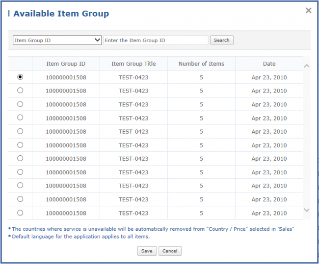

# Item

A pre-registered Item Group will be mapped to the application that is currently being registered (for details on how to register on In App Purchase, refer to the In App Purchase Guide).

## In App Purchase Type & Item Group ID

You can select an item sales type and specify whether to use it or not. For Commercial Sellers, only applications which meet the conditions below can be registered for Tizen In App Purchase.
- Non-Wearable applications of the Linked or Standalone types
- Applications in which the application.launch or appmanager.launch permission has been declared.

1. Select 'Tizen In App Purchase' as In App Purchase Type.
2. Click the [Search Item Group ID] button to call a pop-up window. In the Available Item Group pop-up window, select the desired item group and save.

	

3. In the selected Item Group, you can see a list of items. If you click an Item ID or Item Title, you can see details about the Item.
