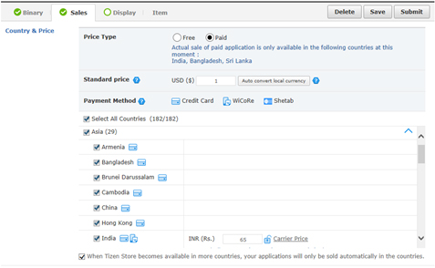
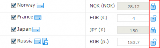
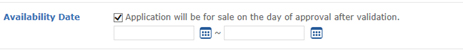
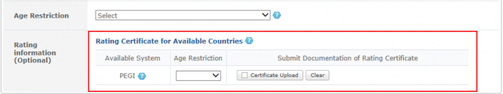

# Sales

Enter application information such as countries for sales, prices, categories and age restrictions.

## Country & Price

You can change the prices of your application without any validation even after you start selling the application. However, you can change countries for sales only when an update occurs.

  1. Select the 'Free' if you want to provide your application free of charge.
  2. If you would like to sell paid applications, deselect the checkbox and enter a standard price in US dollars. When you click [Auto convert local currency], the price for sales will be automatically calculated and entered based on the set exchange rate for each country. If a country requires a different policy for price, you can change the sale price manually. (*You can change the prices of your application without any validation even after you start selling the application. However, you can change countries for sales only when an update occurs.)
  3. You can select whether or not to sell applications when more countries are added for this service and sales. Select "Select All Countries", or select/deselect a checkbox for the country of your choice.
  4. If the Phone Bill price is different for each service provider in a particular country, the Phone Bill price is offered in Tiers. If you click "Carrier Price", you can view the Phone Bill price for each service provider. If the entered price is not supported in Phone Bill, the nearest price is suggested at the bottom. If you do not enter a suggested value from Tier or the recommended text, Phone Bill will not be available as a payment method. (On the screen for price selection, the highest price in each tier is offered as the display price.)
  5. In countries where the Tier-method of Phone Bills is supported, when an auto-converted price is less than the standard price of USD 5, the price charged will be the closest Tier price, based on the auto-converted figure (+/- 5% of the auto-converted amount is allowed).
  6. When you enter a price for applications, an open-lock icon will be shown. When you click the lock-shaped icon to change it to a locked icon, the set price cannot be changed. Also, you cannot change the price for the country when you click the [Auto convert local currency] button. If you need to change the price, simply click on the lock-shaped icon.
  
     

## Availability Date

Set the sales period for applications in Availability Date. You can set that sales start immediately after validation and approval have been granted by selecting the checkbox. If you need to set a specific period, you can click the calendar icon to select dates.

## Category

Set the sales period for applications in Availability Date. You can set that sales start immediately after validation and approval have been granted by selecting the checkbox. If you need to set a specific period, you can click the calendar icon to select dates.

## Age Restriction

1. In Age Restriction, select All, 12+, 16+ or 18+.
2. When you select Game as the Category and Korea Republic of or Brazil as the Country for Sales, rating information must be entered. A certificate of age restriction must be issued by an external certification authority. Age restrictions will be approved when the appropriate document is provided. You must therefore upload the appropriate document on age restriction issued from the relevant country. When you upload a GRB certificate for Korea, or MJ/DEJUS certificate for Brazil, select the age restriction that matches the document. If there is no certificate or a certificate cannot be issued, deselect the country from the list of countries where the application will be sold.
