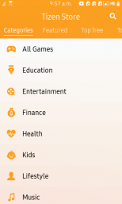
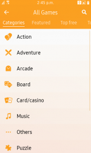
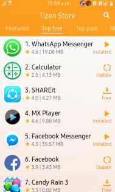
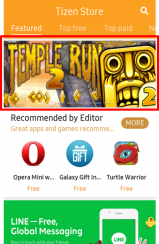
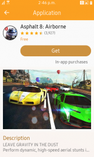
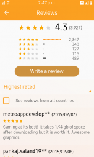

# Tizen Store Overview

## Tizen Store Overview

- Tizen Store is an app store designed specifically for Tizen apps. It provides users in over 180 countries with apps optimized for Tizen devices. Users who have just purchased their first Tizen devices are able to visit Tizen Store, download the apps they want for their Tizen devices, and customize their new devices. But it's not just for new users. Those who have used their Tizen devices for a long time, and have grown familiar with them, also frequently check Tizen Store for new apps to download.
- Several developers are already providing a wide range of apps on Tizen Store, hoping that their apps will add value to Tizen devices and enrich the lives of Tizen users. Now, you too can take the opportunity to join them on Tizen Store, meeting Tizen users all over the world and presenting them with apps that they will love.
- Tizen Store web page([http://www.tizenstore.com/](http://www.tizenstore.com/)) is used for providing various service informations such as Tizen Store introduction and recommended contents collection. Also, support menu from web site provides link to Samsung CS site which user can get FAQ and ask question in 1 on 1 inquiry.
- Tizen Store is currently available on Tizen Mobile Z devices.

 

## Tizen Store Categories

- Tizen Store has a wide variety of useful apps in categories including All Games, Entertainment, Kids, Social networking. The All Gmaes category includes the largest number of apps, and has proven to be the most popular among Tizen Store users. In case of All games, there are 11 sub-categories that users can use more conveniently.

  | **Category**                             | **All Game**                             |
  | ---------------------------------------- | ---------------------------------------- |
  |  |  |

- When you register your apps on Seller Office, you can select up to 2 categories, which will help users to find the apps they want. If you go to the menu for each category, you can see which apps are the most popular in that category (Top free/ paid and New free/paid apps are listed separately). Their rankings are determined by various factors including the number of downloads, revenue, user rating and so on.

  

 

## Featured

- Tizen Store also features the Featured page, where users can view selected apps and get recommendations. This page will promote your apps to provide you with opportunities for greater profits and give users a chance to try various apps.
- The Featured page is regularly updated by our editor, and displays popular apps in each category, as well as the very best of the newly registered apps (the apps must be currently registered on Tizen Store).
- Featured page provides various content set which is collected by themes. Featured page is composed of banner module and app module as below.

  | **Banner Module**                        | **App Module**                           |
  | ---------------------------------------- | ---------------------------------------- |
  |  |  |

## App Details Page

- App detail page displays screenshots, basic info, app description, reviews (rating / comment) and related products

  | **App Details Page**                     | **Reviews**                              |
  | ---------------------------------------- | ---------------------------------------- |
  |  |  |
