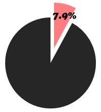
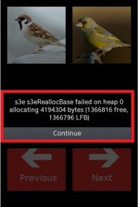

# Basic Functions do not exist or work properly

   

  
Not in compliance with the following Validation guidelines.

- Application should provide functions according to the description or help.
- Each feature of application should work without malfunction.
- If application's function does not work as expected, it will be rejected.

## Defect Examples    
  

	
1. Does not provide functions as explained in the description or help.
   1. Defect: Some of the functions described in description are not provided in application.
   2. Solution: Certain functions should be provided according to the description.
2. Occurring malfunctions.
   1. Defect: Unexpected pop-up or error message Appears when user tries to user application functions.
   2. Defect: Application works in a wrong or unexpected way when user selects one of the menus.
   3. Defect: Linked website is not connected.
   4. Solution: Application functions and menus should work properly without any kinds of malfunctions.
3. UI without any function.
   1. Defect: Nothing happens when user selects menu.
   2. Solution: All UIs should have its function and response when user presses.

## Self-check List

- [3-1] All the menus and functions operate successfully without any problems.
- [6-5] Menu name should be related to its content to let users identify application functions.