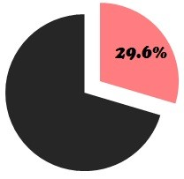
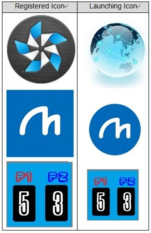

# Icon Problems

  

Not in compliance with the following Validation guidelines. 

- The main icon represents the application and it is recommended to be a circular shape.

- Icon, screenshot, description, supported language and tag in the Tizen Store should be consistent with those installed on device 

## Defect Examples

  

1. Mischoice of Icon itself, shape and size.

   **1-1) Icon Image:**
   - Defect: Icon is the default Tizen icon.
   - Solution: Seller should use own icon.

   **1-2) Icon Shape:**
   - Defect: Icon shape is not a circle.
   - Solution: Icon is recommended to be circled one.

   **1-3) Icon Size:**
   - Defect: Icon size is out of recommendations.
   - Solution: The launching icon is a circle one of 117px size.
   The registered icon is a circle one of 512px size.

2. Inconsistency of icon image and name.

   **2-1) Icon Image Inconsistency:**
   - Defect: Registered and launching icon images are different.
   - Solution: Registered and launching icon images should be same.

   **2-2) Icon name Inconsistency:**
   - Defect: Registered and launching icon names are different.
   - Solution: Registered and launching icon names should be same.                                      

   ## Self-check List

- [1-2] Registered application name, icon, screenshots and supported language should be inconsistent with installed one on device.

- [6-2] Icon shape is recommended to be a circular one. And size for a mobile device which is shown on the real device is 117 x 117 pixels, and size for a store which is shown on the Tizen web site is 512 x 512 pixels.

  > **TIP to solve this issue:**
  >
  > Icon shape and size guideline:
  >
  > [https://developer.tizen.org/documentation/ux-guide/visual-style/icons](https://developer.tizen.org/documentation/ux-guide/visual-style/icons)