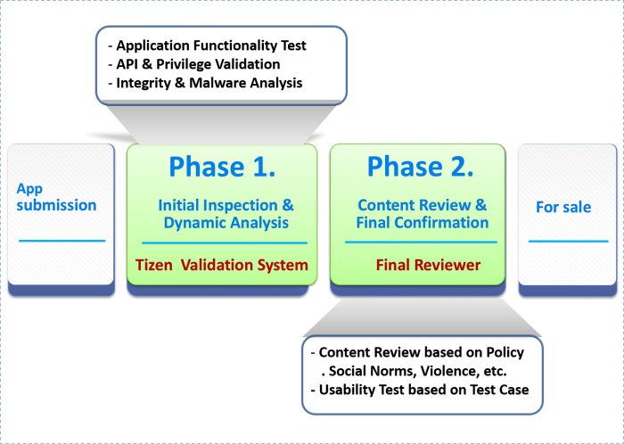

# Application Validation Process

The Validation Process represents the whole procedure ranging from the application's registration to the final confirmation. It is divided into two phases: one is automatically done by a system, referred to as Initial Inspection & Dynamic Analysis, and the second phase is performed manually by Final reviewer, and is referred to as Review & Final Confirmation. If an application passes the process, its status will be changed to *ready for sale* in the Tizen Store. If an application fails, a detailed validation report will be sent to the seller. The Validation Process takes three business days on average.

1. Initial Inspection & Dynamic AnalysisIn this phase an application is validated by the automation system on the basis of the system's *Defect Library*. Tizen Security Analysis System filters out security threats, e.g. malware, API privilege, web attack patterns, etc. Tizen Test Automation System checks the metadata and the application's basic functions.
2. Content Review & Final ConfirmationThis is the second and last phase in which a reviewer makes a final decision regarding the application's approval and delivers the result to the seller. In this stage reviewer validates applications on the basis of the Tizen Validation Guide.