# Creating Certificates

This document explains how to create the necessary certificates or import existing ones to install the Tizen application on a Samsung Tizen wearable device.

## Creating Certificate Profile

In the menu bar, click **Tools** > **Tizen** > **Tizen Certificate Manager** to launch the Certificate Manager.

### Import Old Profile

If you have a profile, which you have created in the past, you can import it. Click the **Cancel** button, if you want to create a new profile.

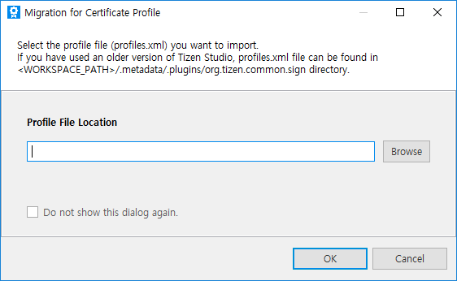

### Create a New Certificate Profile

Certificate profile contains author certificate and distributor certificate.

1. New certificate profile

    Click the **+** button to create a certificate profile.

    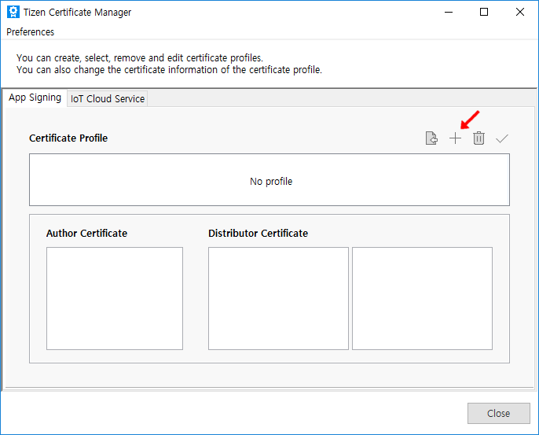

2. Type of the certificate

    Select **Samsung** as the certificate profile to generate certificates to develop and install an application to the Samsung devices. To upload the application to the store, you must select the certificate profile as Samsung.
    However, if you want to use the emulator and do not want to upload the application to the store, select **Tizen** to create certificate locally.

    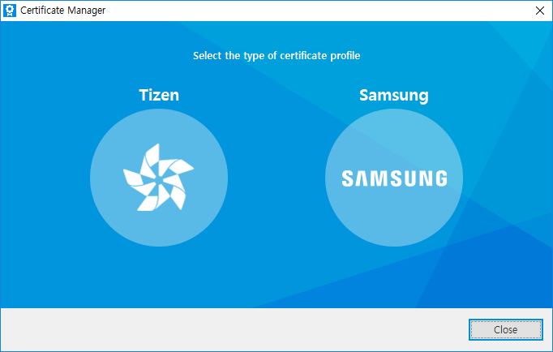

3. Type of the device

    Select **Device Type** and click **Next**.

    

4. Create new or select old profile

    Select **Create a new certificate profile** to create a new profile. If there is an existing profile, then select the second option. For more information on **Select an existing certificate profile**, see [how to manage certificate profile](managing-certificate-profile.md).

    

#### Create a New Author Certificate

An author certificate includes information about the author of the application.

It is used to create an author signature, which ensures the integrity of the application from the author since the publication of the application.

1. Create new or select existing author certificate

    Select **Create a new author certificate**. If there is an existing author certificate, see [how to manage certificate profile](managing-certificate-profile.md).

    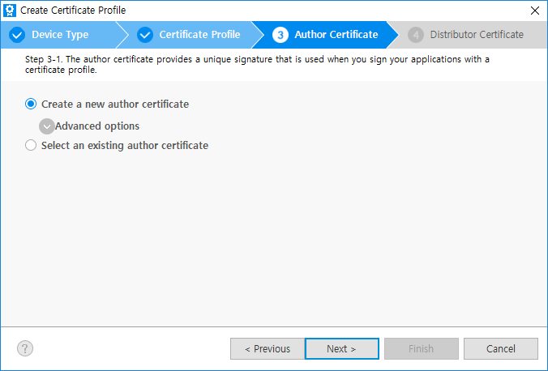

    With **Advanced options** menu, you can check **Use an existing author certificate** option to select either the Android keystore, or you can also choose already existing Samsung author certificate. Click **Next**.

    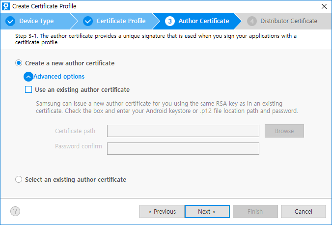

    The same signing key helps in maintaining secure peer authentication between the Tizen Watch app and the Android mobile app.

    For more information, see [Accessory SDK](https://developer.samsung.com/galaxy/accessory). In case of selecting a Samsung author certificate, you can just renew the certificate with the same information. This renewed certificate will be the same as your original RSA key so upgrading your application is guaranteed.

2. Information of the author certificate

    Enter the author name and password. It is recommended to set a strong password. If you want to use the same password for the distributor certificate in the next step, select the check box as shown in the following figure:

    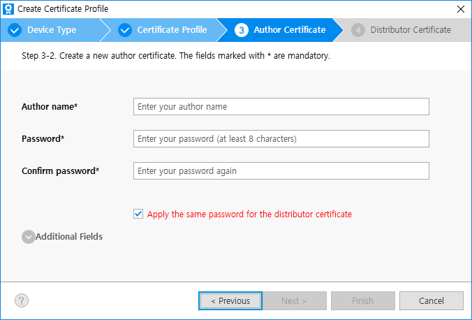

    **Additional Fields** contains more Certificate Signing Request(CSR) information to add, but are not mandatory.
    Click **Next**.

3. Sign in to Samsung Account

    Samsung Account sign-in window appears. Click **Sign in** or **Create new account**. (To get a certificate, you must have a Samsung Account. If you do not have an account, it is recommended to create a new account.)

    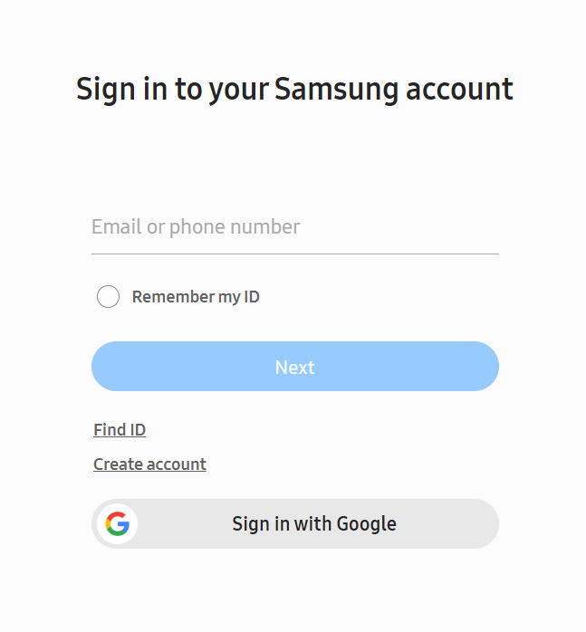

4. Backup created Author certificate

    After sign in step, you can get the author certificate.

    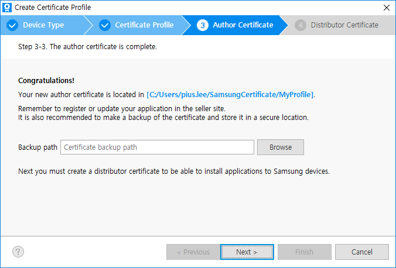

    The author certificate must be secure. Therefore, it is recommend creating a backup. Click **Browse** to specify the backup location.

    If you lose the author certificate, you cannot upgrade your application signed with the same certificate.

    Click **Next**.

The next step is creating distributor certificate.

#### Create a New Distributor Certificate

1. Create new or select existing distributor certificate

    Select **Create a new distributor certificate** to create a new certificate. If you select **Select an existing distributor certificate**, see [Managing Certificate Profile](managing-certificate-profile.md).

    Click **Next**.

    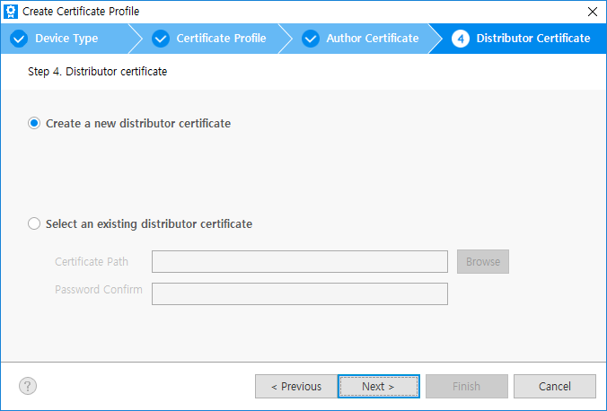

2. Information of the distributor certificate

    Select the **Privilege** level for the distributor certificate. The application must have a distributor certificate with appropriate privilege level to ensure that the implemented APIs work in the device.

    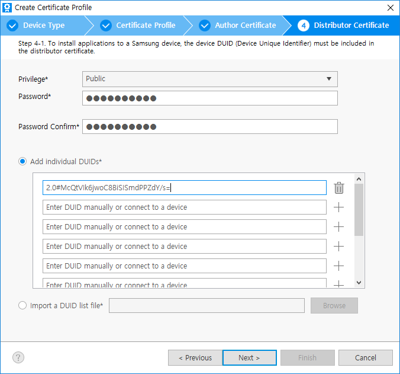

    > **Note**
    >
    > **Privileges**
    >
    > To protect the device system and user private data, the Tizen security architecture is based on privileges and application signing of the Linux basic security model. Linux  basic security model includes process isolation and mandatory access control. The users must have options to grant privileges for security-sensitive operations.
    >
    > - **Public** - No limitation. The privileges can be used by all Tizen application developers.
    > - **Partner** - No limitation to request and get the distributor certificate with this level. But when the application is uploaded to the store, store re-signs the application with official partner level distributor certificate, only for the registered partner developer at Samsung.

    - If you have selected an option to apply same password to the author certificate and to the distributor certificate [while entering author certificate information](#information_of_the_author_certificate), the password is already saved. If you want to change the password, type the new password for the distributor certificate.

    - After the device is connected to the host PC, the DUID is automatically added to the list. If you want to add more devices, connect your device to your host PC via USB or WiFi. The previous DUIDs in the list are not deleted even if you disconnect the device. To delete the DUIDs, click the trash icon. For more information, see [How to connect the device to PC via WiFi](../wearable-connection/index.md).

    - When you need to register devices that are more than 10, upload a txt file using **Import a DUID list file** menu. One DUID on a line and max 50 DUIDs are available.

3. Finish to create the distributor certificate

    Click **Next**, to get the distributor certificate.

    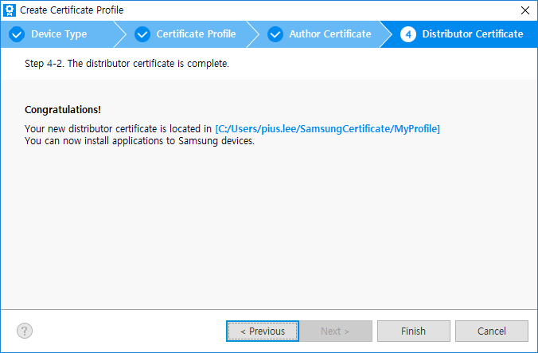

    Click **Finish**. You can find the created profile and its information.

    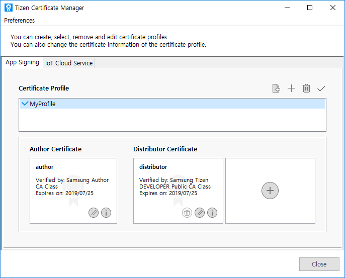
