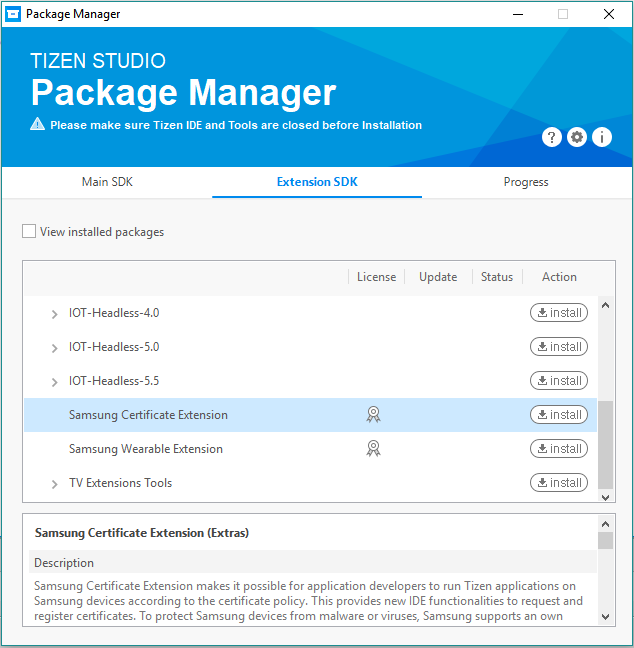

# Install Extension

Samsung Certificate Extension provides functionalities to get and register certificates for Samsung commercial devices.  
It is an add-on SDK, which is installed using the Tizen Studio Package Manager.

To install Samsung Certificate Extension, follow these steps:
  
1. In the Visual Studio menu, select **Tools** > **Tizen** > **Tizen Package Manager**.
2. In the **Tizen Package Manager** window that appears, select **Extension SDK**.
    
	The list of available extensions appears. 
3. Select **Samsung Certificate Extension** from the list and click **Install**.
	
	You can also see that the extension details are described in the **Samsung Certificate Extension (Extras)** panel.

    
