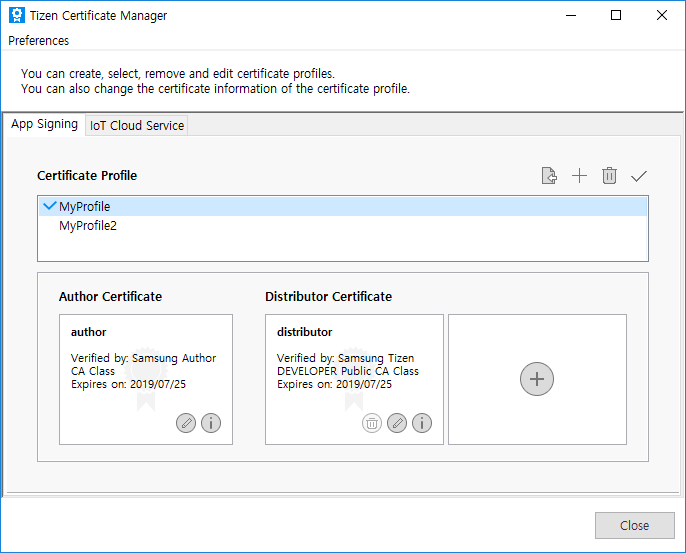
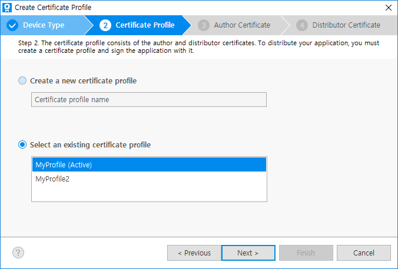
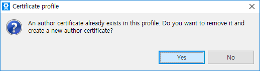
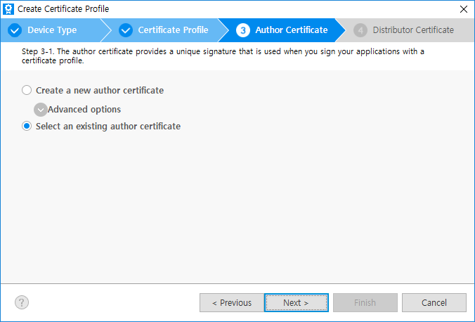
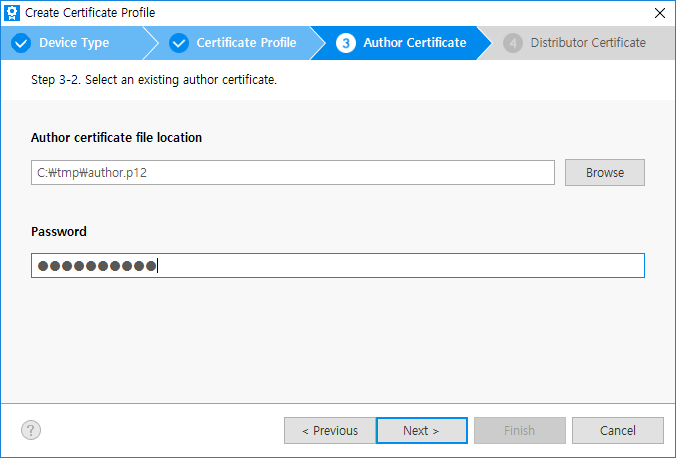

# Managing Certificate Profile

Before installing your application on a device or submitting it to Tizen Store, it must be signed with a certificate profile.
The signature verifies the source of the application and ensures that it is not tampered with since its publication.
A certificate profile is a combination of the certificates used for signing.

## General Information

In the menu bar, click **Tools** > **Tizen** > **Tizen Certificate Manager** to launch the Certificate Manager.

- The Active profile is indicated by the check mark.
- All of the application in this SDK will be signed with this active profile.
- You can create, delete, and set a profile to active here.
- Lower window shows the information of each certificate.
- You can replace the certificate with an existing one.
- The Tizen platform allows multiple distributor certificates up to two, which supports other device manufacturers or telecommunication companies. However, it is not needed for most of the developers generally.

## Changing Only a Distributor Certificate in a Profile

There might be an instance where you need to register more devices or change the devices to the distributor certificate.  
However, author certificates rarely needs to be changed.

This section explains how to change distributor certificate.

Follow the same steps to create a certificate profile as described in [create new or select old profile](creating-certificates.md#create_new_or_select_old_profile).

1. Select an existing certificate profile

    Click **Select an existing certificate profile** and select a profile, for which you want to change the registered device and click **Next**.

    

2. Use the existing author certificate

    If you click **No** to use the existing author certificate then move to [create new or select existing distributor certificate](creating-certificates.md#create_new_or_select_existing_distributor_certificate) to register DUID.

    

    > **Note**
    >
    > If you click **Yes**, it moves to [create a new author certificate](creating-certificates.md#create-a-new-author-certificate) step and original author certificate will be removed permanently.
    > It is recommended to consider the dialog box message carefully.
    > However, the SDK automatically backups the original **author.p12** file with timestamp extension such as author.p12_bak_20160806092013 in the profile directory to protect developer from unintended removal of author certificate.

3. Create new Distributor for certificate profile

    Follow the same steps as mentioned in [create new or select existing distributor certificate](creating-certificates.md#create_new_or_select_existing_distributor_certificate).

## Importing Existing Certificates

If you already have both the **author.p12** and **distributor.p12** certificates and you do not require a new certificate from Samsung, you can import and use the available certificates to sign your application.
In that case, create a new certificate profile and select existing certificates at each step.

Follow the same steps as mentioned in creating certificate before [creating a new profile or selecting an old profile](creating-certificates.md#create_new_or_select_old_profile).

1. Select an existing author certificate

    The author certificate must be the same for the application that is to be upgraded.
    Select **Select an existing author certificate** and click **Next**.

    

    Click **Browse** to select your **author.p12** file, enter the password then click **Next**.

    

2. Select an existing distributor certificate

    Click **Select an existing distributor certificate**, click **Browse** to select your **distributor.p12** file, enter the password and then click **Finish**.

    

3. Find the created profile in the list

    Now you can find the created profile in the list.

    

## Troubleshooting

- Question : I lost the **author.p12**. Can I upgrade my application?
- Answer : No. If the author key is different, the application cannot be upgraded.
