<style>
    .tabcontent img {
        border: 1px solid #555;
        max-width: 100% !important;
        max-height: 100%;
    }
</style>

# Create your first Tizen .NET application

The Tizen .NET framework allows you to easily and efficiently create applications for Tizen. Study the following instructions to help familiarize yourself with the Tizen .NET application development process. With the instructions, you can create and run a basic .NET application, which displays some text on the screen with no user interaction.

1.  Before you get started with developing Tizen applications, set up the [development environment](../../vstools/install.md).

2. [Create a Project](#create-a-project).

    This step shows how you can use a predesigned project template that creates all the basic files and folders required for your project.

3. [Build Your Application](#build-your-application).

    After you have implemented code for the desired features, this step shows how you can build the application to validate and compile the code.

4. [Deploy and Run Your Application](#deploy-and-run-your-application).

    This step shows how you can deploy and run the application on the emulator or a real target device.

5. [Debug your Application in Emulator](#debug-your-application-in-emulator).

    This step shows how you can debug the application using debugging tools.

6. [Enhance Your Application](#enhance-your-application).

    This step shows how you can enhance your application by creating a UI and making minor changes to improve the usability of the application.

## Create a project

The following example shows how to create and configure a basic Tizen .NET application.

To create a new Tizen .NET project, you can use following tools: 
- Visual Studio 
- Visual Studio Code with Tizen SDK extensions
- CLI tools included in Tizen SDK

<div id="TabSection1">
    <div class="sampletab" id="ProjectCreateTab">
        <button id="create-button1" class="tablinks" onclick="openTabSection(event, 'Visual-Studio-2019-Create', 'TabSection1')">Visual Studio</button>
        <button id="create-button2" class="tablinks" onclick="openTabSection(event, 'Visual-Studio-Code-Create', 'TabSection1')">Visual Studio Code</button>
        <button id="create-button3" class="tablinks" onclick="openTabSection(event, 'CLI-Create', 'TabSection1') ">CLI</button>
    </div>
    <div id="Visual-Studio-2019-Create" class="tabcontent">
        <table>
            <tbody>
                <tr>
                    <ol>
                        <li>Launch the Visual Studio tool.</li>
                        <li>In the Visual Studio menu, select <b>File</b> > <b>New</b> > <b>Project</b>.</li>
                        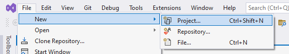
                        <p></p>
                        <li>In <b>New project</b> menu, select <b>#C</b> and <b>Tizen</b> from the dropdown menu, and choose <b>Blank App (Tizen.NUI)</b>. Then click <b>Next</b>.</li>
                        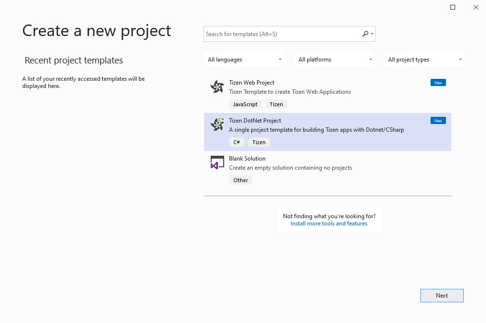
                        <p></p>
                        <p>Configure the project properties and click <b>Create</b>. You can enter the <b>Project name</b>, <b>Location</b>, and <b>Solution name</b>.</p>
                        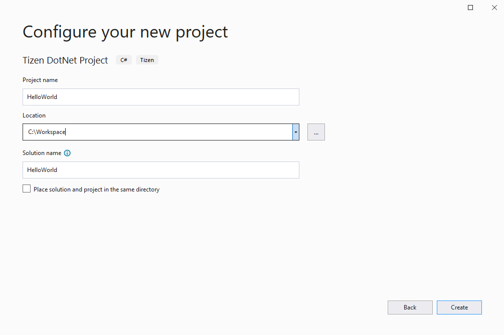
                        <p></p>
                        <p>The <b>Tizen Project Wizard</b> pop-up window appears.</p>
                        <li>Select <b>Profile</b>, <b>Platform Version</b>, and <b>Template</b> and then click <b>OK</b></li>
                        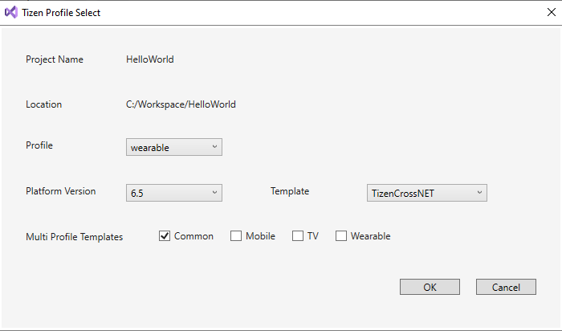
                        <p></p>
                        <p>The following figure illustrates a solution explorer for newly created <b>HelloWorld</b> project:</p>
                        
                        <p></p>
                    </ol>
                </tr>
            </tbody>
        </table>
    </div>
    <div id="Visual-Studio-Code-Create" class="tabcontent">
        <table>
            <tbody>
                <tr>
                    <ol>
                        <li>Launch the Visual Studio Code tool.</li>
                        <li>Use <b>Ctrl + Shift + P</b> to open <b>Command Palette</b> and type <b>Tizen Create</b> and hit Enter key.</li>
                        
                        <p></p>
                        <li>Select project type: <b>DOTNET</b>.</li>
                        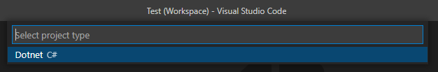
                        <p></p>
                        <li>Select your preferred device profile.</li>
                        
                        <p></p>
                        <li>Select profile version.</li>
                        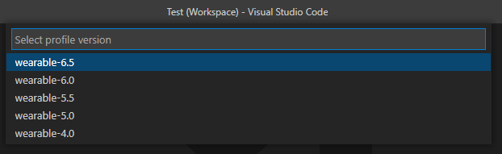
                        <p></p>
                        <li>Choose your desired project template.</li>
                        
                        <p></p>
                        <li>Enter Tizen project name. In this case, <b>HelloWorld</b> is used.</li>
                        
                        <p></p>
                        <li>Lastly, select the working folder for your project.</li>
                        
                        <p></p>
                    </ol>
                </tr>
            </tbody>
        </table>
    </div>
    <div id="CLI-Create" class="tabcontent">
        <table>
            <tbody>
                <tr>
                    <p>Go to a directory where you want project to be created and type:</p>
                    <code>$ tizen create cs-project -t Tizen.NUI.Template55.Single -v tizen-5.5 -n HelloWorld</code>
                </tr>
            </tbody>
        </table>
    </div>
</div>

## Build your application

After you have created the application project, you can implement the required features. In this example, only the default features from the project template are used, and no code changes are required.

When your application code is ready, build the application. The building process performs a validation check and compiles your files. You must sign the application package with an author certificate when building the application. If you have not yet registered a Tizen certificate in Visual Studio, see [Certificate Manager](../../vstools/tools/certificate-manager.md).

<div id="TabSection2">
    <div class="sampletab" id="ProjectBuildTab">
        <button id="build-button1" class="tablinks" onclick="openTabSection(event, 'Visual-Studio-2019-Build', 'TabSection2')">Visual Studio</button>
        <button id="build-button2" class="tablinks" onclick="openTabSection(event, 'Visual-Studio-Code-Build', 'TabSection2')">Visual Studio Code</button>
        <button id="build-button3" class="tablinks" onclick="openTabSection(event, 'CLI-Build', 'TabSection2')">CLI</button>
    </div>
    <div id="Visual-Studio-2019-Build" class="tabcontent">
        <table>
            <tbody>
                <tr>
                    <p>There are two different ways to build the application:</p>
                    <ol>
                        <li>In the Visual Studio menu, select <b>Build > Build Solution</b>.</li>
                        
                        <p></p>
                        <li>In the <b>Solution Explorer</b> view, right-click the solution name and select <b>Build</b>.</li>
                        
                        <p></p>
                    </ol>
                </tr>
            </tbody>
        </table>
    </div>
    <div id="Visual-Studio-Code-Build" class="tabcontent">
        <table>
            <tbody>
                <tr>
                    <ol>
                        <li>Use <b>Ctrl + Shift + P</b> to show Command Palette.</li>
                        <li>Type <b>Tizen Build</b> and select <b>Tizen: Build Tizen Project</b></li>.
                        
                        <p></p>
                        <li>Review the build results in the Output window, and check the location of the package file (.tpk)</li>
                        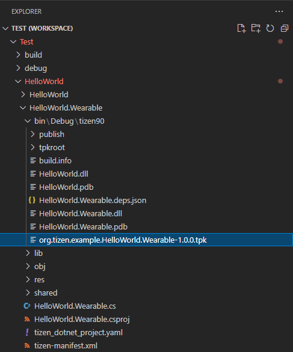
                        <p></p>
                        <p> If you want to deploy the application to a Tizen Device, you must create a certificate profile using <a href="../../vstools/tools/certificate-manager.md">Tizen Certificate Manager</a> or Tizen CLI before building your project.</p>
                    </ol>
                </tr>
            </tbody>
        </table>
    </div>
    <div id="CLI-Build" class="tabcontent">
        <table>
            <tbody>
                <tr>
                    <ol>
                        <li>Change working directory to the <b>HelloWorld</b> project, <b>helloworld.sln</b> file should be placed in the changed directory.</li>
                        <li>Type <code>$ tizen build-cs</code> in your terminal.</li>
                        <li>Output <b>.tpk</b> file should be created in the <b>helloworld/bin/Debug/tizen80/</b> directory.</li>
                    </ol>
                </tr>
            </tbody>
        </table>
    </div>
</div>

Tizen .NET applications are always deployed as installed packages. The package files have the `.tpk` file extension, and the process of generating a package is controlled by the [manifest file](../../vstools/tools/manifest-editor.md). The Tizen SDK tools generate the manifest file (`tizen-manifest.xml`) to the top level of the \<projectname\>.Tizen project.

For this example application, the default manifest is sufficient. If you want to make any changes in the application, such as changing the application icon or installing resources that are used by the application at runtime, see [Package Your Application](#package-your-application).

After you have built the application, deploy and run it.

## Deploy and run your application

To run the application, you must first deploy it to the target: either a device or an emulator. Deploying means transferring the package file (`.tpk`) to the target and invoking the Tizen Package Manager to install it.

To deploy and run the application on the emulator:

<div id="TabSection3">
    <div class="sampletab" id="ProjectRunTab">
        <button id="run-button1" class="tablinks" onclick="openTabSection(event, 'Visual-Studio-2019-Run', 'TabSection3')">Visual Studio</button>
        <button id="run-button2" class="tablinks" onclick="openTabSection(event, 'Visual-Studio-Code-Run', 'TabSection3')">Visual Studio Code</button>
        <button id="run-button3" class="tablinks" onclick="openTabSection(event, 'CLI-Run', 'TabSection3')">CLI</button>
    </div>
    <div id="Visual-Studio-2019-Run" class="tabcontent">
        <table>
            <tbody>
                <tr>
                    <ol>
                        <li>Launch <b>Tizen Emulator Manager</b> from menu <b>Tools > Tizen > Tizen Emulator Manager</b>.</li>
                        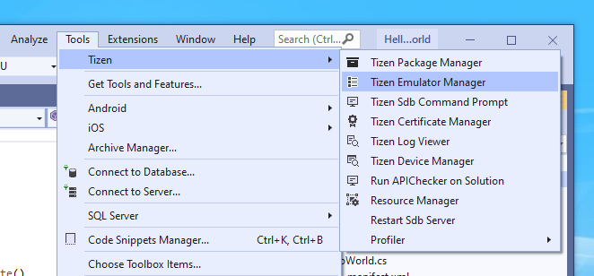
                        <p></p>
                        <li>Choose Emulator. For basic NUI template, there is no difference which platform is used. In this example, the application is tested on TV emulator.</li>
                        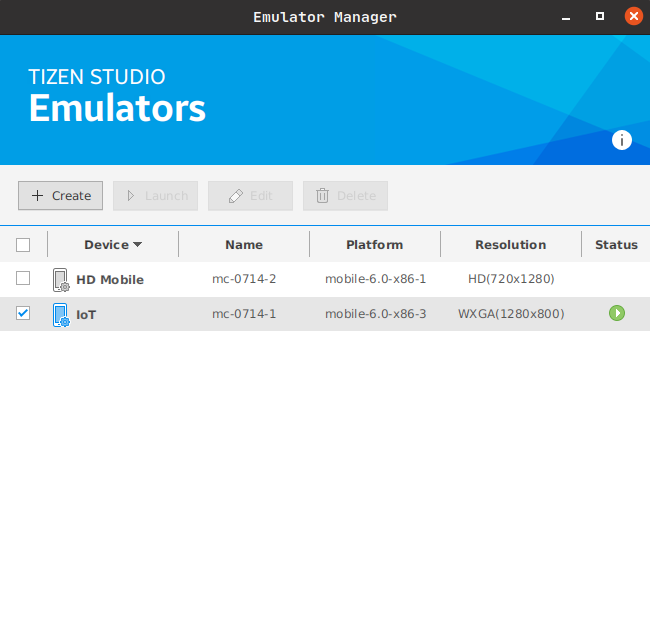
                        <li>When emulator window is visible you can switch back to the Visual Studio.</li>
                        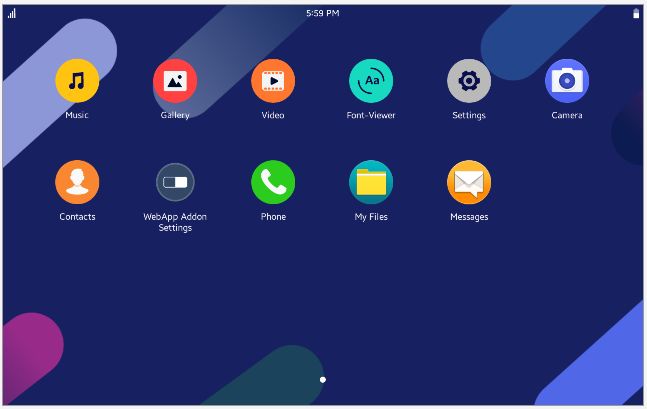
                        <li>In Visual Studio, new launch mode should be visible with valid emulator name. To deploy and run application, green arrow can be used.</li>
                        
                        <li>Finally, <b>HelloWorld</b> project UI is visible on emulator screen.</li>
                        
                        <p></p>
                    </ol>
                </tr>
            </tbody>
        </table>
    </div>
    <div id="Visual-Studio-Code-Run" class="tabcontent">
        <table>
            <tbody>
                <tr>
                    <ol>
                        <li>Use <b>Ctrl + Shift + P</b> to show Command Palette.</li>
                        <p></p>
                        <p>Remember, you cannot launch an emulator directly from Visual Studio Code. Instead, you must launch the Tizen Emulator Manager and use it to launch the emulator you need.</p>
                        <li>Type <b>Tizen Emulator</b> and launch the Tizen Emulator Manager.</li>
                        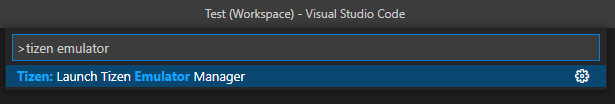
                        <p></p>
                        <li>Choose Emulator. For basic NUI template, there is no difference which platform is used. In this example, the application is tested on TV emulator.</li>
                        
                        <p></p>
                        <li>When emulator window is visible, you can switch back to the Visual Studio Code.</li>
                        
                        <p></p>
                        <li>Use <b>Ctrl + Shift + P</b> to open Command Palette again and type <b>set tizen device</b> and set the Tizen Device.</li>
                        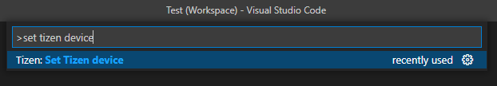
                        <p></p>
                        <p>A popup in the right corner of the Visual Studio code appears.</p>
                        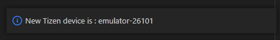
                        <p></p>
                        <li>Use <b>Ctrl + Shift + P</b> to open the Command Palette and type <b>Tizen Run App</b> and choose <b>Tizen: Run Tizen application</b> to run the application on the emulator.</li>
                        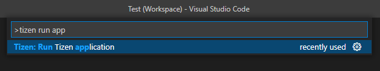
                        <p></p>
                        <li>You can also use <b>Ctrl + Shift + P</b> and type <b>Tizen Install App</b> and choose <b>Tizen: Install Tizen application</b> to install the application on the emulator.</li>
                        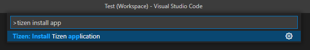
                        <p></p>
                        <li>Finally <b>HelloWorld</b> project UI is visible on emulator screen.</li>
                        
                        <p></p>
                    </ol>
                </tr>
            </tbody>
        </table>
    </div>
    <div id="CLI-Run" class="tabcontent">
        <table>
            <tbody>
                <tr>
                    <ol>
                        <li>Run the Tizen SDK emulator manager manually and start the Emulator Image.</li>
                        <li>Choose Emulator. For basic NUI template, there is no difference which platform is used. In this example, the application is tested on TV emulator.</li>
                        
                        <p></p>
                        <li>In project directory, locate application <b>.tpk</b> file. Then use command:</li>
                        <code>$ sdb install helloworld/bin/Debug/tizen80/org.tizen.example.helloworld-1.0.0.tpk</code>
                        <li>To run application on TV emulator type:</li>
                        <code>$ tizen run -p org.tizen.example.helloworld</code>
                    </ol>
                </tr>
            </tbody>
        </table>
    </div>
</div>

## Debug your application in emulator

The following example shows how you can use the Tizen emulator to debug a basic Tizen .NET application.

To debug your application: 

<div id="TabSection4">
    <div class="sampletab" id="ProjectRunTab">
        <button id="debug-button1" class="tablinks" onclick="openTabSection(event, 'Visual-Studio-2019-Debug', 'TabSection4')">Visual Studio</button>
        <button id="debug-button2" class="tablinks" onclick="openTabSection(event, 'Visual-Studio-Code-Debug', 'TabSection4')">Visual Studio Code</button>
    </div>
    <div id="Visual-Studio-2019-Debug" class="tabcontent">
        <table>
            <tbody>
                <tr>
                    <ol>
                        <li>Open the .cs file in your visual studio application.</li>
                        <p></p>
                        <li>Add a break point in your source code.</li>
                        
                        <p></p>
                        <li>Start the debugging session by selecting <b>Debug > Start Debugging</b> in the menu bar, or pressing <b>F5</b>, or by clicking the <b>Debug</b> button in the menu bar.</li>
                    </ol>
                </tr>
            </tbody>
        </table>
    </div>
    <div id="Visual-Studio-Code-Debug" class="tabcontent">
        <table>
            <tbody>
                <tr>
                    <ol>
                        <li>Deploy and run your application in the emulator.</li>
                        <p></p>
                        <li>In the Visual Studio Code <b>Activity Bar</b>, click the <b>Debug</b> icon .</li>
                        <p></p>
                        <li>In the <b>Debug</b> view, open the <b>Configuration</b> drop-down menu and select <b>Add Configuration</b>.</li>
                        <p></p>
                        <li>Select <b>Netcoredbg for Tizen .NET</b> in the list of configurations.</li>
                        <p></p>
                        <li>Start the debugging session by pressing <b>F5</b>.</li>
                    </ol>
                </tr>
            </tbody>
        </table>
    </div>
</div>

## Enhance your application

Tizen .NET provides a way to build portable applications which run in a native way. It provides a set of controls for building a user interface, as well as generates code which adapts the user interface code to use the native facilities of the supported platforms. The following is a brief introduction to the NUI controls, and how to use them to build on the application you have just created.

### Understand the source code

The C\# code from your first application displays and rotate a label centered on the screen, containing the **Hello Tizen NUI Wolrd** text. This application created from the template is set up and ready to be built and run right after you create it, as described above.

The following shows code generated by template project **HelloWorld.cs** file, generated by the template:

```csharp
using System;
using Tizen.NUI;
using Tizen.NUI.BaseComponents

namespace helloworld
{
    class Program : NUIApplication
    {
        protected override void OnCreate()
        {
            base.OnCreate();
            Initialize();
        }

        void Initialize()
        {
            Window.Instance.KeyEvent += OnKeyEvent;

            TextLabel text = new TextLabel("Hello Tizen NUI World");
            text.HorizontalAlignment = HorizontalAlignment.Center;
            text.VerticalAlignment = VerticalAlignment.Center;
            text.TextColor = Color.Blue;
            text.PointSize = 12.0f;
            text.HeightResizePolicy = ResizePolicyType.FillToParent;
            text.WidthResizePolicy = ResizePolicyType.FillToParent;
            Window.Instance.GetDefaultLayer().Add(text);

            Animation animation = new Animation(2000);
            animation.AnimateTo(text, "Orientation", new Rotation(new Radian(new Degree(180.0f)), PositionAxis.X), 0, 500);
            animation.AnimateTo(text, "Orientation", new Rotation(new Radian(new Degree(0.0f)), PositionAxis.X), 500, 1000);
            animation.Looping = true;
            animation.Play();
        }

        public void OnKeyEvent(object sender, Window.KeyEventArgs e)
        {
            if (e.Key.State == Key.StateType.Down && (e.Key.KeyPressedName == "XF86Back" || e.Key.KeyPressedName == "Escape"))
            {
                Exit();
            }
        }

        static void Main(string[] args)
        {
            var app = new Program();
            app.Run(args);
        }
    }
}
```

This application is constructed with the following NUI components:

- The `Program` class is declared, deriving from the `NUIApplication` class.
- The `Program` class implements Main function and creates application instance. Then the main application loop is started by calling `app.Run(args)` method.
- A basic NUI applictation requires `OnCreate` callback implementation which is called shortly after `app.Run(args)`. In this example this is the entry point of UI components initialization.
- In the above example, `Initialize` method is responsible for setup the key events handler, create the text label and the animation.

### Add a button and the HelloWorld application

The basic template uses a label which displays text in an area of the screen. The properties inherited from the base classes of `Label` give control over the display: font attributes, families, and sizes, as well as layout options. Modify the application by adding a button control. It is similar to the label, but is specifically designed to react to click events. As a result, the `Button` class defines the `Clicked` event, which tells the application what to do when the click event takes place.

In order to do something visible on the screen to show that you have received the click event, define another label. Give the new label a value to be displayed in the initial state, and make the button click event handler update the text and button color once the click event triggers.

To modify the application by adding a button and label:

1. Since the click event triggers outside the class constructor, declare the label, and a click counter at the class level:

    ```csharp
    class Program : NUIApplication
    {
        private TextLabel ButtonStateLabel;
        private int ClickedCounter = 0;

        void Initialize()
        {
    ```
2. To avoid placing elements in the window manually, the `View root` object is created. This is a container for the application components:

    ```csharp
            Window.Instance.KeyEvent += OnKeyEvent;

            View root = new View();
            root.WidthResizePolicy = ResizePolicyType.FillToParent;
            root.HeightResizePolicy = ResizePolicyType.FillToParent;
            Window.Instance.GetDefaultLayer().Add(root);
    ```

3. The `root` object layouts items vertically using `LinearLayout` component:

    ```csharp
            LinearLayout rootLayout = new LinearLayout();
            rootLayout.LinearOrientation = LinearLayout.Orientation.Vertical;
            rootLayout.LinearAlignment = LinearLayout.Alignment.Center;
            rootLayout.CellPadding = new Size2D(10, 10);
            root.Layout = rootLayout;
    ```

4. The `ButtonStateLabel` shows how many times button was clicked:

    ```csharp
            TextLabel text = new TextLabel("Hello Tizen NUI World");
            text.HorizontalAlignment = HorizontalAlignment.Center;
            text.VerticalAlignment = VerticalAlignment.Center;
            text.TextColor = Color.Blue;
            text.PointSize = 12.0f;
            text.HeightResizePolicy = ResizePolicyType.FitToChildren;
            text.WidthResizePolicy = ResizePolicyType.FitToChildren;
            root.Add(text);

            ButtonStateLabel.Text = string.Format("Clicked counter: {0}", ClickedCounter);
            ButtonStateLabel.HorizontalAlignment = HorizontalAlignment.Center;
            ButtonStateLabel.VerticalAlignment = VerticalAlignment.Center;
            ButtonStateLabel.TextColor = Color.Blue;
            ButtonStateLabel.PointSize = 12.0f;
            ButtonStateLabel.HeightResizePolicy = ResizePolicyType.FitToChildren;
            ButtonStateLabel.WidthResizePolicy = ResizePolicyType.FitToChildren;
            root.Add(ButtonStateLabel);
    ```

5. The `Button` object with the clicked event handler assignment is depicted below:

    ```csharp
            Button testButton = new Button();
            testButton.Text = "Click Me!";
            testButton.HeightResizePolicy = ResizePolicyType.FitToChildren;
            testButton.WidthResizePolicy = ResizePolicyType.FitToChildren;
            root.Add(testButton);

            testButton.Clicked += OnTestButtonClicked;
        }
    ```

6.  To change the new label's properties when the button is clicked, define the `OnTestButtonClicked` event handler.

    When an event triggers, two parameters are delivered to any handler set up to watch it. The first parameter is an object representing the control that triggered the event, and the second parameter is the event data appropriate to the event type.

    Increment the click counter, build a string showing how many times the button has been clicked, and set the `Text` property of the label to that string:

    ```csharp
            void OnTestButtonClicked(object sender, EventArgs args)
            {
                ClickedCounter += 1;
                label.Text = String.Format("Number of clicks: {0}", ClickedCounter);
            }
        }
    }
    ```

The following image shows what happens when you run the modified code:

**Figure: Modified Hello World App**
|  Startup State|  Clicked State |
|---------------------------------------------------------|----------------------------------------------------|
| 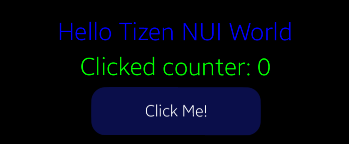  |                                       |

At startup, the text above the button is **Clicked Counter: 0**. After a couple of clicks, the click counter is changed.

This topic only introduces the controls in use in the example above. For more information, see the [NUI Guides](../guides/index.md).

## Package your application

A Tizen .NET application is deployed in the form of an installable package, with the package file extension `.tpk`. A Tizen .NET package has a relatively simple structure: internally it is a ZIP file with content that matches the directory layout of the project.

The package contains the following:

- The `shared` directory, which is for items that are considered system-wide (shareable).

    The application icon is packaged in the `shared/res` directory on installation, and the icon appears on the home screen with the icons for the other applications. You can either replace the icon (which is just a copy of the default Tizen logo) with one of your own using the file name generated by Visual Studio, or put a new icon in the same project directory and update the package manifest to indicate the new name.

- The `res` directory, which is for application-private resources.

    If the application needs a file to open at runtime, it can be placed here.

- The `bin` directory, which contains the generated application executable.
- The `lib` directory, which contains the generated application support code.

    If you use nugget libraries, they are imported in the lib directory.

- The package manifest, which defines the application properties and is used at the installation time.
- Two signature files (author and distributor), which are checked at the installation time.

The following figure shows the layout of the platform-specific (Tizen) project:


It includes the `lib`, `res`, and `shared` (with a `res` subdirectory containing an image file) directories, and the **tizen-manifest.xml** file. There is also the `bin` directory, which Visual Studio only shows if you select the **Show all files** option for the solution. These pieces all go into the package.

Package generation (and in fact installation) is controlled by the **tizen-manifest.xml** package manifest file. The following figure shows the `.tpk` file for the initial application, to illustrate how the combination of the directory layout and the package manifest leads to the actual package.

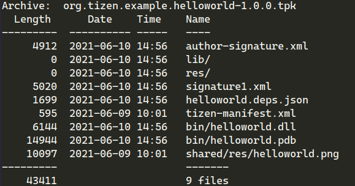

When packaging your application, you also need to consider whether any feature or privilege declarations are needed in the manifest file, and how to place any language-specific files.

<script>
    function openTabSection(evt, profileName, sectionId) {
        var i, tabcontent, tablinks, section;
        let selected = 0;

        section = document.getElementById(sectionId);
        tabcontent = section.getElementsByClassName("tabcontent");

        for (i = 0; i < tabcontent.length; i++) {
            tabcontent[i].style.display = "none";
            if (tabcontent[i].id == profileName) {
                selected = i;
            }
        }

        tablinks = section.getElementsByClassName("tablinks");

        for (i = 0; i < tablinks.length; i++) {
            tablinks[i].className = tablinks[i].className.replace(" active", "");
        }

        tabcontent[selected].style.display = "block";
        evt.currentTarget.className += " active";
    }

    document.getElementById("create-button1").click();
    document.getElementById("build-button1").click();
    document.getElementById("run-button1").click();
    document.getElementById("debug-button1").click();
</script>
