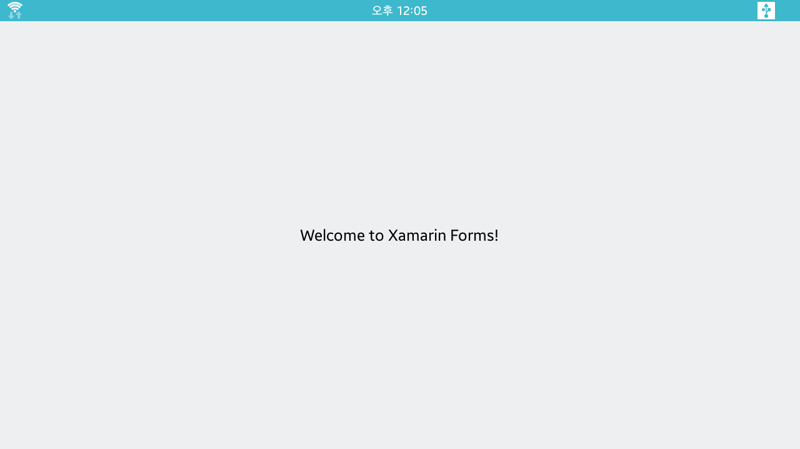
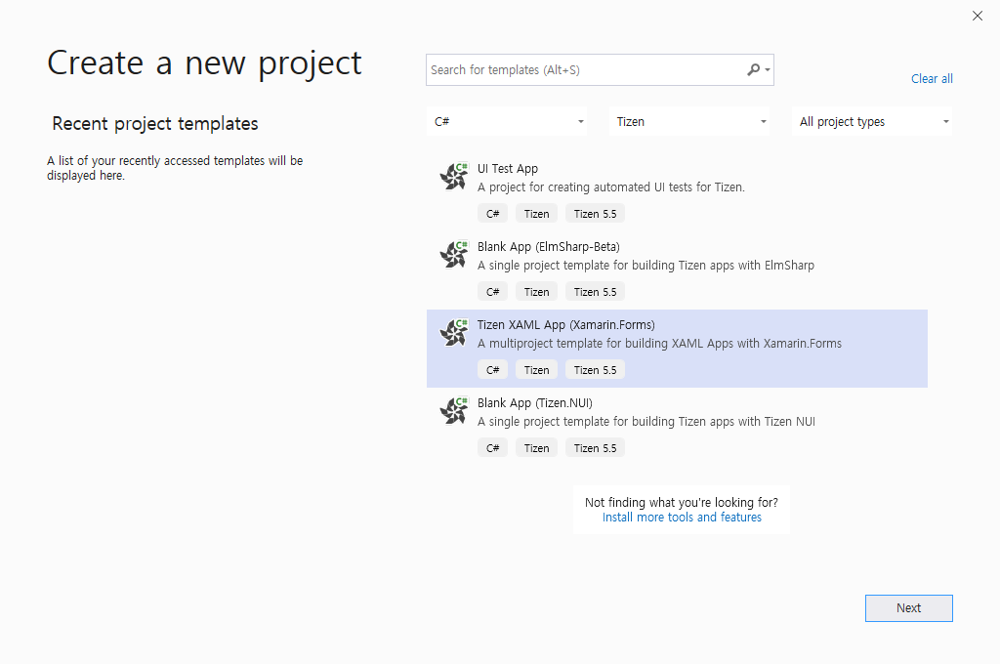
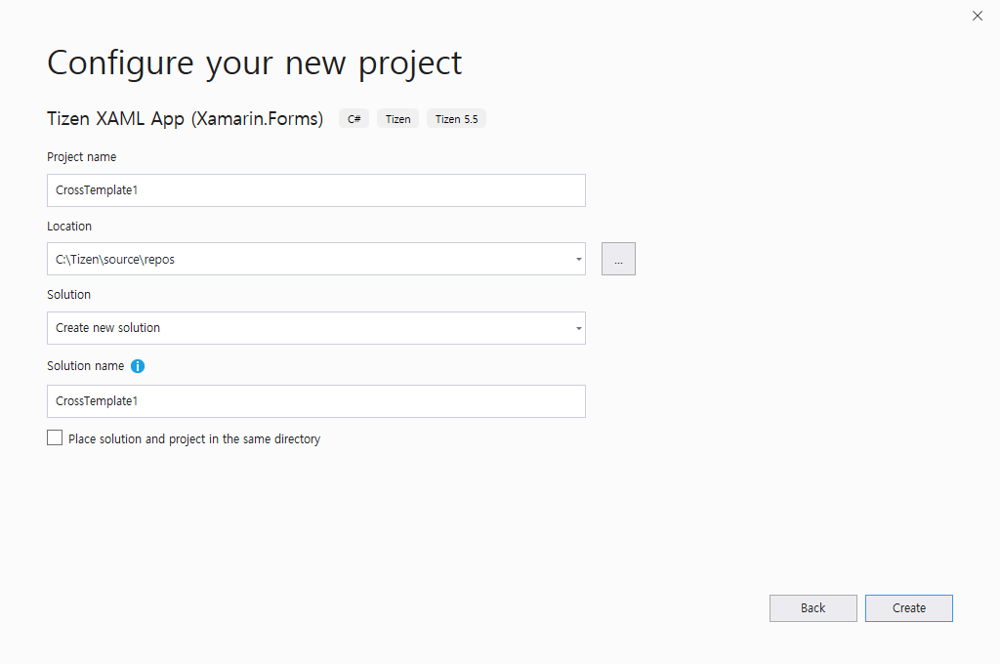
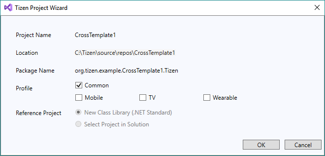
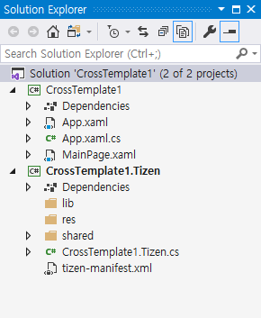
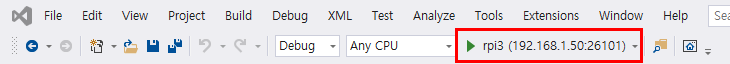
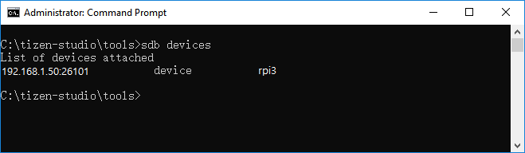
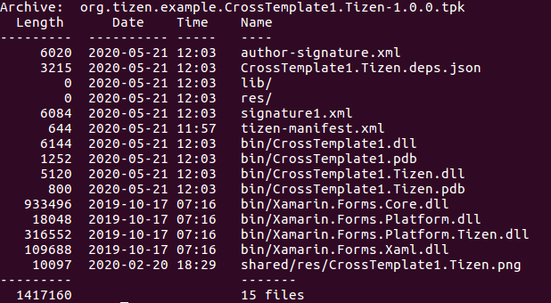

# Create Your First Tizen IoT .NET Application

The Tizen .NET framework allows you to easily and efficiently create applications for Tizen. Study the following instructions to help familiarize yourself with the Tizen .NET application development process. With the instructions, you can create and run a basic .NET application, which displays some texts on the screen without any user interaction.

1.  Before you get started with developing Tizen applications, set up the [development environment](../../../vstools/install.md).

2. [Create a Project](#create-a-project) using Visual Studio.

    This step shows how you can use a predesigned project template that creates all the basic files and folders required for your project.

3. [Build Your Application](#build-your-application).

    After you have implemented code for the features you want, this step shows how you can build the application to validate and compile the code.

4. [Deploy and Run Your Application](#deploy-and-run-your-application).

    This step shows how you can deploy and run the application on the reference board.

5. [Understand Your Application](#understand-your-application).

    This step explains the controls used in the application and the default structure of the basic files.

6. [Package Your Application](#package-your-application).

    This step shows how you can package your application.

## Create a Project

The following example shows you how to create and configure a basic Tizen .NET application project in Visual Studio. An application project contains all the files that make up an application.

The following figure illustrates the output of the application. 



The application screen displays a message, **Welcome to Xamarin Forms!** and there is no user interaction.

To create a new Tizen .NET project:

1.  Launch Visual Studio 2019.

2. In the Visual Studio menu, select **File \> New \> Project**.

    

    A New Project window appears.

3. Select **C\#** from languages and **Tizen** from platforms, select **Tizen XAML App (Xamarin.Forms)** template and click **Next**.

    

    Configure the project properties and click **Create**. You can enter **Project name**, **Location**, **Solution**, and **Solution name**.

    

    The **Tizen Project Wizard** pop-up window appears.

4. Select the profile, **Common** and click **OK**.

    


The following figure illustrates a solution with the common project created and displayed in the **Solution Explorer** view:



-   The **\<projectname\>** project contains the Xamarin.Forms code shared across platforms.
-   A common project titled **\<projectname\>.Tizen** is added. It contains code to instantiate your common application within the Tizen framework.


The `.xaml` file in the portable project already contains simple Xamarin.Forms code that makes a basic UI.

## Build Your Application

After you create the application project, you can implement the required features. In this example, only the default features from the project template are used, and no code change is required.

When your application code is ready, build the application. The building process performs a validation check and compiles your files. You must sign the application package with an author certificate when building the application. If you have not yet registered a Tizen certificate in Visual Studio, see [Certificate Manager](../../../vstools/tools/certificate-manager.md).

There are two different ways to build the application:

-   In the Visual Studio menu, select **Build \> Build Solution**.
-   In the **Solution Explorer** view, right-click the solution name and select **Build**.

Tizen .NET applications are always deployed as installable packages. The package files have the `.tpk` file extension, and the process of generating a package is controlled by the [manifest file](../../../vstools/tools/manifest-editor.md). The Visual Studio template generates the manifest file (`tizen-manifest.xml`) to the top level of the \<projectname\>.Tizen project.

For this example application, the default manifest is sufficient. If you want to make any change in the application, such as changing the application icon or installing resources that are used by the application at runtime, see [Package Your Application](#package-your-application).

After you build the application, deploy and run it.

## Deploy and Run Your Application

To run the UI application, you must first deploy it to the reference board with the headed image installed. Deploying means transferring the package file (`.tpk`) to the target and invoking the Tizen Package Manager to install it.

To deploy and run the application on the reference board:

1. Connect the reference board to your PC.

2. Once you connect the reference board, you can deploy the application by clicking the reference board instance in the Visual Studio toolbar. Make the Tizen project as a start-up project with **Set as StartUp Project**.

    

    In the Visual Studio toolbar, you can select the reference board from the drop-down list to change the deployment target.


3. If the deployment is successful, the application icon is visible on the device screen. Click the icon to launch the application.

    The following figure shows the launched application on the reference board:

    

Visual Studio uses the Smart Development Bridge (SDB) to communicate with the reference board. If you encounter a problem with detecting the device in Visual Studio, you can check the SDB manually:

1.  In the Visual Studio menu, select **Tools \> Tizen \> Tizen Sdb Command Prompt**.
2.  In the command prompt, enter `sdb devices`.

    

    A list of attached devices appears.

If you face any issue during deployment, it is recommended to manually install the application using SDB:

-   IoT application:

    ```bash
    $ sdb install <path-to-package>/org.tizen.example.CrossTemplate1.Tizen-1.0.0.tpk
    ```

## Understand Your Application

The C\# code from your first application displays a label centered on the screen, containing the **Welcome to Xamarin Forms!** text. This CrossTemplate1 application created from the template is set up and ready to be built and run by Visual Studio right after you create it, as described above.

The Xamarin.Forms controls used to create the user interface of a Tizen .NET application can be broadly categorized into four groups:

-   `Pages` represent screens within an application. The UI of an application is built from one or more pages and with a navigation mechanism, if needed. The navigation scheme is specified by the `INavigation` interface. Many pages are of the `ContentPage` type, which describes the view of a single screen.
-   `Layouts` are containers used to compose views into logical structures. Some available types are absolute, grid, relative, and stack layouts; each provides mechanisms, such as orientation, spacing, and padding, to control the layout. The `StackLayout` class is a basic layout where you can simply stack controls on top of, or side-by-side, one another. Layouts can also be bundled with and nested into each other.
-   `Views` are the controls displayed on the user interface, such as labels, buttons, and text entry boxes.
-   `Cells` are specialized elements used for items in tables and lists, which help describe how the items must be rendered.

The following shows the portable code portion of the Tizen Xamarin.Forms project **MainPage.xaml** file, generated by the template:

```xml
<?xml version="1.0" encoding="utf-8" ?>
<ContentPage xmlns="http://xamarin.com/schemas/2014/forms"
             xmlns:x="http://schemas.microsoft.com/winfx/2009/xaml"
             x:Class="CrossTemplate1.MainPage">
    <ContentPage.Content>
        <StackLayout>
            <Label Text="Welcome to Xamarin Forms!"
                VerticalOptions="CenterAndExpand" 
                HorizontalOptions="CenterAndExpand" />
        </StackLayout>
    </ContentPage.Content>
</ContentPage>
```

This application is constructed with the following Xamarin.Forms controls:

- There is the `ContentPage` where you set up the view to display. You assign what you want to display to the `Content` property of the ContentPage.
- The `StackLayout` is added. This layout positions ("stacks") its child elements in a single vertical (default) or horizontal line.
- The `Label` is added, whose `Text` property is the message you want to display.

The code does not show the instantiation of the `App` class. Since application launching is platform-specific, the launching part, including the instantiation of the `App` class and the declaration of the `Main()` function (required as the entry point of every C\# program), happens in the \<projectname\>.Tizen project, in the matching file there. The following example shows the content of the `<projectname>.Tizen.cs` file:

```csharp
using System;
using Xamarin.Forms;

namespace CrossTemplate1
{
    class Program : global::Xamarin.Forms.Platform.Tizen.FormsApplication
    {
        protected override void OnCreate()
        {
            base.OnCreate();

            LoadApplication(new App());
        }

        static void Main(string[] args)
        {
            var app = new Program();
            Forms.Init(app);
            app.Run(args);
        }
    }
}
```

## Package Your Application

A Tizen .NET application is deployed in the form of an installable package, with the package file extension `.tpk`. A Tizen .NET package has a relatively simple structure: internally it is a ZIP file with content that matches the directory layout of the project.

The package contains the following:

- The `shared` directory, which is for items that are considered system-wide (shareable).

    The application icon is packaged in the `shared/res` directory on installation, and the icon appears on the home screen with the icons for the other applications. You can either replace the icon (which is just a copy of the default Tizen logo) with one of your own using the file name generated by Visual Studio, or put a new icon in the same project directory and update the package manifest to indicate the new name.

- The `res` directory, which is for application-private resources.

    If the application needs a file to open at runtime, it can be placed here.

- The `bin` directory, which contains the generated application executable.
- The `lib` directory, which contains the generated application support code.

    If you use Nuget libraries, they are imported in the lib directory.

- The package manifest, which defines the application properties and is used at the installation time.
- Two signature files (author and distributor), which are checked at the installation time.

The following figure shows the layout of the platform-specific (Tizen) project: 


It includes the `lib`, `res`, and `shared` (with a `res` subdirectory containing an image file) directories, and the **tizen-manifest.xml** file. There is also the `bin` directory, which Visual Studio only shows if you select the **Show all files** option for the solution. These pieces all go into the package.

Package generation (and in fact installation) is controlled by the **tizen-manifest.xml** package manifest file. The following figure shows the `.tpk` file for the initial application to illustrate how the combination of the directory layout and the package manifest leads to the actual package.



When packaging your application, you also need to consider whether any feature or privilege declarations are needed in the manifest file and how to place any language-specific files.
