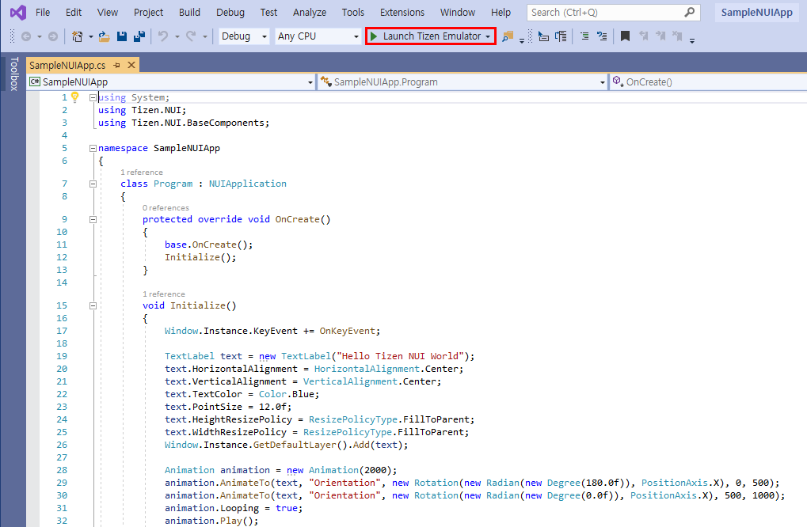
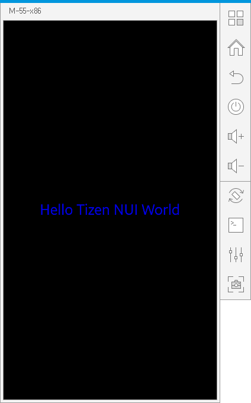

# Create Your First Tizen .NET NUI Application
The Tizen .NET framework allows you to easily and efficiently create applications for Tizen. Study the following instructions to help familiarize yourself with the Natural User Interface (NUI) application development process. With the instructions, you can create and run a basic NUI application, which displays some text on the screen with no user interaction.

   > **Dependencies**
   > - Tizen 4.0 and Higher

1. Before you get started with developing Tizen applications, set up the [development environment](../../../vstools/install.md).

2. [Creating a Project](#creating-a-project) using Visual Studio.
  This step shows how you can use a predesigned project template that
  creates all the basic files and folders required for your project.

3. [Enhancing Your Application](#enhancing-your-application).
  This step shows how you can enhance your application by creating a
  UI and making small alterations to it to improve the usability of the application.

4. [Building and Running NUI Application](#building-and-running-nui-application).
  This step shows how you can build and run the application on the emulator or a real target device.

## Prerequisites
- Visual Studio 2017
- [Visual Studio tools for Tizen](../../../vstools/install.md)

## Setting Up NUI Development Environment
To create a Tizen NUI app template, follow these steps:
1. [Creating a Project](#creating-a-project)
2. [Enhancing Your Application](#enhancing-your-application)
3. [Building and Running NUI Application](#building-and-running-nui-application)

## Creating a Project
The following example shows you how to create and configure a basic NUI application project in Visual Studio. An application project contains all the files that make up an application.
To create a Tizen NUI app, proceed as follows:

1.  Launch Visual Studio.
2.  In the Visual Studio menu, select File > New > Project.
3.  In **New project** menu, select **Tizen** > **Blank App (Tizen.NUI)**. Click **Next**:

    

4.  In **Configure your new project** dialog, specify the Project name, location and solution name. Click **Create**:

    

5.  The new project `SampleNUIApp` is shown in the **Solution Explorer** view:

    

    If Tizen.Net is available in NuGet packages then you can use the NUI APIs.

   > **Note**
   >
   > Tizen.Net : A set of Tizen .NET APIs. This includes all of the APIs built on top of Tizen platform.
   > You can select and install the Tizen.Net version via the nuget package manager.


## Enhancing Your Application
The `SampleNUIApp` is generated by Tizen project template. The project draws a "Hello Tizen NUI world" text and has a rotating animation.
It also demonstrates how you can react to touch events on the application screen.

You can add your code in **SampleNUIApp.cs** file:

```csharp
    using System;
    using Tizen.NUI;
    using Tizen.NUI.BaseComponents;

    namespace SampleNUIApp
    {
        class Program : NUIApplication
        {
            protected override void OnCreate()
            {
                base.OnCreate();
                Initialize();
            }

            void Initialize()
            {
                Window.Instance.KeyEvent += OnKeyEvent;

                TextLabel text = new TextLabel("Hello Tizen NUI World");
                text.HorizontalAlignment = HorizontalAlignment.Center;
                text.VerticalAlignment = VerticalAlignment.Center;
                text.TextColor = Color.Blue;
                text.PointSize = 12.0f;
                text.HeightResizePolicy = ResizePolicyType.FillToParent;
                text.WidthResizePolicy = ResizePolicyType.FillToParent;
                Window.Instance.GetDefaultLayer().Add(text);

                Animation animation = new Animation(2000);
                animation.AnimateTo(text, "Orientation", new Rotation(new Radian(new Degree(180.0f)), PositionAxis.X), 0, 500);
                animation.AnimateTo(text, "Orientation", new Rotation(new Radian(new Degree(0.0f)), PositionAxis.X), 500, 1000);
                animation.Looping = true;
                animation.Play();
            }

            public void OnKeyEvent(object sender, Window.KeyEventArgs e)
            {
                if (e.Key.State == Key.StateType.Down && (e.Key.KeyPressedName == "XF86Back" || e.Key.KeyPressedName == "Escape"))
                {
                    Exit();
                }
            }

            static void Main(string[] args)
            {
                var app = new Program();
                app.Run(args);
            }
        }
    }

```
### Adding text label

1.  Declare the required system and NUI namespaces:

    ```
    using System;
    using Tizen.NUI;
    using Tizen.NUI.BaseComponents;
    ```

2.  Scope the application to the `SampleNUIApp` namespace:

    ```
    namespace SampleNUIApp
    ```

3.  Derive the application from the [Tizen.NUI.NUIApplication](https://samsung.github.io/TizenFX/latest/api/Tizen.NUI.NUIApplication.html) class:

    ```
    class Program : NUIApplication
    ```

    The `Tizen.NUI.NUIApplication` class includes constructors that allow you to create applications with various stylesheets and window modes.

4.  To handle behavior when the application is launched, override the `OnCreate()` method of the `Tizen.NUI.NUIApplication` class and call the initialization method:

    ```
    protected override void OnCreate()
    {
        base.OnCreate();
        Initialize();
    }
    ```

    > **Note**  
    > To invoke the `Created` event of the [Tizen.Applications.CoreApplication](https://samsung.github.io/TizenFX/latest/api/Tizen.Applications.CoreApplication.html) class, you must call the `base.OnCreate()` method inside the override.

5.  Within the `Initialize()` method, set the text label properties:

    1.  Create the text label object from the [Tizen.NUI.BaseComponents.TextLabel](https://samsung.github.io/TizenFX/latest/api/Tizen.NUI.BaseComponents.TextLabel.html) class:

        ```
        TextLabel text = new TextLabel("Hello Tizen NUI World");

        ```

    2.  Align the text horizontally to the center of the available area:

        ```
        text.HorizontalAlignment = HorizontalAlignment.Center;
        ```

    3.  To illustrate the label width, set the label text color:

        ```
        text.TextColor = Color.Blue;
        ```

    4.  Define the text size in points:

        ```
        text.PointSize = 12.0f;
        ```

    For more information on the key properties of the `Tizen.NUI.BaseComponents.TextLabel` class, see [TextLabel](../../guides/nui/textlabel.md).

6.  Implement the main application window:
    1.  Create the window and add an event handler for the `KeyEvent` event of the [Tizen.NUI.Window](https://samsung.github.io/TizenFX/latest/api/Tizen.NUI.Window.html) class. This event handler is invoked whenever the key event is received.

        ```
        Window.Instance.KeyEvent += OnKeyEvent;
        ```

    2.  Add the text label to the window's root layer:

        ```
        Window.Instance.GetDefaultLayer().Add(text);
        ```

7.  Define the event handler to terminate the NUI application:

    ```
    public void OnKeyEvent(object sender, Window.KeyEventArgs e)
    {
        if (e.Key.State == Key.StateType.Down && (e.Key.KeyPressedName == "XF86Back" || e.Key.KeyPressedName == "Escape"))
        {
            Exit();
        }
    }
    ```

8.  To handle behavior when the window close button is clicked and the application is about to terminate, override the `OnTerminate()` method of the `Tizen.NUI.NUIApplication` class:

    ```
    protected override void OnTerminate()
    {
        base.OnTerminate();
    }
    ```

    >  **Note**  
    > To invoke the `Terminated` event of the `Tizen.Applications.CoreApplication` class, you must call the `base.OnTerminate()` method inside the override.

9.  Implement the `Main()` method:
    1.  Create the application through the default constructor:

        ```
        static void Main(string[] args)
        {   
            var app = new Program();
            app.Run(args);
        }

        ```

    2.  Start the application main loop.

        This ensures that images are displayed, and that events and signals are dispatched and captured.

        In this simple tutorial, the `Main()` method resides within the class. For significant application development, the `Main()` method must be placed in a separate `.cs` file.

        ```
        app.Run(args);
        ```

## Building and Running NUI Application
1.  Building the solution:

    - In the Visual Studio menu, select **Build** > **Build Solution**.

    - In the Solution Explorer view, right-click the solution name and select **Build**.

2.  Launching Tizen Emulator:

    - In the Visual Studio menu, select **Tools &gt; Tizen &gt; Tizen Emulator Manager**.

    - Alternatively, click **Launch Tizen Emulator** in the Visual Studio toolbar to launch the Tizen Emulator Manager:

      

    - In the Emulator Manager, select an emulator from the list, and click **Launch**:

      

    - You must update the following emulator images to use the latest version.

3.  After you launch an emulator instance, you can select the target from the drop-down list to change the deployment target in the Visual Studio toolbar:

    

    You can deploy your NUI app to the target emulator in one of the following ways:

    1. Press the **F5** key or **Ctrl+F5** key.

    2. In the Visual Studio menu, select **Debug > Start Debugging** or **Start Without Debugging**.

    3. On the Visual Studio toolbar, click an emulator instance:

       

4.  If the deployment is successful, then the application is launched on the target emulator.

    The following are snapshots of launching this NUI app on mobile emulators:

    **Figure: NUI app on Mobile emulator**

    

    Visual Studio uses the Smart Development Bridge (SDB) to communicate with the target device or emulator.

    You can also deploy your NUI application with SDB manually:

    1.  Copy the application .tpk file from the project binary path to the SDB tool path:

        - The `SampleNUIApp` tpk file(`org.tizen.example.SampleNUIApp-1.0.0.tpk`) is located in `ProjectPath\SampleNUIApp\SampleNUIApp\bin\Debug\tizen50`.

        - To locate the project path in the Solution Explorer view, right-click the solution name and click **Open Folder in File Explorer**.

        - SDB tool is located in `c:\tizen\tools\sdb.exe`.

    2.  Launch the Tizen SDB command prompt:

        - For Windows OS, launch the Tizen SDB command prompt (**Tool** > **Tizen** > **Tizen Sdb Command Prompt**).

        - For Linux OS, you can use the SDB command directly in your project path.

    3.  Install your application using the following SDB command:

        ```
        sdb install org.tizen.example.SampleNUIApp-1.0.0.tpk
        ```

