# Create Your First Tizen TV .NET Application

The Tizen .NET framework allows you to easily and efficiently create applications for Tizen. Study the following instructions to help familiarize yourself with the Tizen .NET application development process. With the instructions, you can create and run a basic .NET application, which displays some text on the screen with no user interaction.

1.  Before you get started with developing Tizen applications, set up the [development environment](../../../vstools/install.md).

2. [Create a Project](#create-a-project) using Visual Studio.

    This step shows how you can use a predesigned project template that creates all the basic files and folders required for your project.

3. [Build Your Application](#build-your-application).

    After you have implemented code for the features you want, this step shows how you can build the application to validate and compile
    the code.

4. [Deploy and Run Your Application](#deploy-and-run-your-application).

    This step shows how you can deploy and run the application on the emulator or a real target device.

5. [Enhance Your Application](#enhance-your-application).

    This step shows how you can enhance your application by creating a UI and making small alterations to it to improve the usability of the application.

## Create a Project

The following example shows you how to create and configure a basic Tizen .NET application project in Visual Studio. An application project contains all the files that make up an application.

The following figure illustrates the output of application. The application screen displays a message, **Welcome to Xamarin Forms!** and there is no user interaction.

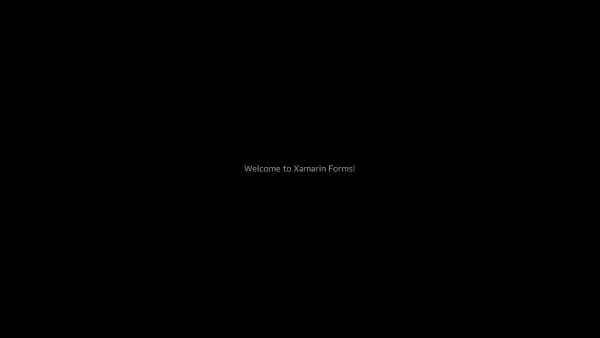

To create a new Tizen .NET project:

1.  Launch Visual Studio 2019.

2. In the Visual Studio menu, select **File \> New \> Project**.

    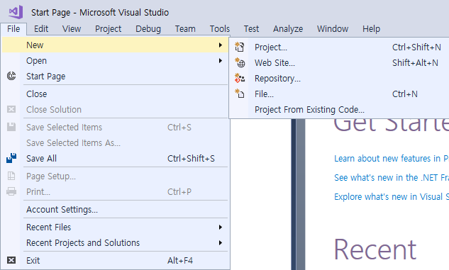

    A New Project window appears.

3. Select **C\#** in languages and **Tizen** in platforms, select **Blank App (Xamarin.Forms)** template, and then click **Next**.

    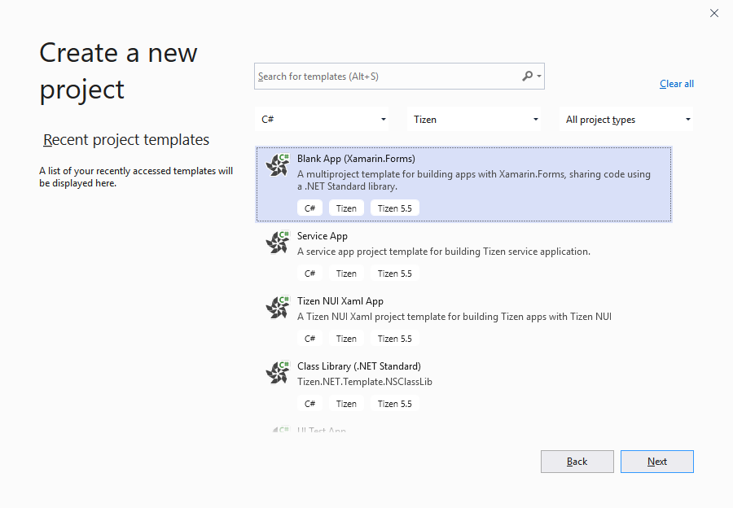

    Configure the project properties and click **Create**. You can enter the **Project name**, **Location**, **Solution**, and **Solution name**.

    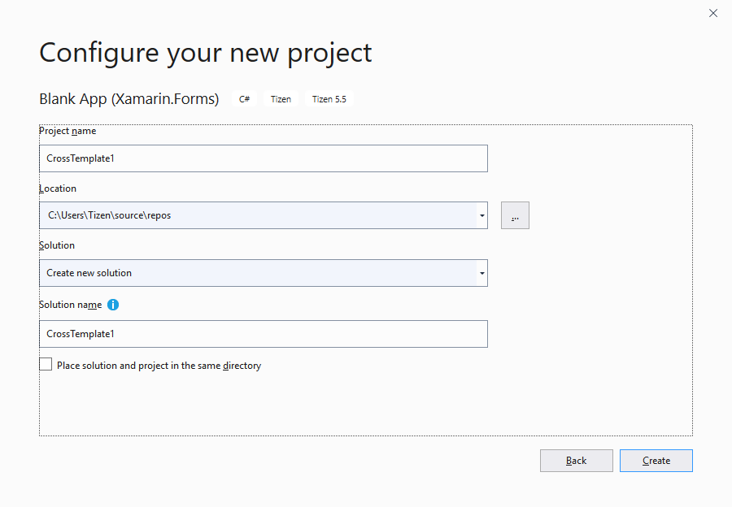

    The **Tizen Project Wizard** pop-up window appears.

4. Select the profile, **TV** and click **OK**.

    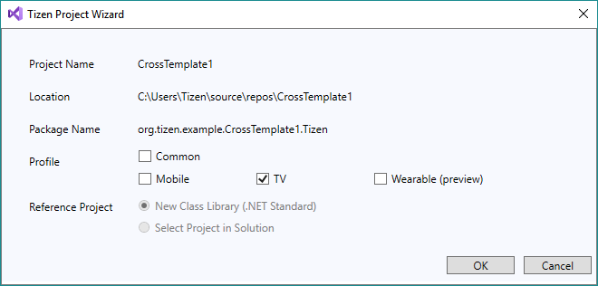

    If you select the **Common** profile, you cannot select **Mobile**, **TV**, or **Wearable**.

The following figure illustrates a solution with four projects created and displayed in the **Solution Explorer** view:


-   The **\<projectname\>** project contains the Xamarin.Forms code shared across platforms.
-   If you select the common profile in the Tizen Project Wizard, a common project titled **\<projectname\>.Tizen** is added. It contains code to instantiate your common application within the Tizen framework.
-   If you select the TV profile in the Tizen Project Wizard, a TV project titled **\<projectname\>.Tizen.TV** is added. It contains code to instantiate your TV application within the Tizen framework.

If you are already familiar with Xamarin.Forms, this project has the same structure as a Xamarin.Forms portable application. The **\<projectname\>** project is the portable class library and the others are the platform-specific projects; however, in Tizen .NET, only the Tizen platform-specific project is generated.

The `.cs` file in the portable project already contains simple Xamarin.Forms code that makes a basic UI.

## Build Your Application

After you have created the application project, you can implement the required features. In this example, only the default features from the project template are used, and no code changes are required.

When your application code is ready, build the application. The building process performs a validation check and compiles your files. You must sign the application package with an author certificate when building the application. If you have not yet registered a Tizen certificate in Visual Studio, see [Certificate Manager](../../../vstools/tools/certificate-manager.md).

There are two different ways to build the application:

-   In the Visual Studio menu, select **Build \> Build Solution**.
-   In the **Solution Explorer** view, right-click the solution name and select **Build**.

Tizen .NET applications are always deployed as installed packages. The package files have the `.tpk` file extension, and the process of generating a package is controlled by the [manifest file](../../../vstools/tools/manifest-editor.md). The Visual Studio template generates the manifest file (`tizen-manifest.xml`) to the top level of the \<projectname\>.Tizen project (if you create projects with mobile, TV, or wearable profiles, a separate manifest file is generated for each profile).

For this example application, the default manifest is sufficient. If you want to make any changes in the application, such as changing the application icon or installing resources that are used by the application at runtime, see [Package Your Application](#package-your-application).

After you have built the application, deploy and run it.

## Deploy and Run Your Application

To run the application, you must first deploy it to the target: either a device or an emulator. Deploying means transferring the package file (`.tpk`) to the target and invoking the Tizen Package Manager to install it.

To deploy and run the application on the emulator:

1.  In the Visual Studio menu, select **Tools \> Tizen \> Tizen Emulator Manager**.

    Alternatively, click **Launch Tizen Emulator** in the Visual Studio toolbar to launch the Tizen Emulator Manager.

    

2.  In the Emulator Manager, select an emulator from the list and click **Launch**.

    If no applicable emulator instance exists, [create one](../../../vstools/tools/emulator-manager.md#create).

    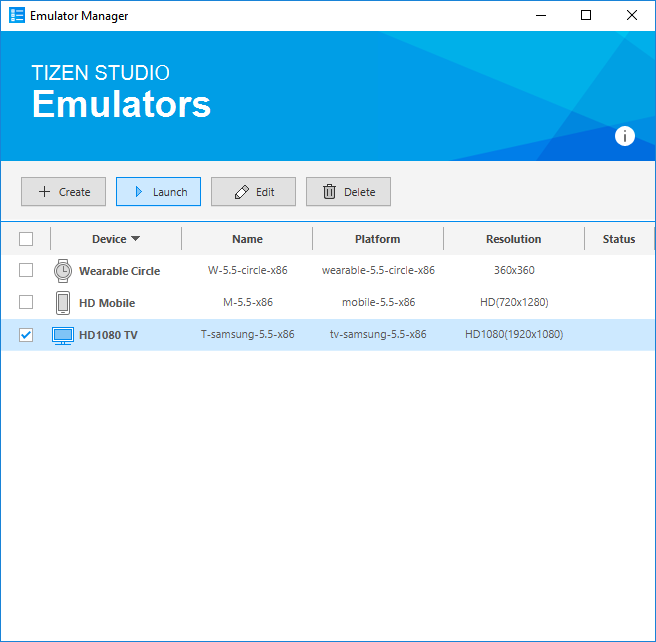

3. Once you launch an emulator instance, you can deploy the application by clicking the emulator instance in the Visual Studio toolbar. Make the TV project **Set as StartUp Project**.

    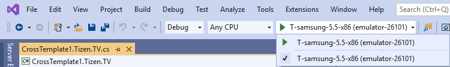

    In the Visual Studio toolbar, you can select the target from the drop-down list to change the deployment target.

    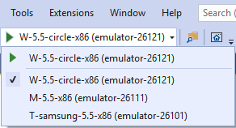

4. If deployment is successful, the application icon is visible on the emulator or device screen. Click the icon to launch the application.  The following figure shows the launched application on the TV emulator:

    

Visual Studio uses the Smart Development Bridge (SDB) to communicate with the target device or emulator. If you encounter problems with detecting the device in Visual Studio, you can check the SDB manually:

1.  In the Visual Studio menu, select **Tools \> Tizen \> Tizen Sdb Command Prompt**.
2.  In the command prompt, enter `sdb devices`.

    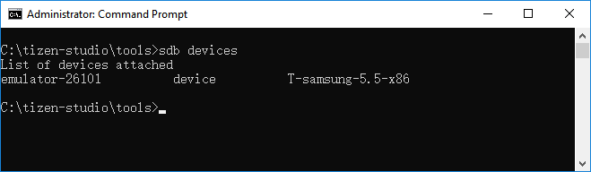

    A list of the attached devices appears.

If you face any issues during deployment, it is recommended to manually install the application using SDB:

- TV application:

    ```bash
    $ sdb install <path-to-package>/org.tizen.example.CrossTemplate1.Tizen.TV-1.0.0.tpk
    ```

## Enhance Your Application

Xamarin.Forms provides a way to build portable applications which run in a native way. It provides a set of controls for building a user interface, as well as generates code which adapts the user interface code to use the native facilities of the supported platforms. The following is a brief introduction to the Xamarin.Forms controls, and how to use them to build on the application you have just created.

### Understand the Source Code

The C\# code from your first application displays a label centered on the screen, containing the **Welcome to Xamarin Forms!** text. This CrossTemplate1 application created from the template is set up and ready to be built and run by Visual Studio right after you create it, as described above.

The Xamarin.Forms controls used to create the user interface of a Tizen .NET application can be broadly categorized into four groups:

-   `Pages` represent screens within an application. The UI of an application is built from one or more pages and with a navigation mechanism, if needed. The navigation scheme is specified by the `INavigation` interface. Many pages are of the `ContentPage` type, which describes the view of a single screen.
-   `Layouts` are containers used to compose views into logical structures. Some available types are absolute, grid, relative, and stack layouts; each provide mechanisms, such as orientation, spacing, and padding, to control the layout. The `StackLayout` class is a basic layout where you can simply stack controls on top of, or side-by-side, one another. Layouts can also be bundled with and nested into each other.
-   `Views` are the controls displayed on the user interface, such as labels, buttons, and text entry boxes.
-   `Cells` are specialized elements used for items in tables and lists, which help describe how the items must be rendered.

The following shows the portable code portion of the Tizen Xamarin.Forms project **CrossTemplate1.cs** file, generated by the template:

```csharp
using System;
using System.Collections.Generic;
using System.Linq;
using System.Text;
using Xamarin.Forms;

namespace CrossTemplate1
{
    public class App : Application
    {
        public App()
        {
            /// Root page of your application
            MainPage = new ContentPage
            {
                Content = new StackLayout
                {
                    VerticalOptions = LayoutOptions.Center,
                    Children =
                    {
                        new Label
                        {
                            HorizontalTextAlignment = TextAlignment.Center,
                            Text = "Welcome to Xamarin Forms!"
                        }
                    }
                }
            };
        }
        protected override void OnStart()
        {
            /// Handle when your app starts
        }
        protected override void OnSleep()
        {
            /// Handle when your app sleeps
        }
        protected override void OnResume()
        {
            /// Handle when your app resumes
        }
    }
}
```

This application is constructed with the following Xamarin.Forms controls:

- The `App` class is declared, deriving from the [Xamarin.Forms.Application](https://developer.xamarin.com/api/type/Xamarin.Forms.Application/) class, which represents a cross-platform mobile application.
- The `App` class constructor creates a `ContentPage` instance where you set up the view to display.
- You assign what you want to display to the `Content` property of the `ContentPage` class.

    In this case, the content is a container, specifically a `StackLayout` instance. This layout positions ("stacks") its child elements in a single vertical (default) or horizontal line.

- Child elements are added to the `Children` property. In this example, a single `Label` instance is added, whose `Text` property is the message you want to display.
- Some lines implement control over the layout. For example, the stack is set to vertically center the child elements, and the label is set to use center-alignment for its text.
- Besides the `App` constructor, the rest of the file is just a template. Event handlers from the `Application` class can be filled in if the application needs to handle application state changes.

The code does not show the instantiation of the `App` class. Since application launching is platform-specific, the launching part, including the instantiation of the `App` class and the declaration of the `Main()` function (required as the entry point of every C\# program), happens in the \<projectname\>.Tizen project, in the matching file there. For example, if the file you are looking at in the portable project is named `<projectname>.cs`, the platform-specific file in the \<projectname\>.Tizen.\<platform\> project is `<projectname>.Tizen.TV.cs`. For a similar application, which uses only Xamarin.Forms controls, the generated code at the \<projectname\>.Tizen part of the project contains everything needed, and you do not need to make any modifications. The following example shows the content of the `<projectname>.Tizen.TV.cs` file:

```csharp
using System;

namespace CrossTemplate1
{
    class Program : global::Xamarin.Forms.Platform.Tizen.FormsApplication
    {
        protected override void OnCreate()
        {
            base.OnCreate();
            LoadApplication(new App());
        }

        static void Main(string[] args)
        {
            var app = new Program();
            global::Xamarin.Forms.Platform.Tizen.Forms.Init(app);
            app.Run(args);
        }
    }
}
```

### Add a Button and the Second Label

To modify and build a new application, create a new project. The default name for the second project is **CrossTemplate2** (as shown in the namespace declaration in the following step list), but of course you can name it anything you want.

The basic template uses a label which displays text in an area of the screen. The properties inherited from the base classes of `Label` give control over the display: font attributes, families, and sizes, as well as layout options. Modify the application by adding a button control. It is similar to the label, but is specifically designed to react to click events. As a result, the `Button` class defines the `Clicked` event, which tells the application what to do when the click event takes place.

In order to do something visible on the screen to show that you have received the click event, define another label. Give the new label a value to be displayed in the initial state, and make the button click event handler update the text and button color once the click event triggers.

To modify the application by adding a button and label:

1. Since the click event triggers outside the class constructor, declare the button, the label, and a click counter at the class level:

    ```csharp
    using System;
    using System.Collections.Generic;
    using System.Linq;
    using System.Text;
    using Xamarin.Forms;

    namespace CrossTemplate2
    {
        public class App : Application
        {
            Button button;
            Label label;
            int clicks = 0;
    ```

2. Instantiate the button, and add the `OnButtonClicked` event handler to the button's `Clicked` event:

    ```csharp
            public App()
            {
                button = new Button
                {
                    Text = "Click here!",
                    BackgroundColor = Color.Red,
                    HorizontalOptions = LayoutOptions.Center,
                };
                button.Clicked += OnButtonClicked;
    ```

3. Instantiate the label, and give the label a value to be displayed in the initial state by setting the `Text` property:

    ```csharp
                label = new Label
                {
                    Text = "unclicked",
                    HorizontalOptions = LayoutOptions.Center,
                };
    ```

4. Change the initial text of the first label to "Welcome to Tizen!", and include the new button and label as children of the `StackLayout`, so they are stacked below the first label:

    ```csharp
                /// The root page of your application
                MainPage = new ContentPage
                {
                    Content = new StackLayout
                    {
                        VerticalOptions = LayoutOptions.Center,
                        Children = {
                            new Label {
                                HorizontalTextAlignment = TextAlignment.Center,
                                Text = "Welcome to Tizen!"
                            },
                            button,
                            label,
                        }
                    }
                };
            }
    ```

5. To change the new label's properties when the button is clicked, define the `OnButtonClicked` event handler.

    When an event triggers, two parameters are delivered to any handler set up to watch it. The first parameter is an object representing the control that triggered the event and the second parameter is the event data appropriate to the event type.

    Increment the click counter, build a string showing how many times the button has been clicked, and set the `Text` property of the label to that string.

    Just for visual effect, you can also set the button background color to something different than the initial color set when the button was instantiated.

    ```csharp
            void OnButtonClicked(object s, EventArgs e)
            {
                clicks += 1;
                label.Text = String.Format("Number of clicks: {0}", clicks);
                button.BackgroundColor = Color.Blue;
            }
            protected override void OnStart()
            {
                /// Handle when your app starts
            }
            protected override void OnSleep()
            {
                /// Handle when your app sleeps
            }
            protected override void OnResume()
            {
                /// Handle when your app resumes
            }
        }
    }
    ```

The following image shows what happens when you run the modified code.

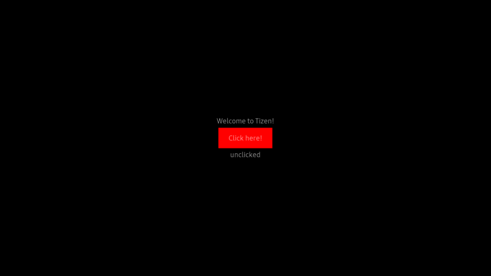

At startup, the button is red and the text below the button is **unclicked**. After a couple of clicks, the click counter is displayed below the button, and the button color has changed.

This topic only introduces the controls in use in the example above. For more information on Xamarin.Forms, see the [Xamarin Developer Center](https://developer.xamarin.com/guides/xamarin-forms/). There is also [a comprehensive book about Xamarin.Forms](https://developer.xamarin.com/guides/xamarin-forms/creating-mobile-apps-xamarin-forms/) available as a free download from Microsoft Press.

## Package Your Application

A Tizen .NET application is deployed in the form of an installable package, with the package file extension `.tpk`. A Tizen .NET package has a relatively simple structure: internally it is a ZIP file with content that matches the directory layout of the project.

The package contains the following:

- The `shared` directory, which is for items that are considered system-wide (shareable).

    The application icon is packaged in the `shared/res` directory on installation, and the icon appears on the home screen with the icons for the other applications. You can either replace the icon (which is just a copy of the default Tizen logo) with one of your own using the file name generated by Visual Studio, or put a new icon in the same project directory and update the package manifest to indicate the new name.

- The `res` directory, which is for application-private resources.

    If the application needs a file to open at runtime, it can be placed here.

- The `bin` directory, which contains the generated application executable.
- The `lib` directory, which contains the generated application support code.

    If you use nugget libraries, they are imported in the lib directory.

- The package manifest, which defines the application properties and is used at the installation time.
- Two signature files (author and distributor), which are checked at the installation time.

The following figure shows the layout of the platform-specific (Tizen) project. 


It includes the `lib`, `res`, and `shared` (with a `res` subdirectory containing an image file) directories, and the **tizen-manifest.xml** file. There is also the `bin` directory, which Visual Studio only shows if you select the **Show all files** option for the solution. These pieces all go into the package.

Package generation (and in fact installation) is controlled by the **tizen-manifest.xml** package manifest file. The following figure shows the `.tpk` file for the initial application, to illustrate how the combination of the directory layout and the package manifest leads to the actual package.

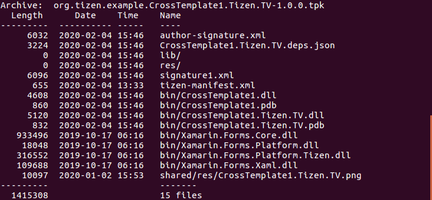

When packaging your application, you also need to consider whether any feature or privilege declarations are needed in the manifest file, and how to place any language-specific files.
