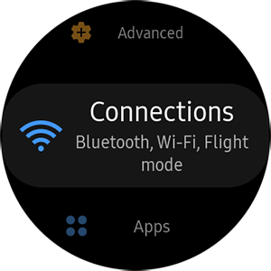
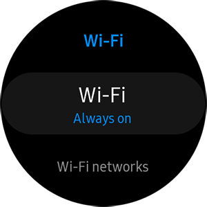

# Connect Your Wearable

To publish a Tizen .NET application to the Samsung Galaxy Store, you have to first test your application on the Samsung Gear devices.
Since Samsung Gear does not have a USB port, Tizen provides support to publish your app to the app store over Wi-Fi.

Therefore, you must connect the Gear device and the host PC to Wi-Fi, or the Unshielded-Twisted-Pair (UTP) cable to the same local network.


## Prepare Gear Device

To debug an application on the Samsung Gear device:

1. Execute the **Settings** application.

2. Scroll to the bottom of the menu and tap **About watch**.

    

3. Tap **Debugging** to turn it on.

    

4. Press the back button of the hardware, scroll to the **Connections**  menu, and tap it.

    

5. Tap **Wi-Fi** to turn it on.

    

    

    

    

## Debugging over Wi-Fi

To install and execute your application on the Samsung Gear device over Wi-Fi, follow these steps:

1. In the Visual Studio menu, select **Tizen** > **Tizen Device Manager** > **Remote Device Manager**.

    

2. To search for remote Samsung Gear devices, click **Scan Devices**. A list of available remote devices appears.

    

    

3. Select the IP of the Samsung Gear device that you want to connect to.

    

    The connected Gear device appears on the Device Manager Explorer window.
	
    

## Connecting via the SDB command

To connect to the Samsung Gear device using the SDB command, follow this step:

Open the Command Prompt in the host PC and enter the following command:

```bash
$ sdb connect [Gear S2 IP address]:26101
```

Example:

```bash
$ sdb connect 192.168.0.71:26101
```
	

The list of devices that are connected to the Gear devices appears:

```bash
$ sdb devices
List of devices attached
192.168.0.71:26101      device       SM-R805U
```
