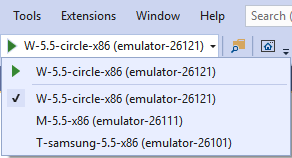
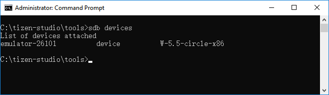

# Create Your First Tizen Wearable XAML Application

The Tizen .NET framework allows you to easily and efficiently create applications for Tizen. Study the following instructions to help familiarize yourself with the Tizen .NET application development process. With the instructions, you can create and run an application, which displays some text on the screen with no user interaction to define user interfaces using markup rather than code.

1.  Before you get started with developing Tizen applications, set up the [development environment](../../../vstools/install.md).

2. [Create a Project](#create-a-project) using Visual Studio.

    This step shows how you can use a predesigned project template that creates all the basic files and folders required for your project.

3. [Build Your Application](#build-your-application).

    After you have implemented code for the features you want, this step shows how you can build the application to validate and compile the code.

4. [Deploy and Run Your Application](#deploy-and-run-your-application).

    This step shows how you can deploy and run the application on the emulator or a real target device.

5. [Enhance Your Application](#enhance-your-application).

    This step shows how you can enhance your application by creating a UI and making small alterations to it to improve the usability of the application.

## Create a Project

The following example shows you how to create and configure a basic Tizen .NET application project in Visual Studio. An application project contains all the files that make up an application.

The following figure illustrates the output of application. 


The application screen displays a message, **Welcome to Xamarin.Forms!** and there is no user interaction.

To create a new Tizen .NET project:

1. Launch Visual Studio 2019.

2. In the Visual Studio menu, select **File \> New \> Project**.

    

    A New Project window appears.

3. In **languages** drop-down list, select **C\#**. In **platforms** drop-down list, select **Tizen**. In **project types**, select **Tizen 5.5**.

    In the template list, select **Tizen Wearable Xaml App** template and then click **Next**.

    

4. Configure the project properties and click **Create**. You can enter the **Project name**, **Location**, **Solution**, and **Solution name**.

    

Once a project is created, you can see your solutions and projects in the **Solution Explorer** view.


The generated files and the project layout as follow:
-   `lib`: The folder for external library files
-   `res`: The folder for resource files used by the application only
-   `shared`: The folder for resource files to be shared with other applications
-   `App.xaml`: Contains resources information
-   `MainPage.xaml`: Contains the layout of the application
-   `tizen-manifest.xml`: The manifest file used by the platform to install and launch the application
-   `TizenWearableXamlApp1.cs`: Contains the application code.

## Build Your Application

After you have created the application project, you can implement the required features. In this example, only the default features from the project template are used, and no code changes are required.

When your application code is ready, build the application. The building process performs a validation check and compiles your files. You must sign the application package with an author certificate when building the application. If you have not yet registered a Tizen certificate in Visual Studio, see [Certificate Manager](../../../vstools/tools/certificate-manager.md).

There are two different ways to build the application:

-   In the Visual Studio menu, select **Build \> Build Solution**.
-   In the **Solution Explorer** view, right-click the solution name and select **Build**.

Tizen .NET applications are always deployed as installed packages. The package files have the `.tpk` file extension, and the process of generating a package is controlled by the [manifest file](../../../vstools/tools/manifest-editor.md). The Visual Studio template generates the manifest file (`tizen-manifest.xml`) to the top level of the \<projectname\> project.

For this example application, the default manifest is sufficient. If you want to make any changes in the application, such as changing the application icon or installing resources that are used by the application at runtime, see [Package your application](#package-your-application).

After you have built the application, deploy and run it.

## Deploy and Run Your Application

To run the application, you must first deploy it to the target: either a device or an emulator. Deploying means transferring the package file (`.tpk`) to the target and invoking the Tizen Package Manager to install it.

To deploy and run the application on the emulator:

1.  In the Visual Studio menu, select **Tools \> Tizen \> Tizen Emulator Manager**.

    Alternatively, click **Launch Tizen Emulator** in the Visual Studio toolbar to launch the Tizen Emulator Manager.

    

2. In the Emulator Manager, select an emulator from the list and click **Launch**.

    If no applicable emulator instance exists, [create one](../../../vstools/tools/emulator-manager.md#create).

    

3. Once you launch an emulator instance, you can deploy the application by clicking the emulator instance in the Visual Studio toolbar.

    

    In the Visual Studio toolbar, you can select the target from the drop-down list to change the deployment target.

    

4. If deployment is successful, the application icon is visible on the emulator or device screen. Click the icon to launch the application.

    The following figure shows the launched application on the wearable emulator:

    

Visual Studio uses the Smart Development Bridge (SDB) to communicate with the target device or emulator. If you encounter problems with detecting the device in Visual Studio, you can check the SDB manually:

1. In the Visual Studio menu, select **Tools \> Tizen \> Tizen Sdb Command Prompt**.
2. In the command prompt, enter `sdb devices`.

    

    A list of the attached devices appears.

If you face any issues during deployment, it is recommended to manually install the application using SDB:

```bash
$ sdb install <path-to-package>/org.tizen.example.TizenWearableXamlApp1-1.0.0.tpk
```

## Enhance Your Application

Tizen Wearable XAML application adopts and integrates Xamarin.Forms XAML, which is mostly used to define the visual contents of a page and works together with a C# code-behind file.
If you create your application using **Tizen Wearable Xaml App** template, you can update the UI and the business logic layer separately as they are not coupled and add different layout-xaml files for different configurations. 

For more information about creating a XAML application, see [Part 1. Getting Started with XAML](https://docs.microsoft.com/en-us/xamarin/xamarin-forms/xaml/xaml-basics/get-started-with-xaml).

### Understand the Source Code

The C\# code from your first application displays a label centered on the screen, containing the **Welcome to Xamarin.Forms!** text. This XAML application created from the template is set up and ready to be built and run by Visual Studio right after you create it, as described above.

**TizenWearableXamlApp1** project has a pair of files: `App.xaml` is the XAML file and `App.xaml.cs` is the C# code-behind file associated with the XAML file. Both of them contribute to a class named `App` that derives from `Application`.

To see the code-behind file, `App.xaml.cs`, click the arrow icon next to `App.xaml`.

The other two XAML files in `TizenWearableXamlApp1` project are associated to a class that derives from `CirclePage` to define the visual contents of an entire page :
- `MainPage.xaml`: The XAML file
- `MainPage.xaml.cs`: The C# code-behind file

The following code snippet shows `MainPage.xaml` file:
```xml
<?xml version="1.0" encoding="utf-8" ?>
<c:CirclePage xmlns="http://xamarin.com/schemas/2014/forms"
             xmlns:x="http://schemas.microsoft.com/winfx/2009/xaml"
             xmlns:c="clr-namespace:Tizen.Wearable.CircularUI.Forms;assembly=Tizen.Wearable.CircularUI.Forms"
             x:Class="TizenWearableXamlApp1.MainPage">
  <c:CirclePage.Content>
    <StackLayout>
      <Label Text="Welcome to Xamarin.Forms!"
          VerticalOptions="CenterAndExpand"
          HorizontalOptions="CenterAndExpand" />
    </StackLayout>
  </c:CirclePage.Content>
</c:CirclePage>
```
Within the namespace declarations in the root tag (`c:CirclePage`) of the XAML files, you can see two XML namespace (`xmlns`) declarations referring to URIs. The first XML namespace declaration means that tags defined with no prefix refer to classes in Xamarin.Forms. The second namespace declaration with the `x` prefix maps several elements and attributes that are intrinsic to XAML itself and which are supported by other implementations of XAML.

The namespace declaration with `c` prefix allows you to access custom classes. The CLR namespace(`clr-namespace`) is declared within the assembly that contains the public types to expose as elements.

At the end of the root tag, the `x` prefix is used for an attribute named Class. Because the use of this `x` prefix is virtually universal for the XAML namespace, XAML attributes such as `Class` are almost always referred to as `x:Class`. The `x:Class` attribute specifies a fully qualified .NET class name: the `MainPage` class in the `TizenWearableXamlApp1` namespace. This means that this XAML file defines a new class named `MainPage` in the `TizenWearableXamlApp1` namespace that derives from `CirclePage`.

The `c:CirclePage.Content` tag is called property element tags. `Content` is a property of `CirclePage`, and is generally set to a single view or a layout with child views. Normally properties become attributes in XAML.

`StackLayout` tag sets the `TizenWearableXamlApp1` layout that contains a 'Label', but you can configure your own layout by adding views and elements in this tag.

For the detail informaion about XAML file, see [Anatomy of a XAML file](https://docs.microsoft.com/en-us/xamarin/xamarin-forms/xaml/xaml-basics/get-started-with-xaml?tabs=windows#anatomy-of-a-xaml-file).


The following code snippet shows `MainPage.xaml.cs` file:
```csharp
using System;
using System.Collections.Generic;
using System.Linq;
using System.Text;
using System.Threading.Tasks;

using Xamarin.Forms;
using Xamarin.Forms.Xaml;
using Tizen.Wearable.CircularUI.Forms;

namespace TizenWearableXamlApp1
{
    [XamlCompilation(XamlCompilationOptions.Compile)]
    public partial class MainPage : CirclePage
    {
        public MainPage()
        {
            InitializeComponent();
        }
    }
}
```
The `MainPage` class derives from `CirclePage`, but the class is the `partial` class definition. When Visual Studio builds the project, it parses the XAML file to generate `MainPage.xaml.g.cs` file in `TizenWearableXamlApp1/obj/Debug/tizen60` directory. This file is the other partial class definition of `MainPage` that contains the definition of the `InitializeComponent` method called from the `MainPage` constructor. These two partial `MainPage` class definitions can then be compiled together. Depending on whether the XAML is compiled or not, either the XAML file or a binary form of the XAML file is embedded in the executable.

The source of most XAML specific contents is  [Part 1. Getting Started with XAML](https://docs.microsoft.com/en-us/xamarin/xamarin-forms/xaml/xaml-basics/get-started-with-xaml) and [Anatomy of a XAML file](https://docs.microsoft.com/en-us/xamarin/xamarin-forms/xaml/xaml-basics/get-started-with-xaml?tabs=windows#anatomy-of-a-xaml-file). 

### Add a Button and the Second Label

The basic template uses a label which displays text in an area of the screen. The properties inherited from the base classes of `Label` give control over the display: font attributes, families, and sizes, as well as layout options. Modify the application by adding a button control. It is similar to the label, but is specifically designed to react to click events. As a result, the `Button` class defines the `Clicked` event, which tells the application what to do when the click event takes place.

In order to do something visible on the screen to show that you have received the click event, define another label. Give the new label a value to be displayed in the initial state, and make the button click event handler update the text and button color once the click event triggers.

To modify the application by adding a button and label, edit `MainPage.xaml` and `MainPage.xaml.cs`.

The following code snippet shows the changes of `MainPage.xaml`:
```diff
<c:CirclePage xmlns="http://xamarin.com/schemas/2014/forms"
          xmlns:x="http://schemas.microsoft.com/winfx/2009/xaml"
          xmlns:c="clr-namespace:Tizen.Wearable.CircularUI.Forms;assembly=Tizen.Wearable.CircularUI.Forms"
          x:Class="TizenWearableXamlApp1.MainPage">
<c:CirclePage.Content>
 <StackLayout>
-      <Label Text="Welcome to Xamarin.Forms!"
+      <Label Text="Welcome to Tizen!"
       VerticalOptions="CenterAndExpand"
       HorizontalOptions="CenterAndExpand" />
+      <Button Text="Click here!"
+          BackgroundColor="Red"
+          HorizontalOptions="CenterAndExpand"
+          VerticalOptions="CenterAndExpand"
+          Clicked="OnButtonClicked" />
+      <Label x:Name="valueLabel" Text="unclicked"
+          HorizontalOptions="CenterAndExpand"
+          VerticalOptions="CenterAndExpand" />
 </StackLayout>
</c:CirclePage.Content>
</c:CirclePage>
```

The `Text` attribute of the previous `Label` was changed. A `Button` and a new `Label` were added. The following code snippet shows the changes of `MainPage.xaml.cs`:

```diff
 using System;
 using System.Collections.Generic;
 using System.Linq;
 using System.Text;
 using System.Threading.Tasks;

 using Xamarin.Forms;
 using Xamarin.Forms.Xaml;
 using Tizen.Wearable.CircularUI.Forms;
 
 namespace TizenWearableXamlApp1
 {
     [XamlCompilation(XamlCompilationOptions.Compile)]
     public partial class MainPage : CirclePage
     {
+        int clicks = 0;
         public MainPage()
         {
             InitializeComponent();
         }
+
+        void OnButtonClicked(object sender, EventArgs args)
+        {
+            Button button = (Button)sender;
+            clicks += 1;
+            valueLabel.Text = String.Format("Number of clicks: {0}", clicks);
+            button.BackgroundColor = Color.Blue;
+
+        }
     }
 }
```

To change the new label's properties when the button is clicked, define the `OnButtonClicked` event handler.

When an event triggers, two parameters are delivered to any handler set up to watch it. The first parameter is an object representing the control that triggered the event and the second parameter is the event data appropriate to the event type.

Increase the click counter, build a string showing how many times the button has been clicked, and set the `Text` property of the label to that string.

Just for visual effect, you can also set the button background color to something different than the initial color set when the button is instantiated.

The following image shows what happens when you run the modified code.

&nbsp;&nbsp;&nbsp;

At startup, the button is red and the text below the button is **unclicked**. After a couple of clicks, the click counter is displayed below the button, and the button color has changed.

This topic only introduces the controls in use in the example above. For more information on Xamarin.Forms, see the [Xamarin Developer Center](https://developer.xamarin.com/guides/xamarin-forms/). There is also [a comprehensive book about Xamarin.Forms](https://developer.xamarin.com/guides/xamarin-forms/creating-mobile-apps-xamarin-forms/) available as a free download from Microsoft Press.

## Package Your Application

Package generation (and in fact installation) is controlled by the **tizen-manifest.xml** manifest file, which describes the functionality and requirements of your application.

The following figure shows the layout of the **TizenWearableXamlApp1** project.


It includes the `lib`, `res`, and `shared` (with a `res` subdirectory containing an image file) directories, and the **tizen-manifest.xml** file. There is also the `bin` directory, which Visual Studio only shows if you select the **Show all files** option for the solution. These pieces all go into the package.

If you build the project, a package file with the file extension `.tpk` is generated. The package has a relatively simple structure: internally it is a ZIP file with content that matches the directory layout of the project.

You can see how the combination of the directory layout and the package manifest leads to the actual package in the following `.tpk` file.


The package contains the following directories and files:

- The `shared` directory, which is for items that are considered system-wide (shareable).

    The application icon is packaged in the `shared/res` directory on installation, and the icon appears on the home screen with the icons for the other applications. You can either replace the icon (which is just a copy of the default Tizen logo) with one of your own using the file name generated by Visual Studio, or put a new icon in the same project directory and update the package manifest to indicate the new name.

- The `res` directory, which is for application-private resources.

    If the application needs a file to open at runtime, it can be placed here.

- The `bin` directory, which contains the generated application executable.
- The `lib` directory, which contains the generated application support code.

    If you use NuGet libraries, they are imported in the `lib` directory.

- The package manifest, which defines the application properties and is used at the installation time.
- Two signature files (author and distributor), which are checked at the installation time.

When packaging your application, you might also consider whether more Tizen feature and privilege declarations are needed in the manifest file, and how to place language resources for localization.
