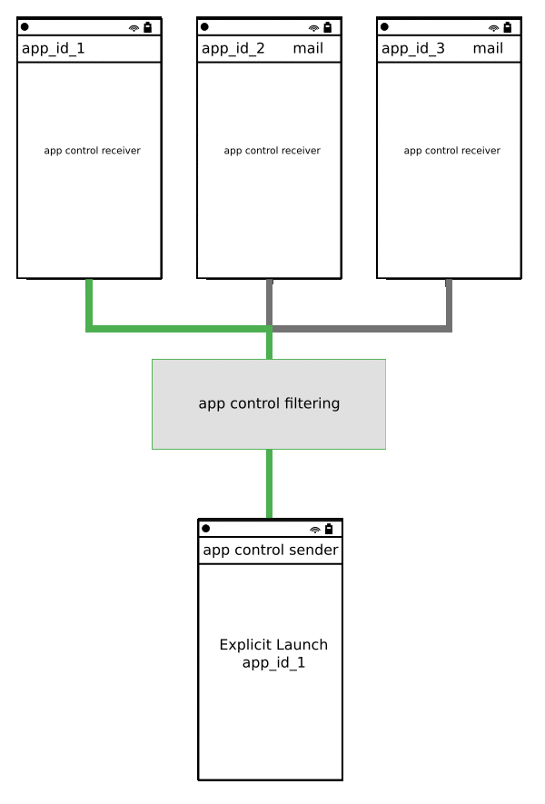
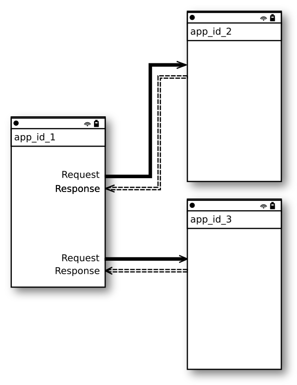
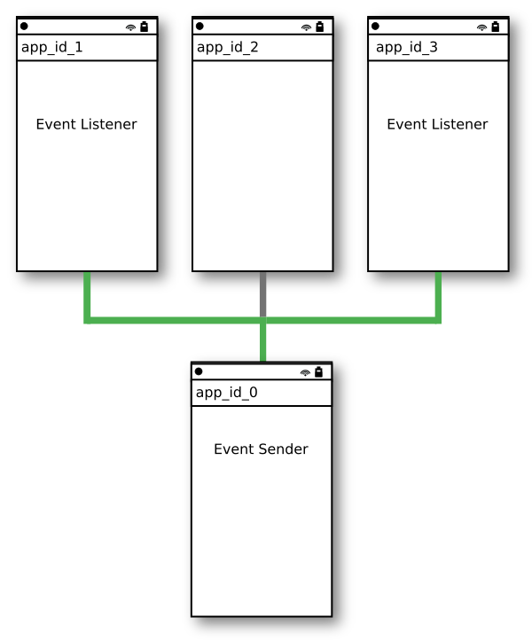
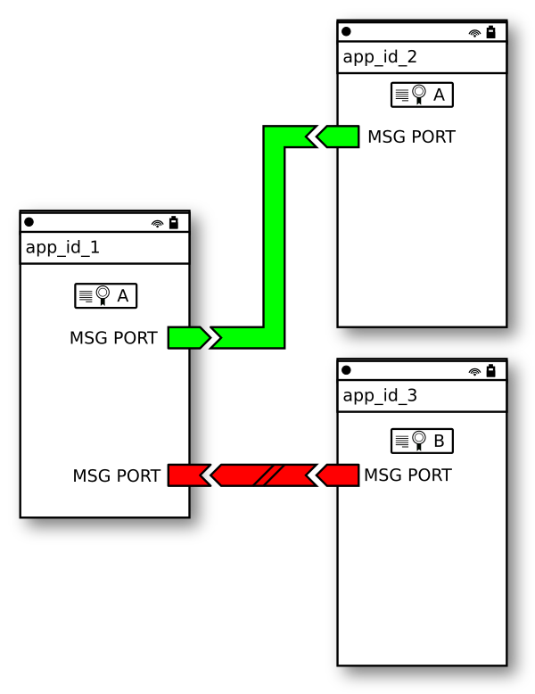

# Exchange Data Between Applications

With increasing complexity of the project, it is worth to separate an application functionality into smaller, independent components.
The advantage of this is: 
- Create reusable code.
- Improved fault tolerance.
- Easier maintenance.
- Improved code readability.

For this purpose Tizen .NET API introduce few mechanisms for developers to implement communication process between processes:
- [Application Control](./01_app_control.md)
- [Data Control](./02_data_control.md)
- [Event Broadcast and Subscription](./03_event.md)
- [Message Port](./04_message_port.md)

## [Application Control](./01_app_control.md)

An application control (app control) is a way of sharing an application’s functionality. Using another application’s features through application controls reduces the time and effort needed to develop your own application.

You can use in your application operations, such as calling, Web browsing, and playing media items, which are exported by other applications. This mechanism allows you to conveniently launch other applications whose functionalities you need in your application. If you need to use functionality from another application, launching an application control allows you to request the system to launch that application according to your requirements. You can launch applications based on your immediate needs - you do not need to know their identifiers or specifications. You can use application controls by creating an application control request. The request allows you to launch other applications to use their functionalities.

## [Data Control](./02_data_control.md)

Data control allows you to read and modify data stored and provided by another application, and monitor changes in that data. The application storing and controlling the data is called a DataControl provider application. The application using the data is called a DataControl consumer application. A single DataControl provider can serve multiple DataControl consumers.

## [Event Broadcast and Subscription](./03_event.md)

Event is a broadcast message send by application and all applications which want to listen receive this event. A set of specific, platform events are provided by the Tizen operating system such as: 

| Name                                     | Condition                                |
|------------------------------------------|------------------------------------------|
| `SystemEvents.BatteryChargerStatus.EventName` | When the charger state is `SystemEvents.BatteryChargerStatus.StatusValueConnected`. |
| `SystemEvents.UsbStatus.EventName`         | When the USB state is `SystemEvents.UsbStatus.StatusValueConnected`.     |
| `SystemEvents.EarjackStatus.EventName`     | When the earjack state is `SystemEvents.EarjackStatus.StatusValueConnected`. |
| `SystemEvents.IncomingMsg.EventName`       | When the `SystemEvents.IncomingMsg.TypeKey` and `SystemEvents.IncomingMsg.IdKey` exist.  |
| `SystemEvents.WifiState.EventName`         | When the Wi-Fi state is `SystemEvents.WifiState.StateValueConnected`.   |

Events could also be used to launch app: they are called `launch events`. 

## [Message Port](./04_message_port.md)

`Message Port` provides encrypted communication using author certificate. If data exchanged between two applications should be secured, you could use `Message Port` API. Secure connection could be established only for applications using the same certificate. Following picture shows possible trusted data exchange between two apps. Possible connection is marked using green color. Communication between Apps using `A certificate` and `B certificate` is not allowed.

