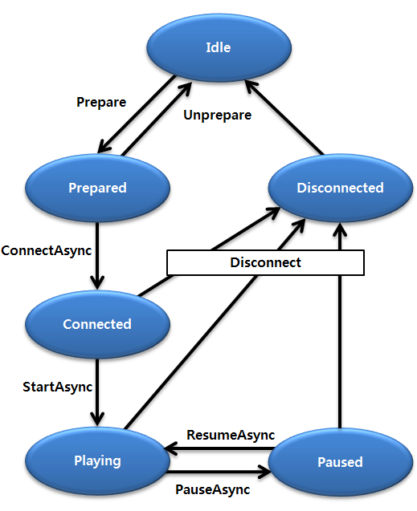

# Screen Mirroring

You can mirror the device screen and sound to another device wirelessly using the screen mirroring feature. Tizen follows the Wi-Fi Display Technical Specification and supports the feature as a sink which receives shared data from a source device that supports the Wi-Fi Display, and displays it. Remember to prepare your application to use the screen mirroring sink functionality and set up the necessary callbacks before you start, and release the resources when you are done.

The main features of the `Tizen.Multimedia.Remoting.ScreenMirroring` class include:

-   Preparing for screen mirroring

    You can [prepare for screen mirroring](#prepare) by registering an event handler to track screen mirroring state changes.

-   Managing the connection to the screen mirroring source

    You can [connect to a screen mirroring source](#connect), and start, pause, and resume the screen mirroring sink.

-   Monitoring state changes in the screen mirroring sink

    To track state changes, you can register an event handler for the `StateChanged` event of the `Tizen.Multimedia.Remoting.ScreenMirroring` class.

    You can also [handle any errors](#handle) with the `ErrorOccurred` event.

The following figure illustrates the screen mirroring states.

**Figure: Screen mirroring state diagram**



## Prerequisites


To use the methods and properties of the [Tizen.Multimedia.Remoting.ScreenMirroring](/application/dotnet/api/TizenFX/latest/api/Tizen.Multimedia.Remoting.ScreenMirroring.html) class, include the [Tizen.Multimedia.Remoting](/application/dotnet/api/TizenFX/latest/api/Tizen.Multimedia.Remoting.html) namespace in your application:

```csharp
using Tizen.Multimedia.Remoting;
```

<a name="prepare"></a>
## Preparing for Screen Mirroring

To prepare for screen mirroring:

1.  Define and register an event handler for the `StateChanged` event of the [Tizen.Multimedia.Remoting.ScreenMirroring](/application/dotnet/api/TizenFX/latest/api/Tizen.Multimedia.Remoting.ScreenMirroring.html) class:

    ```csharp
    void OnStateChanged(object sender, ScreenMirroringStateChangedEventArgs args)
    {
        Tizen.Log.Info(LOG_TAG, $"Current state = {args.State}");
    }

    screenMirroring.StateChanged += OnStateChanged;
    ```

2.  Prepare the screen mirroring sink using the `Prepare()` method with an instance of the [Tizen.Multimedia.Display](/application/dotnet/api/TizenFX/latest/api/Tizen.Multimedia.Display.html) class as a parameter:

    ```csharp
    screenMirroring.Prepare(new Display(mediaView));
    ```

    The screen mirroring state changes to `Prepared`.

<a name="connect"></a>
## Connecting and Starting Screen Mirroring

To connect to a source and start screen mirroring:

1.  Connect to the screen mirroring source using the `ConnectAsync()` method of the [Tizen.Multimedia.Remoting.ScreenMirroring](/application/dotnet/api/TizenFX/latest/api/Tizen.Multimedia.Remoting.ScreenMirroring.html) class with the source IP address as a parameter:

    ```csharp
    await screenMirroring.ConnectAsync(ipAddress);
    ```

    The screen mirroring state changes to `Connected`.

2.  Start the screen mirroring using the `StartAsync()` method:

    ```csharp
    await screenMirroring.StartAsync();
    ```

    The screen mirroring state changes from `Connected` to `Playing`.

<a name="handle"></a>
## Handling Screen Mirroring Errors

You can receive notifications of errors caused by internal screen mirroring issues or by the source device disconnecting the session. Define and register an event handler for the `ErrorOccurred` event of the [Tizen.Multimedia.Remoting.ScreenMirroring](/application/dotnet/api/TizenFX/latest/api/Tizen.Multimedia.Remoting.ScreenMirroring.html) class:

```csharp
void OnErrorOccurred(object sender, ScreenMirroringErrorOccurredEventArgs args)
{
    Tizen.Log.Info(LOG_TAG, $"Error = {args.Error}");
}

screenMirroring.ErrorOccurred += OnErrorOccurred;
```


## Related Information
* Dependencies
  -   Tizen 4.0 and Higher
