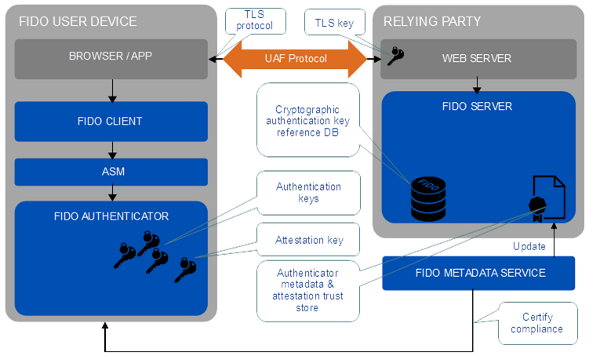
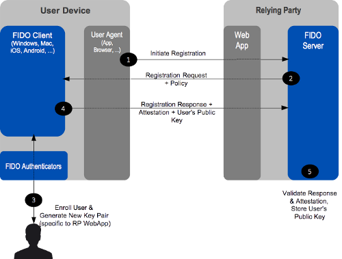
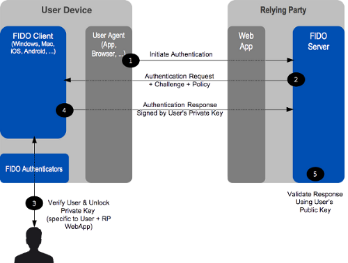
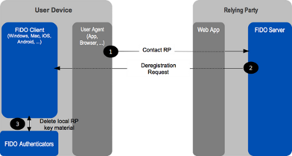

# FIDO Universal Authentication Framework


The FIDO (Fast IDentity Online) Alliance is an organization formed to address the lack of interoperability among strong authentication devices as well as the problems users face with creating and remembering multiple usernames and passwords.

FIDO covers both password-less authentications (through [FIDO UAF components](#fido_uaf_components)), such as fingerprint, iris, voice, and multi-factor authentication, such as OTP and USB dongle. Tizen currently does not support multi-factor authentication.

FIDO Alliance provides certification for FIDO-compliant products through FIDO Ready™.

<a name="fido_uaf_components"></a>
## FIDO UAF Components

UAF (Universal Authentication Framework) authenticators can be connected to a user device using various physical interfaces, such as SPI, USB, and Bluetooth. The UAF Authenticator-Specific Module (ASM) is a software interface on top of UAF authenticators, which gives a standardized way for the FIDO UAF clients to [detect and access the functionality of UAF authenticators](#find_auth), and hides the internal communication complexity from the clients.

The ASM is a platform-specific software component offering an API to FIDO UAF clients, enabling them to discover and communicate with 1 or more available authenticators. A single ASM can report on behalf of multiple authenticators.

The FIDO UAF protocol and its various operations are described in the [FIDO UAF Protocol Specification](https://fidoalliance.org/specs/fido-uaf-v1.0-ps-20141208/fido-uaf-protocol-v1.0-ps-20141208.html). The following figure shows a simplified architecture diagram of the interactions and actors.

**Figure: UAF high level architecture**



The FIDO UAF consists of the following basic components:

-   **FIDO UAF client**

    The FIDO UAF client implements the client side of the FIDO UAF protocols, and is responsible for interacting with specific FIDO UAF authenticators using the FIDO UAF authenticator abstraction layer through the [Tizen.Account.FidoClient](/application/dotnet/api/TizenFX/latest/api/Tizen.Account.FidoClient.html) namespace. Before you use the authenticators, [check whether the device can process the UAF protocol messages](#check_uaf_msg_supported).

-   **FIDO UAF server**

    The FIDO UAF server implements the server side of the FIDO UAF protocols and is responsible for:

    -   Interacting with the relying party Web server to [communicate FIDO UAF protocol messages to a FIDO UAF client](#set_server_result) using a device user agent.

    -   Validating FIDO UAF authenticator attestations against the configured authenticator metadata to ensure only trusted authenticators are registered for use.

    -   Managing the association of registered FIDO UAF authenticators to user accounts at the relying party.

    -   Evaluating user authentication and transaction confirmation responses to determine their validity.

-   **FIDO UAF protocols**

    The FIDO UAF protocols carry FIDO UAF messages between user devices and relying parties. [Use the protocol messages to register, authenticate, and deregister the authentication](#protocol_conversation):

    -   Authenticator registration:

        The FIDO UAF registration protocol enables relying parties to discover the FIDO UAF authenticators available on a user's system or device. Discovery conveys the FIDO UAF authenticator attributes to the relying party, thus enabling policy decisions and enforcement to take place.

        **Figure: FIDO UAF registration**

        

    -   User authentication:

        Authentication is typically based on cryptographic challenge-response authentication protocols and facilitates the user choice regarding which FIDO UAF authenticators are employed in an authentication event.

        **Figure: FIDO UAF authentication**

        

    -   Authenticator deregistration:

        Deregistration is typically required when the user account is removed at the relying party. The relying party can trigger the deregistration by requesting the authenticator to delete the UAF credential associated with the user account.

        **Figure: FIDO UAF deregistration**

        

-   **FIDO UAF authenticator abstraction layer**

    The FIDO UAF authenticator abstraction layer provides a uniform API to FIDO clients enabling the use of authenticator-based cryptographic services for FIDO-supported operations. It provides a uniform lower-layer "authenticator plugin" API facilitating the deployment of multi-vendor FIDO UAF authenticators and their requisite drivers.

-   **FIDO UAF authenticator**

    The FIDO UAF authenticator is a secure entity, connected to or housed within the FIDO user devices, that can create key material associated with a relying party. The key can then be used to participate in FIDO UAF strong authentication protocols.

-   **FIDO UAF authenticator metadata validation**

    In the FIDO UAF context, attestation is how authenticators make claims to a relying party during registration. They claim that the keys they generate, and certain measurements they report, originate from genuine devices with certified characteristics. An attestation signature, carried in a FIDO UAF registration protocol message, is validated by the FIDO UAF server.

## Prerequisites


To enable your application to use the FIDO UAF functionality:

1.  To use the [Tizen.Account.FidoClient](/application/dotnet/api/TizenFX/latest/api/Tizen.Account.FidoClient.html) namespace, the application has to request permission by adding the following privilege to the `tizen-manifest.xml` file:

    ```XML
    <privileges>
       <privilege>http://tizen.org/privilege/fido.client</privilege>
    </privileges>
    ```

2.  To use the methods and properties of the Tizen.Account.FidoClient namespace, include it in your application:

    ```csharp
    using Tizen.Account.FidoClient;
    ```

<a name="find_auth"></a>
## Finding the FIDO Authenticator

To obtain the list of all available authenticators, use the `DiscoverAuthenticatorsAsync()` method of the [Tizen.Account.FidoClient.UafAuthenticatorFinder](/application/dotnet/api/TizenFX/latest/api/Tizen.Account.FidoClient.UafAuthenticatorFinder.html) class:

```csharp
IEnumerable authInfos = await UafAuthenticatorFinder.DiscoverAuthenticatorsAsync();
foreach (AuthenticatorInformation authInfo in authInfos)
{
    string aaid = authInfo.Aaid;
    string title = authInfo.Title;
}
```

<a name="check_uaf_msg_supported"></a>
## Checking the UAF Message Support

To check whether the given UAF protocol message can be processed by the device, use the `CheckPolicyAsync()` method of the [Tizen.Account.FidoClient.UafClient](/application/dotnet/api/TizenFX/latest/api/Tizen.Account.FidoClient.UafClient.html) class:

```csharp
UafMessage uafRequest = new UafMessage()
{
    Operation = UafRequestJson
};
var response = await UafClient.CheckPolicyAsync(uafRequest);
```

<a name="protocol_conversation"></a>
## Managing the Protocol Conversation

The core UAF protocol consists of conceptual conversations between the FIDO UAF client and the FIDO server, which allow the server to prompt the client to register authenticators and authenticate the end user. Deregistration is triggered by the server when it needs to deregister authentication keys.

To receive conversation messages from the server:

-   For an authenticator registration request:

    ```csharp
    UafMessage UafRegistrationRequest = new UafMessage()
    {
        Operation = UafRegistrationRequestJson
    };

    var response = await UafClient.ProcessRequestAsync(UafRegistrationRequest, null);
    Assert.IsInstanceOf<UafResponse>(response, "Expected return type is UafResponse");
    ```

-   For an authentication request:

    ```csharp
    UafMessage UafAuthRequest = new UafMessage()
    {
        Operation = UafAuthRequestJson
    };

    var response = await UafClient.ProcessRequestAsync(UafAuthRequest, null);
    Assert.IsInstanceOf<UafResponse>(response, "Expected return type is UafResponse");
    ```

<a name="set_server_result"></a>
## Setting the Server Result

The server result is used to indicate the status code resulting from a FIDO UAF message delivered to the remote server.

To set the server result:

-   Set the server result with success:

    ```csharp
    UafMessage uafRequest = new UafMessage()
    {
        Operation = UafRequestJson
    };

    var response = await UafClient.ProcessRequestAsync(uafRequest, null);
    Assert.IsInstanceOf<UafResponse>(response, "Expected return type is UafResponse");

    try
    {
        await UafClient.NotifyResultAsync(UafClient.StautsOk, response);
    }
    catch (Exception ex)
    {
        LogUtils.Write(LogUtils.DEBUG, LogUtils.TAG, ex.ToString());
        Assert.IsTrue(false, "Exception is not expected");
    }
    ```

-   Set the server result with failure:

    ```csharp
    UafResponse response = new UafResponse()
    {
        Response = "Response"
    };

    try
    {
        await UafClient.NotifyResultAsync(UafClient.StautsOk, response);
        Assert.IsTrue(false, "ArgumentException is expected");
    }
    catch (Exception ex)
    {
        LogUtils.Write(LogUtils.DEBUG, LogUtils.TAG, ex.ToString());
        Assert.IsTrue(ex is ArgumentException, "ArgumentException is expected");
    }
    ```


## Related Information
* Dependencies
  -   Tizen 4.0 and Higher
