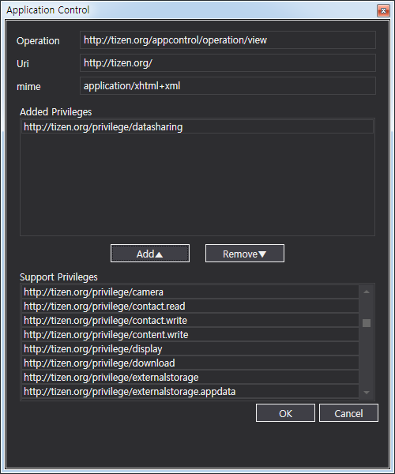

# Application Controls


An application control (app control) is a way of sharing an
application's functionality with other applications. Using another
application's features through application controls reduces the time and
effort needed to develop your own application.

An application can be launched by the user from the launcher or by
another application through the application control. The application
control launch request describes either an action to be performed by
other applications, or the results of that action. The application can
also receive results from the launched application through an
application control reply.

The main application control features are:

-   Requesting application launches

    You can [create application control launch requests](#request) to
    ask the platform to launch an application to perform a specific task
    for you.

    You can use different [launch types](#launch) (implicit or
    explicit), depending on whether you know the exact application you
    want to launch. When you make an implicit launch request, the
    platform uses the conditions in the launch request to determine
    which application can be launched to handle the requested task.

- Launching an application due to a launch request

    After the platform has found the correct application to launch, the
    application is activated through the [launch process](#process), and
    can perform the task the original application has requested. After
    the task is completed, the launched application can send the results
    back to the original application.

- Handling application control launch results

    When the launched application is finished with its task and has sent
    back the results, you can [receive those results](#results) in your
    application and handle them accordingly.

- Exporting application controls

    You can [allow other applications to launch your application and use
    your functionalities](#export_appcontrol) by exporting your
    application features as application controls.

- Controlling application groups through the launch mode

    You can [set the launch mode](#group) when launching an application
    through an application control. The launch mode determines whether
    the application is launched in its own group, or as a sub
    application within an existing group.

<a name="launch"></a>
## Launch Types

You can launch an application with an application control using 2
different launch types:

-   Explicit launch:

    Explicit launch means that you launch a specific application with
    the application ID. When you [request an explicit
    launch](#explicit):

    -   If the underlying application launcher framework finds an
        application matched with the given application ID in the
        installed application list, it launches the application in a
        new process. If the matched application is not found, the
        `AppNotFoundException` occurs. Additional information (such as
        operation, URI, or MIME type) is not used to select an
        application for an explicit launch.
    -   If the `Operation` property of a
        [Tizen.Applications.AppControl](https://developer.tizen.org/dev-guide/csapi/api/Tizen.Applications.AppControl.html)
        instance is set to `AppControlOperations.Default`, the
        application ID must be set. Otherwise the
        `ArgumentException` occurs.

    > **Note**   
	> Be careful when using the explicit launch, because if the
    target application does not exist on the device, you need to handle
    the `AppNotFoundException`. If you want to launch any application
    that supports a certain operation, use the implicit launch.

- Implicit launch

    Implicit launch means that you launch any application which matches
    the operation, URI (or scheme), or MIME type you need. When you
    [request an implicit launch](#implicit):

    1.  To determine which application can be launched, the application
        launcher framework compares the operation, URI, and MIME
        type conditions.
    2.  The application launcher framework iterates the application
        controls of all applications on the device to [find the
        applications that match](#resolution) the given conditions.
    3.  If only 1 application is matched for the given conditions, that
        application is launched. If multiple matching applications are
        found, the application selector is shown and the user can select
        the proper application.

<a name="request"></a>
## Launch Requests

To launch an application with the application control, you must create a
launch request. You must create an instance of the
[Tizen.Applications.AppControl](https://developer.tizen.org/dev-guide/csapi/api/Tizen.Applications.AppControl.html)
class, and add the conditions for selecting the application to be
launched. You can add the following information to the instance:

-   `Operation`: Action to be performed by the launched application.

    > **Note**   
	> The operation name format is
    `http://tizen.org/appcontrol/operation/<verb>`. You can also use an
    instance of the
    [Tizen.Applications.AppControlOperations](https://developer.tizen.org/dev-guide/csapi/api/Tizen.Applications.AppControlOperations.html) class.

    The operation is mandatory information for sending the
    launch request.

- `Uri`: Data itself to be performed.
- `Mime`: Specific type of the URI.
- `ApplicationId`: ID of the application to be launched.
- `ExtraData`: Key-value pairs to [provide additional information for
    the launch request and launch result](#use).

<a name="explicit"></a>
### Explicit Launch Request

The following example shows how to create an explicit launch request
which launches an application explicitly by setting the `ApplicationId`
property of the
[Tizen.Applications.AppControl](https://developer.tizen.org/dev-guide/csapi/api/Tizen.Applications.AppControl.html)
class instance:

```
AppControl appcontrol = new AppControl();

appcontrol.Operation = AppControlOperations.Default;
appcontrol.ApplicationId = "org.tizen.TestApp";

AppControl.SendLauncherRequest(appcontrol);
```

<a name="implicit"></a>
### Implicit Launch Request

The following examples show how to create an implicit launch request:

-   To launch a camera application with a specific operation and MIME
    type:

    ```
    AppControl appcontrol = new AppControl();

    appcontrol.Operation = AppControlOperations.CreateContent;
    appcontrol.Mime = "image/jpg";

    AppControl.SendLauncherRequest(appcontrol);
    ```

- To launch a viewer application with a specific operation, URI, and
    MIME type:

    ```
    AppControl appcontrol = new AppControl();

    appcontrol.Operation = AppControlOperations.View;
    appcontrol.Mime = "image/*";
    appcontrol.Uri = "file:///home/myhome/Photos/1_photo.jpg";

    AppControl.SendLauncherRequest(appcontrol);
    ```

<a name="resolution"></a>		
### Determining the Application for an Implicit Launch Request

In the case of an implicit launch, the platform determines which
application to launch by "resolving the application control". This means
that the platform considers the given conditions (operation, URI, and
MIME type) in the launch request, searches the filters (installed
applications with available application controls) on the device, and
attempts to find a match.

The launch request conditions are matched to the available filters using
the following logic:

1.  The operation value is matched first. An exact match is required for
    the value in both the launch request and the filters.

    If multiple matching filters with identical operations are
    available, the URI and MIME types in the matching filters
    are compared.

2. If the launch request has URI or MIME types as a condition, the
    comparison is done only among the filters that have URI or
    MIME types. For example, if the launch request has a URI, but a
    filter does not, that filter is not added to the result even if the
    operations are the same. Similarly, if the launch request has MIME
    types, it is not compared to the filters that have no MIME types.

    An exception is applied to the URIs with a "file" scheme for
    the value. If the launch request URI contains an existing file path
    and no MIME types are supplied, the filters that have the MIME type
    of the given file path are also added to the results.

    > **Note**   
	> A filter (application) that expects to match with any form
    of URI and any type of MIME must use `'*'` and `*/*` in their
    application control information in the `tizen-manifest.xml` file,
    instead of leaving the value to `NULL`. Otherwise, the application
    is discarded by the platform when the application control
    is resolved.

3. Unlike the operation, the URI and MIME types support wildcards on
    the filters. Detailed conditions for matches are:
    -   The URI match can be an exact, partial (scheme), or pattern
        match according to the value in the filters. URI filters are
        matched with the launch request if:
        -   Both URIs are exactly the same.
        -   Launch request URI passes the test with a `glob()`-like
            function with the filter URI.
        -   Scheme and host part of the URI in the launch request and
            filters are the same.
        -   Scheme part of the URI in the launch request and filters is
            the same.
    -   The MIME type match can be an exact or pattern match according
        to the value in the filters. MIME type filters are matched with
        the launch request if:
        -   Both MIME types are exactly the same.
        -   MIME type in the launch request and filters has the same
            type and '\*' for the subtype.
        -   The filters have `*/*` for the MIME type.

The following examples show different scenarios for the results of
resolving the application control:

-   Operation provided:

    -   Request:
        -   Operation: `http://tizen.org/appcontrol/operation/view`
        -   URI: `NULL`
        -   MIME: `NULL`
    -   Result (the reason for the failure is marked in **bold**):

    **Table: Scenario when only the operation is provided**

    | Filter ID | Operation                                | URI        | MIME   | Result |
    |---------|----------------------------------------|----------|------|------|
    | 1         | `http://tizen.org/appcontrol/operation/view` | `NULL`     | `NULL` | Pass   |
    | 2         | **`http://tizen.org/appcontrol/operation/default`** | `NULL`     | `NULL` | Fail   |
    | 3         | `http://tizen.org/appcontrol/operation/view` | **`file`** | `NULL` | Fail   |

- Operation and URI provided:

    -   Request:
        -   Operation: `http://tizen.org/appcontrol/operation/view`
        -   URI: `file:///usr/share/icons/calendar.png`
        -   MIME: `NULL`
    -   Result (the reason for the failure is marked in **bold**):

    **Table: Scenario when the operation and URI are provided**

    | Filter ID | Operation                                | URI                                    | MIME            | Result |
    |---------|----------------------------------------|--------------------------------------|---------------|------|
    | 1         | `http://tizen.org/appcontrol/operation/view` | **`NULL`**                             | `NULL`          | Fail   |
    | 2         | `http://tizen.org/appcontrol/operation/view` | `file:///usr/share/icons/calendar.png` | `*/*`           | Pass   |
    | 3         | `http://tizen.org/appcontrol/operation/view` | `file:///*`                            | `*/*`           | Pass   |
    | 4         | `http://tizen.org/appcontrol/operation/view` | `file`                                 | `*/*`           | Pass   |
    | 5         | `http://tizen.org/appcontrol/operation/view` | **`http`**                             | `*/*`           | Fail   |
    | 6         | `http://tizen.org/appcontrol/operation/view` | `NULL`                                 | `image/png`     | Pass   |
    | 7         | `http://tizen.org/appcontrol/operation/view` | `NULL`                                 | **`image/jpg`** | Fail   |

- Operation and MIME type provided:

    -   Request:
        -   Operation: `http://tizen.org/appcontrol/operation/view`
        -   URI: `NULL`
        -   MIME: `image/png`
    -   Result (the reason for the failure is marked in **bold**):

    **Table: Scenario when the operation and MIME type are provided**

    | Filter ID | Operation                                | URI                                    | MIME            | Result |
    |---------|----------------------------------------|--------------------------------------|---------------|------|
    | 1         | `http://tizen.org/appcontrol/operation/view` | `NULL`                                 | `image/png`     | Pass   |
    | 2         | `http://tizen.org/appcontrol/operation/view` | `NULL`                                 | `image/*`       | Pass   |
    | 3         | `http://tizen.org/appcontrol/operation/view` | `NULL`                                 | `*/*`           | Pass   |
    | 4         | `http://tizen.org/appcontrol/operation/view` | `file:///usr/share/icons/calendar.png` | **`NULL`**      | Fail   |
    | 5         | `http://tizen.org/appcontrol/operation/view` | `NULL`                                 | **`image/jpg`** | Fail   |
    | 6         | `http://tizen.org/appcontrol/operation/view` | `NULL`                                 | **`video/*`**  | Fail   |
    | 7         | `http://tizen.org/appcontrol/operation/view` | **`http://tizen.org/favorites.png`**   | `image/png`     | Fail   |

- Operation, URI, and MIME type provided:

    -   Request:
        -   Operation: `http://tizen.org/appcontrol/operation/view`
        -   URI: `http://www.tizen.org/favorites.png`
        -   MIME: `image/png`
    -   Result (the reason for the failure is marked in **bold**):

    **Table: Scenario when the operation, URI, and MIME type are provided**

    | Filter ID | Operation                                | URI                                  | MIME        | Result |
    |---------|----------------------------------------|------------------------------------|-----------|------|
    | 1         | `http://tizen.org/appcontrol/operation/view` | `http://www.tizen.org/favorites.png` | `image/png` | Pass   |
    | 2         | `http://tizen.org/appcontrol/operation/view` | `http://www.tizen.org/favorites.png` | **`NULL`**  | Fail   |
    | 3         | `http://tizen.org/appcontrol/operation/view` | `http://www.tizen.org/*`             | `image/png` | Pass   |
    | 4         | `http://tizen.org/appcontrol/operation/view` | `http`                               | `image/png` | Pass   |
    | 5         | `http://tizen.org/appcontrol/operation/view` | **`NULL`**                           | `image/png` | Fail   |
    | 6         | `http://tizen.org/appcontrol/operation/view` | `*`                                  | `*/*`       | Pass   |


<a name="process"></a>
## Launch Process

Regardless of the launch request type, when the application launcher
framework has received and resolved a launch request, it starts the
application by creating a new process and calling the entry point of the
application:

1.  Like a conventional C\# application, the main method of the
    application is its entry point. In a Tizen .NET application, the
    main task is to hand over control to the application framework by
    calling the `Run()` method:

    ```
    class App : CoreUIApplication
    {
        protected override void OnCreate()
        {
            /// Hook to take necessary actions before main event loop starts; this
            /// usually means initializing the UI

            base.OnCreate();
        }

        protected override void OnAppControlReceived(AppControlReceivedEventArgs e)
        {
            /// Handle the launch request, show the user the task requested through the
            /// "AppControlReceivedEventArgs" parameter

            base.OnAppControlReceived(e);
        }

        protected override void OnPause()
        {
            /// Take necessary actions when application becomes invisible

            base.OnPause();
        }

        protected override void OnResume()
        {
            /// Take necessary actions when application becomes visible

            base.OnResume();
        }

        protected override void OnTerminate()
        {
            /// Release all resources

            base.OnTerminate();
        }

        static void Main(string[] args)
        {
            App app = new App();
            app.Run(args);
        }
    }
    ```

2. The `Run()` method initializes the application and starts the
    main loop.

    It takes a parameter and uses it to initialize the application. The
    `args` parameter contains the values from the application framework,
    and you must never change their values.

3. When the `Run()` method is first invoked, the application moves from
    the ready state to the created state, and must initialize itself.
    During this transition, the application framework calls the
    application's `OnCreate()` state transition method just before the
    application enters the main loop. Within the method, you must
    initialize the application resources and create the main window.
4. Just after the application enters the main loop, the application
    framework calls the application's `OnAppControlReceived()` method.

    The reason the application was launched is contained in an instance
    of the
    [Tizen.Applications.ReceivedAppControl](https://developer.tizen.org/dev-guide/csapi/api/Tizen.Applications.ReceivedAppControl.html)
    class, which is derived from the
    [Tizen.Applications.AppControl](https://developer.tizen.org/dev-guide/csapi/api/Tizen.Applications.AppControl.html) class.
    The application is always responsible for checking the content of
    the `Tizen.Applications.ReceivedAppControl` instance and
    responding appropriately. The content of the
    `Tizen.Applications.ReceivedAppControl` instance can be empty, if
    the application is launched by the user from the launcher.

    If the application wants to return the result of the application
    control operation to the application that originally sent the launch
    request, the result can be sent with the `ReplyToLaunchRequest()`
    method of the `Tizen.Applications.ReceivedAppControl` class.

    ```
    protected override void OnAppControlReceived(AppControlReceivedEventArgs e)
    {
        ReceivedAppControl receivedAppControl = e.ReceivedAppControl;

        if (receivedAppControl.IsReplyRequest)
        {
            AppControl replyRequest = new AppControl();

            /// Send reply to the caller app
            receivedAppControl.ReplyToLaunchRequest(replyRequest, AppControlReplyResult.Succeeded);
        }

        base.OnAppControlReceived(e);
    }
    ```

<a name="results"></a>
## Launch Results

After the requested application (callee) has been launched and the
launched application has performed the requested operation, the results
of the operation are delivered back to the application that sent the
original launch request (caller).

The following code example requests the launch of another application
and sets the `AppControlReplyCallback()` method to get the launch
result:

```
public void LaunchRequestResultTest()
{
    string MyAppId = "org.tizen.MyApp";

    AppControl appCtrl = new AppControl();
    appCtrl.Operation = AppControlOperations.Default;
    appCtrl.ApplicationId = MyAppId;

    /// Set method to get the launch result
    AppControl.SendLaunchRequest(appCtrl, AppControlReplyCallback);
}
```

The results are delivered in an instance of the
[Tizen.Applications.AppControl](https://developer.tizen.org/dev-guide/csapi/api/Tizen.Applications.AppControl.html)
instance with extra data. For some cases, the
[Tizen.Applications.AppControlData](https://developer.tizen.org/dev-guide/csapi/api/Tizen.Applications.AppControlData.html)
provides predefined extra data keys. If the key you need is not
predefined, you can create your own key. However, the customized key
must be shared between the caller and callee applications.

The following example shows how you can retrieve the results of the
launch request and requested operation by implementing the
`AppControlReplyCallback()` method:

```
/// Method for getting the result
static void AppControlReplyCallback(Tizen.Applications.AppControl launchRequest, Tizen.Applications.AppControl replyRequest, AppControlReplyResult result)
{
    string callerAppId;
    string selected;

    if (result >= AppControlReplyResult.Succeeded)
    {
        /// Get the value of ExtraData sent by callee
        callerAppId = replyRequest.ExtraData.Get<string>("CallerApplicationId");
        selected = replyRequest.ExtraData.Get<string>(AppControlData.Selected);
    }
}
```

<a name="export_appcontrol"></a>
## Application Control Export

You can allow other applications to launch your application and use your
application features through application controls by exporting your
application control functionalities. To allow other applications to
launch your application implicitly without the application ID, specify
your application control information in Visual Studio.

**Figure: Exporting app control**



The operation, URI, and MIME type information is used when [resolving
the application control](#resolution). The operation information is
mandatory, while the URI or MIME type information is optional. Any
application requesting a launch of your application must either specify
your application ID (for an explicit launch) or have the same operation
value and applicable URI and MIME type information (for an implicit
launch).
You can define privileges to restrict your application from launching. To launch
your application, the caller application must request for launch permission
by defining privileges in the `tizen-manifest.xml` file.

> **Note**  
> The URI or MIME type can contain wildcards, such as '\*', to
match against given conditions in the application control:
> -   In the MIME type, you can use two types of wildcards: `image/*` and
    `*/*`.
> -   In the URI, a more complex pattern of wildcards with similar
    semantics as the standard `glob()` function is available: '\*'
    matches an arbitrary, possibly empty, string, and '?' matches an
    arbitrary character. Unlike in the `glob()` function, the '/'
    character can be matched by the wildcards. There are no \[...\]
    character ranges, and the wildcards '\*' and '?' cannot be escaped
    to include them literally in a pattern.


<a name="group"></a>
## Application Group Management

You can [define the application launch mode](#mode) and group your
applications into entities that can be managed together.

The main application group features include:

-   Defining the application launch mode

    When an application is launched through an application control, its
    launch mode defines its behavior:

    -   The single launch mode means that the application is launched as
        a main application (in a new group).
    -   The caller launch mode means that the application is launched as
        a sub application belonging to the same group as the caller
        application who is causing the application to be launched.

    You can set the application launch mode [in the manifest
    file](../../../vstools/tools/manifest-editor.md#launch_mode)
    using the `launch_mode` attribute of the `<ui-application>` element.
    If the launch mode is set to `caller`, the application that calls
    the application control can define the launch mode for the called
    application using the `LaunchMode` property. However, if the called
    application has set its launch mode in its manifest file to
    `single`, that setting overrides the caller application's launch
    mode request.

- Managing the application group

    Applications in a same group act as if they are in 1 stack. For
    example, if application A wants to send an email using email
    application B, the application A can launch the email application B,
    making the email application B a sub application in the same group
    as the application A. When both applications are running, and the
    user presses the home button, both applications are hidden. When the
    user later resumes the caller application (application A), the email
    application B is shown on top of the caller application.

    If an application is launched in a group, it can be terminated by
    the main (first) application in the group. If the main application
    is terminated or killed, the sub applications in the group are
    terminated automatically (they can be terminated by the framework
    even if they are hidden).

    **Figure: Group behavior**

    


## Prerequisites

To enable your application to use the application control functionality:

1.  To use application controls, the application has to request
    permission by adding the following privilege to the
    `tizen-manifest.xml` file:

    ```
    <privileges>
       <privilege>http://tizen.org/privilege/appmanager.launch</privilege>
    </privileges>
    ```

2. To use the methods and data types of the
    [Tizen.Applications](https://developer.tizen.org/dev-guide/csapi/api/Tizen.Applications.html)
    namespace, include it in your application:

    ```
    using Tizen.Applications;
    ```

<a name="use"></a>
## Launching Applications Using Extra Data

To run a specific application control with some preconfigured
parameters:

1.  Prepare the application control:

    ```
    AppControl appControl = new AppControl();
    ```

2. When the instance of the
    [Tizen.Applications.AppControl](https://developer.tizen.org/dev-guide/csapi/api/Tizen.Applications.AppControl.html)
    class is created, set the operation and MIME type. In this example,
    the application control launches an application which has the
    `AppControlOperations.View` operation and the `image/jpeg`
    MIME type.

    The `Operation` property is mandatory information for the
    launch request. If the operation is not specified,
    `AppControlOperations.Default` is used for the launch request.

    ```
    appControl.Operation = AppControlOperations.View;
    appControl.Mime = "image/jpeg";
    ```

3. Add extra data to the `Tizen.Applications.AppControl` instance by
    using the `ExtraData` property and the `Add()` method of the
    [Tizen.Applications.AppControl.ExtraDataCollection](https://developer.tizen.org/dev-guide/csapi/api/Tizen.Applications.AppControl.ExtraDataCollection.html) class.
    In the following example, a message is added as extra data:

    ```
    appControl.ExtraData.Add("MyKey", "My Message");
    ```

4. Launch the `Tizen.Applications.AppControl` instance with the
    `SendLaunchRequest()` method:

    ```
    AppControl.SendLaunchRequest(appControl, AppControlReplyCallback);
    ```

5. In the launched application, read the extra data added to the
    application control by using the `ExtraData` property of the
    [Tizen.Applications.ReceivedAppControl](https://developer.tizen.org/dev-guide/csapi/api/Tizen.Applications.ReceivedAppControl.html)
    class instance and the `Get()` method of the
    `Tizen.Applications.ExtraDataCollection` class. The same property
    and method can be used in the original application to read the reply
    message, when the application control reply is returned.

    ```
    /// Callee application
    protected override void OnAppControlReceived(AppControlReceivedEventArgs e)
    {
        string message;
        ReceivedAppControl receivedAppControl = e.ReceivedAppControl;

        /// Get ExtraData coming from caller application
        message  = receivedAppControl.ExtraData.Get<string>("MyKey");

        if (receivedAppControl.IsReplyRequest)
        {
            AppControl replyRequest = new AppControl();
            replyRequest.ExtraData.Add("ReplyKey", "Reply message");

            /// Send reply to the caller application
            receivedAppControl.ReplyToLaunchRequest(replyRequest, AppControlReplyResult.Succeeded);
        }

        base.OnAppControlReceived(e);
    }
    ```

    ```
    /// Caller application
    static void AppControlReplyCallback(Tizen.Applications.AppControl launchRequest, Tizen.Applications.AppControl replyRequest, AppControlReplyResult result)
    {
        string receivedMessage;
        if(result >= AppControlReplyResult.Succeeded)
        {
            receivedMessage = replyRequest.ExtraData.Get<string>("ReplyKey");
        }
    }
    ```

<a name="mode"></a>
## Controlling the Launch Mode

To set the application control in the caller application to launch a sub
application within the same group:

```
AppControl appControl = new AppControl();
appControl.ApplicationId = "org.tizen.TestApp";
appControl.LaunchMode = AppControlLaunchMode.Group;

AppControl.SendLaunchRequest(appControl);
```


## Related Information
* Dependencies
  -   Tizen 4.0 and Higher
