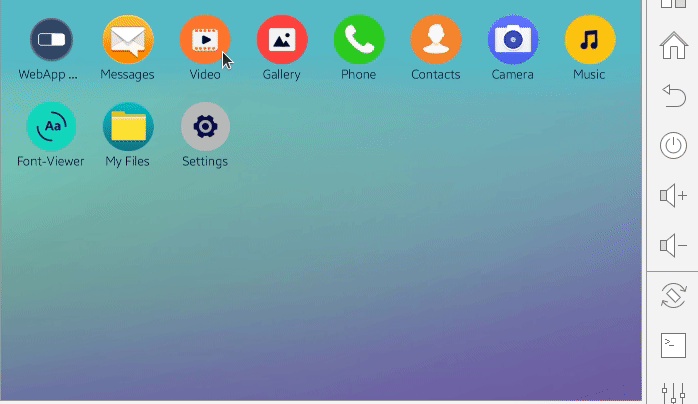
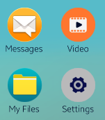

# Application Launcher

This guide explains how to create a basic application launcher. The application launcher is the main application that normally starts after the system boots. This app is commonly replaced in the platform adjustment process. It is easy to use the .NET APIs in the application launcher implementation.

Every application launcher must be able to do the following tasks:
 - List installed and runnable applications
 - Run applications selected by the user

You can also implement advanced functionalities such as the following:
 - Grouping installed applications into folders
 - Removing applications
 - Rearrangement of icons
 - Viewing notifications
 - Viewing widgets

## Prerequisites

To list the installed applications and launch them, the launcher app must have defined privileges in the project manifest file:

```xml
<?xml version="1.0" encoding="utf-8"?>
  <ui-application appid="NUIApplicationLauncher">
    <!-- Auto generated manifest properties -->
  </ui-application>
  <privileges>
    <privilege>http://tizen.org/privilege/packagemanager.info</privilege>
    <privilege>http://tizen.org/privilege/appmanager.launch</privilege>
  </privileges>
```

## Manage app launcher

The following steps illustrate how to implement the simple application launcher using:
 - [NUI](/application/dotnet/api/TizenFX/latest/api/Tizen.NUI.html) for the view implementation
 - [Package Manager](/application/dotnet/api/TizenFX/latest/api/Tizen.Applications.PackageManager.html) to gather installed applications
- [TizenFX AppControl](/application/dotnet/api/TizenFX/latest/api/Tizen.Applications.AppControl.html) to launch an app on touch event

**Figure: NUI application launcher**



1. To use mentioned API's, the following namespaces have to be included:

    ```csharp
    using System;
    using System.Collections.Generic;

    using Tizen.Applications;

    using Tizen.NUI;
    using Tizen.NUI.BaseComponents;
    ```

2. To group application launcher responsibilities, three classes in the `NUIApplicationLauncher` namespace are defined which represent the main application structure:

    ```csharp
    namespace NUIApplicationLauncher
    {
        //Each touch event needs additional data like application ID to launch application
        partial class ApplicationIconClickedEventArgs : EventArgs
        {
            //...
        }

        //Application Icon component with ImageView and Label. Also OnTouch Event is handler here.
        class ApplicationIcon : View
        {
            //...
        }

        //Main Application Code
        class Program : NUIApplication
        {
            //...
        }
    }
    ```

3. To add an application ID field, create the event arguments derived class. The application ID is used by `AppControl` to launch the application:

    ```csharp
    partial class ApplicationIconClickedEventArgs : EventArgs
    {
        public string AppId = "";

        public ApplicationIconClickedEventArgs(string id)
        {
            AppId = id;
        }
    }
    ```

4. The `ApplicationIcon` class stores  the application ID. The `Icon` component and `OriginSize` are used to resize `Icon` when it is in the pressed state. The `ApplicationIconClicked` is invoked when touch changes its state to finished:

    ```csharp
    class ApplicationIcon : View
    {
        private string AppId;

        private ImageView Icon;
        private Size2D OriginSize;

        public event EventHandler<ApplicationIconClickedEventArgs> ApplicationIconClicked;
    }
    ```

5. The `ApplicationIcon` constructor is responsible for the following:
    - Set `AppId` and `OriginSize`.
    - Create view components: `Label` which is used to show an application name and `Icon` which load resource from `path` string and show loaded image.
    - Create `Layout` of the `ApplicationIcon`. In this case, the vertical linear layout is used.
    - Setup the `TouchEvent` handler.


    ```csharp
    public ApplicationIcon(string name, string path, Size2D size, string id)
    {
        this.AppId = id;
        OriginSize = new Size2D(size.Width - 40, size.Height - 40);

        this.Size2D = size;

        TextLabel label = new TextLabel()
        {
            PointSize = 6,
            Text = name,
            MultiLine = true,
            Size2D = new Size2D(size.Width, 40),
            HorizontalAlignment = HorizontalAlignment.Center,
            VerticalAlignment = VerticalAlignment.Center,
        };

        Icon = new ImageView()
        {
            Size2D = new Size2D(size.Height - 40, size.Height - 40),
            ResourceUrl = path,
        };

        this.Layout = new LinearLayout()
        {
            HorizontalAlignment = HorizontalAlignment.Center,
            LinearOrientation = LinearLayout.Orientation.Vertical
        };

        this.Add(Icon);
        this.Add(label);

        this.TouchEvent += OnTouchEvent;
    }
    ```

    **Figure: Application icons**

    

6. `OnTouchEvent` reads state from the `TouchEventArgs`. If touch is in `PointStateType.Down` state, the application icon is resized. Otherwise, it returns to normal size and the predefined event is invoked with the proper `AppId`:

    ```csharp
    public bool OnTouchEvent(object sender, TouchEventArgs args)
    {
        var state = args.Touch.GetState(0);

        switch (state)
        {
            case PointStateType.Down:
                Icon.Size2D = new Size2D((int)(OriginSize.Width * 1.1f), (int)(OriginSize.Height * 1.1f));
                break;
            case PointStateType.Finished:
                Icon.Size2D = OriginSize;
                ApplicationIconClicked.Invoke(this, new ApplicationIconClickedEventArgs(this.AppId));
                break;
            default:
                break;
        }

        return false;
    }
    ```

7. The `Program` class derived from NUIApplication handles all necessary system events ([Application Lifecycle](../applications/uiapplication/application_lifecycle.md)). The `AppLauncher` is created in `Initialize()` method and used in an icon touch handler:

    ```csharp
    class Program : NUIApplication
    {
        private AppControl AppLauncher;

        //...
    }
    ```

8. The `OnCreate()` method calls `Initialize()` function before the main application loop starts:

    ```csharp
    protected override void OnCreate()
    {
        base.OnCreate();
        Initialize();
    }
    ```

9. The `Initialize()` method set up key listener, `AppControl` object, and the application background:

    ```csharp
    void Initialize()
    {
        var appWindow = Window.Instance;
        appWindow.KeyEvent += OnKeyEvent;

        AppLauncher = new AppControl();
        ImageView background = new ImageView(DirectoryInfo.Resource + "/images/bg.png");

        //Setting the background parameters so that it occupies the entire application window
        background.Size2D = new Size2D(appWindow.Size.Width, appWindow.Size.Height);
        background.Position2D = new Position2D(0, 0);
        appWindow.GetDefaultLayer().Add(background);
    }
    ```

10. In the next step, the grid component for application icons is created. Grid spacing and columns number are defined in the [GridLayout](../user-interface/nui/grid-layout.md) object. The `appGrid` component width and height is set to fill its parent:

    ```csharp
    View appGrid = new View()
    {
        WidthResizePolicy = ResizePolicyType.FillToParent,
        HeightResizePolicy = ResizePolicyType.FillToParent,
        Layout = new GridLayout()
        {
            Columns = 8,
            GridOrientation = GridLayout.Orientation.Horizontal,
            RowSpacing = 35f,
            ColumnSpacing = 12f,
            Padding = new Extents(30, 30, 30, 30)
        }
    };
    ```

11. The [PackageManager.GetPackages()](./package-manager.md) is used to obtain all installed packages. Each package may contain several applications. Hence, `pkg.GetApplications()` is used. `ApplicationInfo` object is used to filter apps that must be displayed. In this case, `NUIApplicationLauncher` app with no icon or app with `IsNoDisplay` parameter will not be inserted into `appGrid`:

    ```csharp
    IEnumerable<Package> packageList = PackageManager.GetPackages();

    foreach (var pkg in packageList)
    {
        var list = pkg.GetApplications();

        foreach (var app in list)
        {
            if (!app.IsNoDisplay && app.IconPath != null && app.Label != "NUIApplicationLauncher") {
                var icon = new ApplicationIcon(app.Label, app.IconPath, new Size2D((), 139), app.ApplicationId);
                icon.ApplicationIconClicked += OnAppIconClicked;
                appGrid.Add(icon);
            }
        }
    }
    ```

12. Once `appGrid` object is created, it must be inserted in the application window:

    ```csharp
        appWindow.GetDefaultLayer().Add(appGrid);
    ```

13. Clicked event set up `AppLauncher` and pass it to [AppControl](/application/dotnet/api/TizenFX/latest/api/Tizen.Applications.AppControl.html) `SendLaunchRequest()` API. Now, the selected applications get started:

    ```csharp
    public void OnAppIconClicked(object sender, ApplicationIconClickedEventArgs args)
    {
        AppLauncher.ApplicationId = args.AppId;
        AppLauncher.Operation = AppControlOperations.Default;
        AppControl.SendLaunchRequest(AppLauncher);
    }
    ```

14. The following code shows how to implement `back` button clicked event. In this case application exits, but normally the launcher app doesn't call the `Exit()` API:

    ```csharp
    public void OnKeyEvent(object sender, Window.KeyEventArgs args)
    {
        Tizen.Log.Info(LogTag, args.Key.ToString());

        if (args.Key.State == Key.StateType.Down && (args.Key.KeyPressedName == "XF86Back" || args.Key.KeyPressedName == "Escape"))
        {
            Exit();
        }
    }
    ```

15. The common main code of the NUI application:

    ```csharp
    static void Main(string[] args)
    {
        var app = new Program();
        app.Run(args);
    }
    ```

For full source code of the example, see [here](./source-code/application-launcher.cs).

## Related information
* Dependencies
  -   Tizen 4.0 and Higher
* API Reference
  - [Tizen.NUI](/application/dotnet/api/TizenFX/latest/api/Tizen.NUI) namespace
  - [Tizen.Applications.PackageManager](/application/dotnet/api/TizenFX/latest/api/Tizen.Applications.PackageManager) class
  - [Tizen.Applications.AppControl](/application/dotnet/api/TizenFX/latest/api/Tizen.Applications.AppControl) class
