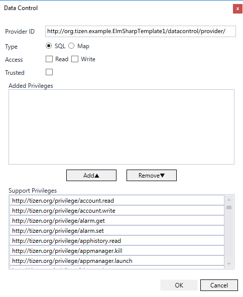

# Data Control

The data control is a standard mechanism for exchanging specific data between applications.

A provider application shares its data, and a consumer application can request the shared data. All applications can function as consumers and request data shared by other applications using a data control. However, only service applications can function as providers and share their own data.

The main features of the Tizen.Applications.DataControl namespace include:

-   Managing a provider

    You can have your application function as a provider to [provide data to consumer applications](#map1) by using the [Tizen.Applications.DataControl.Provider](/application/dotnet/api/TizenFX/latest/api/Tizen.Applications.DataControl.Provider.html) class.

    To create a provider, you must [export its provider functionalities](#export) in the application project settings in the IDE.

- Managing a consumer

    You can have your application function as a consumer to [access data shared by service applications](#map2) by using the [Tizen.Applications.DataControl.Consumer](/application/dotnet/api/TizenFX/latest/api/Tizen.Applications.DataControl.Consumer.html) class.

    The consumer sends a request to the provider to insert, update, select, or delete SQL-type data, or to add, access, set, or remove map-type data. The provider processes the request and sends a response back to the consumer.

    For the consumer to access the data from the provider, it must know the provider ID and data ID.

- Using a matrix cursor

    You can [use a matrix cursor](#map3) by using the [Tizen.Applications.DataControl.MatrixCursor](/application/dotnet/api/TizenFX/latest/api/Tizen.Applications.DataControl.MatrixCursor.html) class.

    The matrix cursor helps you to create a cursor for a collection of data that is not in a database.

**Figure: Data control mechanism**


## Prerequisites

The data control use cases involve two applications. Each application plays a different role: one as a consumer, the other as a provider.

To enable your application to use the data control functionality, you have to include [Tizen.Applications.DataControl](/application/dotnet/api/TizenFX/latest/api/Tizen.Applications.DataControl.html) namespace.
```csharp
using Tizen.Applications.DataControl;
```

#### Consumer
Consumer application needs to request specific permission by adding the following privileges to the `tizen-manifest.xml` file:
```XML
<privileges>
    <privilege>http://tizen.org/privilege/datasharing</privilege>
    <privilege>http://tizen.org/privilege/appmanager.launch</privilege>
</privileges>
```

#### Provider

For your provider, you need to include a few things in `tizen-manifest.xml`. If you are using Visual Studio, double-click `tizen-manifest.xml`, and in the manifest editor, go to **Advanced > Data Control**, and click **Add** to add the provider details. Add the `Read` and `Write` access rights to both `SQL` and `Map` types, as needed.

You can set the data access to be trusted, allowing other applications signed with the same certificate to access the data. You can also define privileges to restrict access to applications having the specific privileges.

If you are not using Visual Studio, this is sample `tizen-manifest.xml`, that you can modify for your needs accordingly.
```XML
<?xml version="1.0" encoding="utf-8"?>
<manifest xmlns="http://tizen.org/ns/packages" api-version="8" package="org.tizen.example.ProviderSample" version="1.0.0">
  <profile name="common" />
  <service-application appid="org.tizen.example.ProviderSample"
                       exec="ProviderSample.dll"
                       multiple="false" 
                       nodisplay="true" 
                       taskmanage="false" 
                       splash-screen-display="true" 
                       type="dotnet">
    <label>ProviderSample</label>
    <icon>ProviderSample.png</icon>
    <datacontrol providerid="http://org.tizen.example.ProviderSample/datacontrol/provider/Test" access="ReadWrite" type="Sql" />
    <datacontrol providerid="http://org.tizen.example.ProviderSample/datacontrol/provider/Test" access="ReadWrite" type="Map" />
    <background-category value="background-network" />
  </service-application>
  <privileges>
    <privilege>http://tizen.org/privilege/datasharing</privilege>
  </privileges>
  <provides-appdefined-privileges />
</manifest>

```

> [!NOTE]
> In your Consumer application, you must pass your `providerid` to consumer constructor method. `providerid` is defined in the provider's `tizen-manifest.xml`. Add `.dll` to the end of `providerid` when you pass it to consumer constructor:
> ```XML
> "http://org.tizen.example.ProviderSample/datacontrol/provider/Test.dll"
> ```
> For consumer example code, see [Managing a consumer](#managing-a-consumer).


<a name="map1"></a>
## Managing a provider

In a provider application, you must override the following abstract methods of the [Tizen.Applications.DataControl.Provider](/application/dotnet/api/TizenFX/latest/api/Tizen.Applications.DataControl.Provider.html) class for handling SQL requests: `OnSelect()`, `OnInsert()`, `OnUpdate()`, and `OnDelete()`. If you want to use Map-type data controls, you must override the `OnMapAdd()`, `OnMapGet()`, `OnMapSet()`, and `OnMapRemove()` methods. Optionally, you can override the `OnBulkInsert()`, `OnMapBulkAdd()`, and `OnDataChangeListenRequest()` methods as well.

The applicable overridden method is called when a request is received from a consumer application.

1.  Create a new `MyProvider` class, which inherits the `Tizen.Applications.DataControl.Provider` class, and implement the method overrides to react to the requests from consumer applications:

    ```csharp
    namespace XamarinProvider
    {
        public class MyProvider : Provider
        {
            private const string LogTag = "XamarinProvider";

            public MyProvider(string dataId) : base(dataId)
            {
            }

            protected override BulkInsertResult OnBulkInsert(IEnumerable<string> queryList, BulkData bulkInsertData)
            {
                Log.Error(LogTag, "datacontrol  OnBulkInsert " + bulkInsertData.GetCount().ToString());

                for (int i = 0; i < bulkInsertData.GetCount(); i ++)
                {
                    Log.Error(LogTag, "datacontrol " + bulkInsertData.GetData(i).GetItem<string>("test"));
                }

                BulkResultData data = new BulkResultData();
                foreach (string query in queryList)
                {
                    Log.Error(LogTag, "provider !!! @@@@! OnBulkInsert " + query);
                }

                var b = new Bundle();
                b.AddItem("test", "test123");

                var b2 = new Bundle();
                b2.AddItem("test", "test777");

                var b3 = new Bundle();
                b3.AddItem("test", "test!!!!");

                data.Add(b, 0);
                data.Add(b2, 0);
                data.Add(b3, 0);

                BulkInsertResult rdata = new BulkInsertResult(data, true);

                return rdata;
            }

            protected override DataChangeListenResult OnDataChangeListenRequest(string requestAppID)
            {
                Log.Error(LogTag, "provider !!! @@@@! DataChangeListenRequestResult " + requestAppID);

                return new DataChangeListenResult(ResultType.Success);
            }

            protected override InsertResult OnInsert(string query, Bundle insertData)
            {
                long rowId = 0;
                bool result = true;
                Log.Error(LogTag, "provider !!! @@@@! OnInsert " + query);

                SendDataChange(ChangeType.Insert, insertData);

                return new InsertResult(rowId, result);
            }

            protected override UpdateResult OnUpdate(string query, string where, Bundle updateData)
            {
                bool result = true;
                Log.Error(LogTag, "provider !!! @@@@! OnUpdate " + query);

                return new UpdateResult(result);
            }

            protected override DeleteResult OnDelete(string query, string where)
            {
                bool result = true;
                Log.Error(LogTag, "provider !!! @@@@! OnDelete " + query);

                return new DeleteResult(result);
            }

            protected override SelectResult OnSelect(string query, string where, string[] columList, int columnCount, string order, int pageNum, int countPerPage)
            {

                Log.Error(LogTag, "provider !!! @@@@! OnSelect ");

                string[] name = new string[] {"str1", "str2", "str3", "str4"};
                ColumnType[] type = new ColumnType[]
                {
                    ColumnType.ColumnTypeInt,
                    ColumnType.ColumnTypeDouble,
                    ColumnType.ColumnTypeString,
                    ColumnType.ColumnTypeBlob
                };
                MatrixCursor mc = new MatrixCursor(name, type);
                object[] value = new object[4];

                int a = 10;
                double b = 0.111;

                byte[] _byte = new byte[] {50, 60, 70, 80, 90};
                for (int i = 0; i < 5; i++)
                {
                    value[0] = a;
                    value[1] = b;
                    value[2] ="testvalue";
                    value[3] = _byte;
                    mc.AddRow(value);
                    a++;
                    b++;
                }

                return new SelectResult(mc, true);
            }
        }
    ```

2. Create an instance of the `MyProvider` class, and start the provider functionality with the `Run()` method of the new instance:

    ```csharp
        public class App
        {
            MyProvider _dp;

            public App()
            {
                _dp = new MyProvider("Dictionary");
                _dp.Run();
    ```

3. To notify the consumer of data changes, use the `SendDataChange()` method:

    ```csharp
                var b = new Bundle();
                b.AddItem("test", "test123");

                dp.SendDataChange(ChangeType.Delete, b);
    ```

4. When no longer needed, stop the provider with the `Stop()` method:

    ```csharp
                _dp.Stop();
            }
        }
    }
    ```


<a name="map2"></a>
## Managing a consumer

In a consumer application, you must override the following abstract methods of the [Tizen.Applications.DataControl.Consumer](/application/dotnet/api/TizenFX/latest/api/Tizen.Applications.DataControl.Consumer.html) class for handling responses to SQL requests: `OnSelectResult()`, `OnInsertResult()`, `OnUpdateResult()`, and `OnDeleteResult()`. If you want to use Map-type data controls, you must override the `OnMapAddResult()`, `OnMapGetResult()`, `OnMapSetResult()`, and `OnMapRemoveResult()` methods. Optionally, you can override the `OnBulkInsertResult()`, `OnMapBulkAddResult()`, and `OnDataChangeListenResult()` methods as well. If you want to override the behavior for when the provider uses the `SendDataChange()` method of the [Tizen.Applications.DataControl.Provider](/application/dotnet/api/TizenFX/latest/api/Tizen.Applications.DataControl.Provider.html) class, override the `OnDataChange()` method.

The applicable overridden method is called when a result is received from a provider.

1.  Create a new `MyConsumer` class, which inherits the `Tizen.Applications.DataControl.Consumer` class, and implement the method overrides to react to the requests from the provider:

    ```csharp
    namespace XamarinConsumer
    {
        public class MyConsumer : Consumer
        {
            private const string LogTag = "MyConsumer";

            public MyConsumer(string providerId, string dataId) : base(providerId, dataId)
            {
            }

            protected override void OnDataChangeListenResult(DataChangeListenResult result)
            {
                Log.Debug(LogTag, "OnDataChangeListenResult called");
            }

            protected override void OnDataChange(ChangeType type, Bundle data)
            {
                Log.Debug(LogTag, "OnDataChange called");
            }

            protected override void OnInsertResult(InsertResult result)
            {
                Log.Debug(LogTag, "OnInsertResult called");
            }

            protected override void OnSelectResult(SelectResult result)
            {
                Log.Debug(LogTag, "OnSelectResult called");
            }

            protected override void OnUpdateResult(UpdateResult result)
            {
                Log.Debug(LogTag, "OnUpdateResult called");
            }

            protected override void OnDeleteResult(DeleteResult result)
            {
                Log.Debug(LogTag, "OnDeleteResult called");
            }
        }

        public class App
        {
            private const string _dataId = "ProviderTest";
            private const string _providerId = "http://Tizen.DataControl.Tests.dll.com/datacontrol/provider/Tizen.DataControl.Tests.dll";
            MyConsumer dc;
            public App()
            {
                dc = new MyConsumer(_providerId, _dataId);
            }
        }
    }
    ```

2. Implement the consumer application:
    1.  In case of SQL-type data, the consumer sends requests for the insert, select, update, and delete operations to the provider, and receives the result as a response from the provider:

        ```csharp
        public class App
        {
            var b = new Bundle();
            b.AddItem("test_insert", "test_insert");
            dc.Insert(b);

            var b_update = new Bundle();
            b_update.AddItem("test_insert", "test_update");
            dc.Update(b_update, "WHERE test_insert = 'test_insert'");

            string[] columnList = new string[] {"test_insert"};
            dc.Select(columnList, null, null);

            dc.Delete("WHERE test = 'test_update'");
        ```

    2. In case of map-type data, the consumer sends requests for the add, set, get, and remove operations to the provider, and receives the result as a response from the provider:

        ```csharp
            dc.MapAdd("key", "oldvalue");

            dc.MapSet("key", "oldvalue", "newvalue");

            dc.MapGet("key");

            dc.MapRemove("key", "newvalue");
        ```

    3. In case of bulk data, the consumer sends a request to the provider by using the `BulkInsert()` method of the `Tizen.Applications.DataControl.Consumer` class for SQL-type data or the `MapBulkAdd()` method for map-type data:

        ```csharp
            BulkData data = new BulkData();
            var b = new Bundle();
            b.AddItem("test", "test1");

            var b2 = new Bundle();
            b2.AddItem("test", "test2");

            var b3 = new Bundle();
            b3.AddItem("test", "test3");

            data.Add(b);
            data.Add(b2);
            data.Add(b3);

            dc.BulkInsert(data);

            dc.MapBulkAdd(data);
        ```

    4. To receive data change notifications from the provider, the consumer uses the `DataChangeListen()` method of the `Tizen.Applications.DataControl.Consumer` class:

        ```csharp
            dc.DataChangeListen();
        }
        ```


<a name="map3"></a>
## Using a Matrix Cursor

If you use a consumer application for SQL-type data and you have a collection of data that is not in a database, you can use the [Tizen.Applications.DataControl.MatrixCursor](/application/dotnet/api/TizenFX/latest/api/Tizen.Applications.DataControl.MatrixCursor.html) class to create a cursor for the data:

To create a matrix cursor, simply construct it with an array of column names:

-   Add one row at a time to the matrix by passing either an array of objects or an Iterable to the `AddRow()` method of the `Tizen.Applications.DataControl.MatrixCursor` class.
-   Define column types for a matrix cursor by using the values of the [Tizen.Applications.DataControl.ColumnType](/application/dotnet/api/TizenFX/latest/api/Tizen.Applications.DataControl.ColumnType.html) enumeration.

To use a matrix cursor:

1.  Implement the provider application.

    If a consumer sends a select request to the provider, the `OnSelect()` method of the [Tizen.Applications.DataControl.Provider](/application/dotnet/api/TizenFX/latest/api/Tizen.Applications.DataControl.Provider.html) class is called, and the provider sends the results to the consumer as an instance of the [Tizen.Applications.DataControl.SelectResult](/application/dotnet/api/TizenFX/latest/api/Tizen.Applications.DataControl.SelectResult.html) class:

    ```csharp
    public class MyProvider : Provider
    {
        protected override SelectResult OnSelect(string query, string where, string[] columList, int columnCount, string order, int pageNum, int countPerPage)
        {
            Log.Error(LogTag, "provider !!! @@@@! OnSelect ");

            string[] name = new string[] {"str1", "str2", "str3", "str4"};
            ColumnType[] type = new ColumnType[]
            {
                ColumnType.ColumnTypeInt,
                ColumnType.ColumnTypeDouble,
                ColumnType.ColumnTypeString,
                ColumnType.ColumnTypeBlob
            };
            MatrixCursor mc = new MatrixCursor(name, type);
            object[] value = new object[4];

            int a = 10;
            double b = 0.111;

            byte[] _byte = new byte[] {50, 60, 70, 80, 90};
            for (int i = 0; i < 5; i++)
            {
                value[0] = a;
                value[1] = b;
                value[2] ="testvalue";
                value[3] = _byte;
                mc.AddRow(value);
                a++;
                b++;
            }

            return new SelectResult(mc, true);
        }
    }
    ```

2. Implement the consumer application.

    The consumer sends a select request to the provider. When the provider responds by sending a `Tizen.Applications.DataControl.SelectResult` instance, the `OnSelectResult()` method of the [Tizen.Applications.DataControl.Consumer](/application/dotnet/api/TizenFX/latest/api/Tizen.Applications.DataControl.Consumer.html) class is called:

    ```csharp
    public class MyConsumer : Consumer
    {
        protected override void OnSelectResult(SelectResult result)
        {
            Log.Debug(LogTag, "OnSelectResult called");

            var data = result.ResultCursor;

            int int_val = data.GetIntValue(0)
            double double_val = data.GetDoubleValue(1);
            string str = data.GetStringValue(2);
        }
    }

    public class App
    {
        private const string _dataId = "ProviderTest";
        private const string _providerId = "http://Tizen.DataControl.Tests.dll.com/datacontrol/provider/Tizen.DataControl.Tests.dll";

        MyConsumer dc;

        public App()
        {
            dc = new MyConsumer(_providerId, _dataId);

            string[] columnList = new string[] {"test"};
            dc.Select(columnList, null, null);
        }
    }
    ```


<a name="export"></a>
## Data Control Export

You can export the provider functionalities of your Tizen .NET service application in the application project settings in Visual Studio. The provider ID, type, and accessibility must be specified for the available data control.

**Figure: Exporting data control**



To help other applications to use the exported data controls, the data model must be open to the public. The data model consists of the following data:

-   Provider ID
    -   It is used for identifying the data control provider.
    -   It must be unique and use a fully-qualified domain name.
    -   It must consist of alphanumeric characters separated with the period (".") character, and it must start with a letter.
    -   Platform-defined data control provider is defined in the `http://tizen.org/datacontrol/provider/<application name>` format.
    -   User-defined data control provider is defined in the `http://<vendor.com>/datacontrol/provider/<application name>` format.
-   Data ID
    -   It is used for identifying data (usually a database table name or a registry section name) exported by the data control provider.
    -   It must be unique in the data control provider and it is given as a string of 1 or more components, separated by a slash ("/") character.
-   Type
    -   You can use Tizen .NET applications that provide their own data structure table and implement the SQL-type data control provider using a database file.
    -   You can use Tizen .NET applications that provide their own key-value pairs data structure map and implement the map-type data control provider using registry file or collection map classes.
-   Data schema
    -   SQL-type data control exports column names and types of the data structure table.
    -   Map-type data control exports key names and types of the data structure map.
-   Data accessibility
    -   You can control read and write access from other applications by defining data control accessibility.
-   Trusted
    -   You can allow access from other applications signed with the same certificate by setting the trusted status for the data control.
-   Privileges
    -   Your provider application can restrict access to applications that have specific privileges defined.

The following table contains an example data model of a data control provider.

**Table: Data model example of a data control provider**

| Data control type | Data control provider ID                 | Data control data ID | Data schema              | Data accessibility      | Trusted    | Privileges |                                          |
|-----------------|----------------------------------------|--------------------|------------------------|-----------------------|----------|----------|----------------------------------------|
| SQL               | `http://<vendor.com>/datacontrol/provider/sample` | `data1`              | `column1`(Type: Integer) | `column2`(Type: String) | Read-Only  | True       | `http://tizen.org/privilege/application.admin` |
| Map               | `http://<vendor.com>/datacontrol/provider/sample2` | `data2`              | `key1`(Type: String)     | `key2`(Type: String)    | Read-Write | False      | `http://tizen.org/privilege/appmanager.launch` |


## Related Information
  * Dependencies
    -   Tizen 4.0 and Higher
