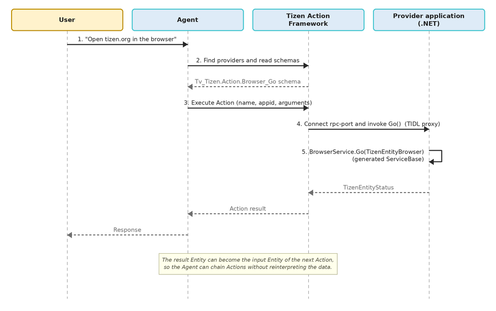

# Tizen Action 2.0

Tizen Action 2.0 allows your application to expose its capabilities to an Agent as structured, discoverable tools. The platform defines Actions and Entities as schemas; your application generates a C# service stub from those schemas, implements it, and registers itself as a provider.

The main Tizen Action 2.0 features are:

- Providing platform-defined Actions

  You can implement an Action category defined by the platform by generating a C# service stub with the `actionc` tool and implementing the generated `ServiceBase` class.

- Registering your application as a provider

  You can register your application as the provider of each Action it serves through `tizen-manifest.xml` metadata, which makes the Actions discoverable and executable by an Agent.

- Chaining Actions through Entities

  Because Actions exchange typed Entities, the result Entity of one Action can become the input Entity of the next one, so an Agent can compose Actions structurally instead of reinterpreting intermediate data.

## Core concepts

| Component | Role |
|---|---|
| Action | A capability an Agent can discover and run. An `.action` file is a JSON schema; a 2.0 TIDL Action has `"type": "tidl"`. |
| Entity | A typed data model passed between Actions. An `.entity` file defines its type name, inheritance, and data schema. |
| Category | A group of Actions. One category becomes one generated interface and one RPC port. |
| `actionc` | Converts Actions and Entities into a TIDL interface and generates the service stub in the requested language. |
| Agent | Discovers Actions and Entities and executes an Action through the Action API or the `action-tool` CLI. |

The following figure shows how a single user utterance flows through the framework to your application and back:

**Figure: Action execution flow from a user utterance**



## Action and Entity schemas

A TIDL Action schema declares its name, category, contracts, and provider. The platform `Tv_Tizen.Action.Browser_Go` Action is defined as follows:

```json
{
  "version": "v2",
  "name": "Tv_Tizen.Action.Browser_Go",
  "type": "tidl",
  "category": "Tizen.Action.Browser",
  "description": "open a URL in the browser",
  "allowedBackground": "true",
  "autoDispose": "false",
  "inputSchema": {
    "type": "Tizen.Entity.Browser"
  },
  "outputSchema": {
    "type": "Tizen.Entity.Status"
  },
  "details": {
    "appid": "org.tizen.next-browser"
  }
}
```

| Field | Description |
|---|---|
| `version` | The 2.0 schema version. Platform examples use `v2`. |
| `name` | The unique Action name. Action names are device-wide identifiers. |
| `type` | Use `tidl` for a TIDL Action. |
| `category` | One category generates one interface. |
| `inputSchema`, `outputSchema` | JSON-Schema-shaped contracts. Reference an Entity directly in `type`, or from an object property. |
| `details.appid` | The provider application ID declared by the schema. |
| `allowedBackground`, `autoDispose` | Optional background and lifecycle flags passed to the RPC-port connection. Both default to `false`. Prefer booleans; the current parser also accepts the strings `"true"` and `"false"`, as the platform Action above does. |

An Action is not limited to the provider named in `details.appid`. Your application registers itself as an additional provider of the same Action through manifest metadata, and the Agent selects which provider to invoke with `params.appid` when it executes the Action.

An Entity keeps data meaning by using a `Tizen.Entity.*` type instead of only JSON primitives, and can inherit from the platform root Entity. `Tizen.Entity.Browser`, the input of the Action above, is defined as follows:

```json
{
  "typeName": "Tizen.Entity.Browser",
  "description": "a web page",
  "base": "Tizen.Entity",
  "dataSchema": {
    "type": "object",
    "properties": {
      "Url": { "type": "string", "description": "Url" },
      "Title": { "type": "string", "description": "Title" },
      "Details": { "type": "string", "description": "Details" }
    }
  },
  "entityResolver": {
    "category": "Tizen.Action.Browser",
    "getByIdsAction": "Tv_Tizen.Action.Browser_GetBrowserByIds",
    "idField": "Id",
    "stableId": true
  }
}
```

Every Entity reference needs a corresponding `.entity` file. Entity property names become public field names on the generated C# class, so treat published names as part of the contract.

The optional `entityResolver` block declares how a reference to this Entity is refreshed into a live Entity. Because a provider-owned Entity instance is not stored in the Action database, a refreshable Entity names the Action that resolves identifiers back into Entities. A provider of the category must therefore implement and register the declared `getByIdsAction`, which is `Tv_Tizen.Action.Browser_GetBrowserByIds` in this case.

## Generate the C# service stub

Generate the stub for the category you want to provide with the `-l C#` option:

```bash
mkdir -p gen && cd gen
actionc -a Tizen.Action.Browser -l C# -o ImplBrowser
```

This produces `ImplBrowser.cs`. `actionc` converts the schemas to a TIDL interface and runs the TIDL compiler on it. Use `--keep-temp` to retain the intermediate `.tidl` files for inspection, and set `ACTIONC_DATA_DIR` when the framework schemas are not in the default location.

The generated file declares two namespaces, named after the `-o` output:

| Namespace | Contents |
|---|---|
| `RPCPort.ImplBrowser` | Entity classes, such as `TizenEntityBrowser` and `TizenEntityStatus` |
| `RPCPort.ImplBrowser.Stub` | The category stub class, `TizenActionBrowser` |

Add both to your source file:

```csharp
using RPCPort.ImplBrowser;
using RPCPort.ImplBrowser.Stub;
```

Do not hand-edit the generated file; regenerate it after a schema change.

## Implement the generated ServiceBase

The stub class contains a nested abstract `ServiceBase` class. Derive from it and override every abstract member. Besides the Action methods, `OnCreate()` and `OnTerminate()` are also abstract, so they must be implemented:

```csharp
class BrowserService : TizenActionBrowser.ServiceBase
{
    public override void OnCreate()
    {
        Log.Info(LogTag, $"Client connected: Sender={Sender}, Instance={Instance}");
    }

    public override void OnTerminate()
    {
        Log.Info(LogTag, $"Client disconnected: Sender={Sender}, Instance={Instance}");
    }

    public override TizenEntityStatus Go(TizenEntityBrowser browser)
    {
        Log.Info(LogTag, $"Go: Url=\"{browser.Url}\", Title=\"{browser.Title}\"");

        // Perform the application capability here.
        return new TizenEntityStatus { Success = true, Reason = "" };
    }

    public override TizenEntityStatus GetCurrent(out TizenEntityBrowser result)
    {
        result = new TizenEntityBrowser
        {
            Id = "current_id",
            Url = "https://tizen.org",
            Title = "Tizen Project"
        };

        return new TizenEntityStatus { Success = true, Reason = "" };
    }
}
```

Note the following about the generated signatures:

- In `outputSchema`, the property named `return` becomes the method return value, and every other property becomes an `out` parameter. `GetCurrent` above returns `Tizen.Entity.Status` and hands the browser Entity back through `out result`.
- Entity members are public fields, and each Entity class provides a parameterless constructor and a `ToJson()` method that is useful for logging.
- An Entity that inherits from `Tizen.Entity` also exposes the inherited `Id` and `Extra` fields.
- Report failures through the returned `TizenEntityStatus` by setting `Success` to `false` and putting an actionable cause in `Reason`.
- `Sender` and `Instance` identify the connected client, and `Disconnect()` closes the connection.

A resolver Action such as `GetBrowserByIds` returns the requested Entities in request order and reports the identifiers it could not resolve:

```csharp
public override TizenEntityStatus GetBrowserByIds(List<string> ids,
                                                  out List<TizenEntityBrowser> result,
                                                  out List<string> unresolvedIds)
{
    result = new List<TizenEntityBrowser>();
    unresolvedIds = new List<string>();

    foreach (string id in ids)
    {
        // LookUpPage() is your application's own lookup for the identifier.
        TizenEntityBrowser browser = LookUpPage(id);
        if (browser != null)
            result.Add(browser);
        else
            unresolvedIds.Add(id);
    }

    return new TizenEntityStatus { Success = true, Reason = "" };
}
```

## Start the stub listener

Create the stub and start listening when your application starts. `Listen()` takes the service **type**, not an instance: the stub creates one service object per connected client:

```csharp
class Program : NUIApplication
{
    private TizenActionBrowser _browser;

    protected override void OnCreate()
    {
        base.OnCreate();

        _browser = new TizenActionBrowser();
        try
        {
            _browser.Listen(typeof(BrowserService));
        }
        catch (Exception e)
        {
            Log.Error(LogTag, $"Failed to listen: {e.Message}");
            return;
        }

        Log.Info(LogTag, "TizenActionBrowser stub is listening");
    }
}
```

`Listen()` throws `ArgumentException` when the given type does not derive from `ServiceBase`, so log the exception as the example does. `OnCreate()` runs when a client connects and `OnTerminate()` when it disconnects, so state shared between service objects can be accessed concurrently; protect it, and do not block an Action method indefinitely. Use `GetServices()` to enumerate the connected service objects.

## Register the provider in the manifest

Register your application as the provider of each Action it serves. Add one `http://tizen.org/metadata/action/provider` entry per Action name; a category value is silently ignored:

```xml
<manifest xmlns="http://tizen.org/ns/packages" api-version="10.0"
          package="org.example.actionsampleappcs" version="1.0.0">
  <profile name="common" />
  <ui-application appid="org.example.actionsampleappcs"
                  exec="ActionSampleAppCs.dll"
                  type="dotnet"
                  multiple="false"
                  taskmanage="true"
                  nodisplay="false"
                  launch_mode="single">
    <label>ActionSampleAppCs</label>
    <metadata key="http://tizen.org/metadata/action/provider"
              value="Tv_Tizen.Action.Browser_Go" />
    <metadata key="http://tizen.org/metadata/action/provider"
              value="Tv_Tizen.Action.Browser_GetCurrent" />
    <metadata key="http://tizen.org/metadata/action/provider"
              value="Tv_Tizen.Action.Browser_GetBrowserByIds" />
  </ui-application>
  <privileges>
    <privilege>http://tizen.org/privilege/datasharing</privilege>
    <privilege>http://tizen.org/privilege/appmanager.launch</privilege>
  </privileges>
</manifest>
```

The `datasharing` and `appmanager.launch` privileges let the framework's TIDL proxy connect to your stub. Declare only the minimum privileges required for your application, including any `requiredPrivileges` of the Actions you provide.

Register providers only. The Action and Entity schemas of a platform-defined category are already installed and owned by the platform: if a package declares an Action or Entity name that the platform already owns, the installation is rejected, because Action and Entity names are device-wide identifiers.

## Build and deploy

Build the project and install the resulting package on the target:

```bash
dotnet build
sdb install bin/Debug/net8.0-tizen10.0/org.example.actionsampleappcs-1.0.0.tpk
```

The project targets the Tizen framework of the device API level, for example:

```xml
<PropertyGroup>
  <OutputType>Exe</OutputType>
  <TargetFramework>net8.0-tizen10.0</TargetFramework>
</PropertyGroup>
```

> [!NOTE]
> The generated stub uses the `Tizen.Applications.RPCPort` namespace, so the build needs the reference assemblies of the device API level. A Tizen 10.1 device is TizenFX API 14, and if the installed .NET Tizen workload does not ship reference assemblies for that API level, the framework reference does not resolve and the build fails.

## Verify on the target device

Check that the provider is registered, run an Action, and read your application's log:

```bash
sdb shell action-tool find-appids Tizen.Action.Browser --json
sdb shell action-tool get-action Tv_Tizen.Action.Browser_Go

sdb shell "action-tool execute '{
  \"id\": 10,
  \"params\": {
    \"name\": \"Tv_Tizen.Action.Browser_Go\",
    \"appid\": \"org.example.actionsampleappcs\",
    \"arguments\": {
      \"Url\": \"https://tizen.org\",
      \"Title\": \"Tizen OS\",
      \"Details\": \"Rpi4 Board\"
    }
  }
}'"

sdb shell dlogutil -d <YOUR_LOG_TAG>
```

Terminate any previously running instance before re-running an Action, so that a stale process does not serve the request:

```bash
sdb shell "killall ActionSampleAppCs || true"
```

In the response, `isError` indicates whether the request reached your application, while `return.Success` indicates whether your application logic succeeded. Evaluate both values separately.

If discovery or execution fails, check the following:

1. `find-appids` lists your `appid`. An empty result usually means the provider metadata is missing, uses a category instead of Action names, or the package metadata was not reprocessed after installation.
2. The Action name and `appid` in the request contain no typos.
3. `Listen()` succeeded. If the port never opened, the request does not reach your application.
4. Your application declares the `datasharing` and `appmanager.launch` privileges.

## Design recommendations

- Reuse the same Entity type for the same semantics so that Actions can be chained.
- Return stable identifiers and actionable failure reasons.
- Keep the returned values aligned with the `outputSchema` contract.
- Persist required state so that provider restart and connection auto-dispose are safe; the connection can be recreated at any time.
- Verify the success and failure paths, and the background, disconnect, and provider-restart behavior of your `allowedBackground` and `autoDispose` settings.

## Related information
* Dependencies
  - Tizen 10.1 and Higher
