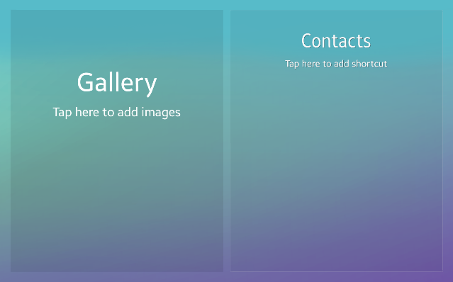

# Widget Viewer

[Widgets](../applications/uiapplication/widget-app.md) are commonly used in applications like home screen (launcher) or lock screen. **Widget** is a simple component based on NUI View designed to show a personalized set of information.

**Figure: Widget viewer**



**NUI** framework provides API to use and view widgets in your application. To read more about widget applications you can check the following topics:
- [Widget Application Guide](../applications/uiapplication/widget-app.md)
- [Widget Management Guide](./widget-control.md)

Platform applications preinstalled in the Tizen image provide a few simple widgets such as `Gallery`, `Music Player`, and `Contacts`. To check installed widget applications in your Tizen image, you can use the SDB tool and pkginfo command line interface.

To open the device/emulator shell use the SDB tool: 

```shell
sdb shell
```

Then list installed widgets:

```shell
pkginfo --listpkg | grep widget
```

## Prerequisites
To view a widget, the application has to request permission by adding the following privilege to the `tizen-manifest.xml` file:

```xml
<ui-application appid="org.tizen.example.NUIWidgetViewer">
    <!-- application description -->
</ui-application>
<privileges>
    <privilege>http://tizen.org/privilege/widget.viewer</privilege>
</privileges>
```

## Create widget viewer

To use the methods and properties of the [WidgetViewManager](/application/dotnet/api/TizenFX/latest/api/Tizen.NUI.WidgetViewManager.html) class, include the [Tizen.NUI](/application/dotnet/api/TizenFX/latest/api/Tizen.NUI.html) namespace in your application:

```csharp
using Tizen.NUI;
using Tizen.NUI.BaseComponents;
```

Commonly the `OnCreate()` callback is implemented to initialize UI of an application:

```csharp
namespace NUIWidgetViewer
{
    class Program : NUIApplication
    {
        protected override void OnCreate()
        {
            base.OnCreate();
            Initialize();
        }
    }
    //...
```

In this case, the `Initialize()` function called from the `OnCreate()` callback:

- Creates the `widgetsList` View instance and:
    - Set its size using `WidthResizePolicy` and `HeightResizePolicy` to screen size.
    - Set up horizontal `Layout` with padding and margin.
- Creates the `widgetViewManager` instance and registers current application as a viewer for installed widgets using the [application ID](/application/dotnet/api/TizenFX/latest/api/Tizen.Applications.ApplicationInfo.html).
- Creates instances of two widgets. The `galleryWidget` and `contactsWidget` are created using `widgetViewManager` object.
- Inserts created widgets into created `widgetsList` and add `widgetsList` to the default layer of the application window:

```csharp
    void Initialize()
    {
        View widgetsList = new View()
        {
            WidthResizePolicy = ResizePolicyType.FillToParent,
            HeightResizePolicy = ResizePolicyType.FillToParent,
            Layout = new LinearLayout()
            {
                VerticalAlignment = VerticalAlignment.Center,
                LinearOrientation = LinearLayout.Orientation.Horizontal,
                CellPadding = new Size2D(20, 20),
                Padding = new Extents(30, 30, 30, 30)
            }
        };

        WidgetViewManager widgetViewManager = new WidgetViewManager(this, this.ApplicationInfo.ApplicationId);

        var galleryWidget = widgetViewManager.AddWidget("org.tizen.gallery.widget", "", 
                Window.Instance.WindowSize.Width / 2 - 40, Window.Instance.WindowSize.Height, 0);
        var contactsWidget = widgetViewManager.AddWidget("org.tizen.contacts.widget", "", 
                Window.Instance.WindowSize.Width / 2 - 40, Window.Instance.WindowSize.Height, 0);
        
        widgetsList.Add(galleryWidget);
        widgetsList.Add(contactsWidget);

        Window.Instance.GetDefaultLayer().Add(widgetsList);
    }
```

Handling back button press events:

```csharp
    public void OnKeyEvent(object sender, Window.KeyEventArgs e)
    {
        if (e.Key.State == Key.StateType.Down && (e.Key.KeyPressedName == "XF86Back" || e.Key.KeyPressedName == "Escape"))
        {
            Exit();
        }
    }
```

Main code of the application:

```csharp
    static void Main(string[] args)
    {
        var app = new Program();
        app.Run(args);
    }
```

For full source code of the example, see [here](./source-code/widget-viewer.cs).

## Related information
  - Dependencies
    -   Tizen 4.0 and Higher
  - API Reference
    - [Tizen.NUI](/application/dotnet/api/TizenFX/latest/api/Tizen.NUI) namespace
    - [Tizen.NUI.WidgetViewManager](/application/dotnet/api/TizenFX/latest/api/Tizen.NUI.WidgetViewManager) class
