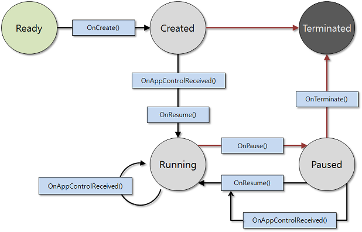

# Applications

A Tizen .NET application is similar to a conventional C\# application, with some additional features optimized for Tizen devices. The additional features have constraints, such as a relatively small screen size and lack of system resources compared to a larger system. For example, for power management reasons, the application can take actions to reduce usage when it finds out that it has its display window covered over by another application window. State change events are delivered to make it possible to detect these situations.

## Tizen .NET Application Models

Tizen provides various application models to allow you to create applications targeted for specific tasks:

- [UI Application](./uiapplication/overview.md)

  The UI application has a graphical user interface. You can create diverse applications with a variety of features, and design
  versatile applications and intriguing user interfaces with text and graphics while taking advantage of many device functionalities, such as sensors and call operations. In addition, you can, for example, manage content and media files, use network and social services, and provide messaging and embedded Web browsing functionality.

## Tizen .NET Application Life-Cycle

The Tizen .NET application model handles application life-cycle and system events. Tizen .NET application life-cycle is handled by the [Tizen.Applications](/application/dotnet/api/TizenFX/latest/api/Tizen.Applications.html) namespace. It provides methods to manage the main event loop, the application state change events, and basic system events.

Applications in the same package follow the same installation life-cycle, which is handled by the application package manager. Each application in the package follows its own application life-cycle. Each application in an application package can be identified by its own ID.

## Tizen .NET Application State Change Methods

A Tizen .NET application can be in one of several different states.  Typically, the application is launched by the user from the Launcher, or by another application. When the application is starting, the `OnCreate()` method is executed and the main event loop starts. The application is normally at the top of the window, with focus.

When the application loses the focus status, the `OnPause()` method is invoked. The application can go into the pause state, which means that your application is not terminated but continues to run in the background, when:

- A new application is launched by the request of your application.
- The user requests to go to the home screen.
- A system event (such as an incoming phone call) occurs and causes a resident application with a higher priority to become active and temporarily hide your application.
- An alarm is triggered for another application, which becomes the topmost window and hides your application.

The application in the background goes into a suspended state. In the suspended state, the application process is executed with limited CPU resources. In other words, the platform does not allow the running of background applications, except for some exceptional applications (such as Media and Download) that necessarily work in the background. In this case, you can [define a background category in the application manifest file](./uiapplication/ui-app.md#allow_bg), to prevent the application from going into the suspended state.

When your application becomes visible again, the `OnResume()` method is invoked. The visibility returns, when:

- Another application requests your application to run (for example, the Task Navigator, which shows all running applications and lets the user select any application to run).
- All applications on top of your application in the window stack finish.
- An alarm is triggered for your application, bringing it to the front and hiding other applications.

When your application starts exiting, the `OnTerminate()` method is invoked. Your application can start the termination process, when:

- Your application itself requests to exit by calling the `Exit()` method to terminate the event loop.
- The low memory killer is killing your application in a low memory situation.

The following figure shows the UI application states.

**Figure: UI application states**

Application state changes are managed by the underlying framework. For
more information on application state transitions, see [Application
States and Transitions](./uiapplication/ui-app.md#state_trans).

## Related Information
- Dependencies
  - Tizen 4.0 and Higher
