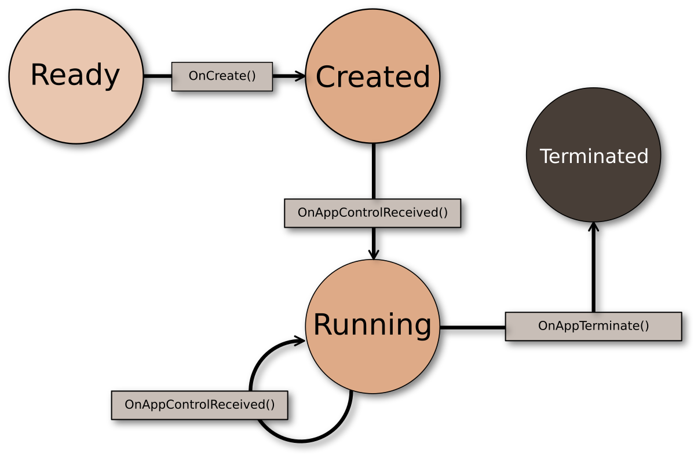

# Service Applications 

Service applications are Tizen .NET applications with no graphical user interface that runs in the background. They can be very useful in performing activities (such as getting sensor data in the background) that need to run periodically or continuously, but do not require any user intervention.

The service application type allows the creation of reusable and independent parts that are important in bigger projects where we can easily split responsibilities of the application into different parts. 
Consider the speedometer application designed for average speed measurement; the service part, in this case, is responsible for reading speed from the device's GPS module, it also calculates the average speed. The UI communicates with the service when required, and shows the measured values to the user. 
This approach allows reusing modules between different applications, such as cyclist applications, automotive solutions, and sport activity apps. The core module with business logic, works in the background and performs the task it was designed for until it gets closed by system events, such as `OnLowMemory` or `OnLowBattery`. The activity of the core module remains unaffected by any user action, such as the accidental closing of the app UI.

The main Service Application API feature includes the following: 
-  Application states:

    A Tizen service application has different states which it transitions through during its life cycle.

- Event callbacks:
  
    The service application can receive both basic system events and application state change events. You can register handlers for these events to respond to them.

- Application behavior attributes:
  
    You can determine your service application behavior at boot time and after abnormal terminations by using specific attributes which you can set in the application manifest file. 

The service application can be explicitly launched by a UI application. They can also be launched conditionally.

The list of running service applications is available in the task switcher system application; however, no events occur if the user selects a service application from the task switcher. The main menu does not contain icons for service applications. Multiple service applications can be running simultaneously with other service and UI applications.

## Application states

The following figure and table describe the service application states.

**Figure: Service application life cycle**


**Table: Service application states**

| State        | Description                         |
|--------------|-------------------------------------|
| `READY`      | Application is launched.            |
| `CREATED`    | Application starts the main loop.   |
| `RUNNING`    | Application runs in the background. |
| `TERMINATED` | Application is terminated.          |

Since a service application has no UI, it does not have a pause state. Since Tizen 2.4, the service application can go into the suspended state. The service application is running in the background by its nature; so the platform does not allow running the service application unless the application has a background category defined in its manifest file. However, when the UI application that is packaged with the service application is running in the foreground, the service application is also regarded as a foreground application and it can run without a designated background category.

## Background categories

Since Tizen 2.4, an application is not allowed to run in the background unless it is explicitly declared to do so. The following table lists the background categories that allow an application to run in the background.

<a name="allow_bg_table"></a>
**Table: Allowed background application policy**

| Background category            | Description                              | Related namespaces                       | Manifest file \<background-category\> element value |
|------------------------------|----------------------------------------|----------------------------------------|----------------------------------------|
| Media                          | Playing audio, recording, and outputting streaming video in the background | [Tizen.Multimedia](/application/dotnet/api/TizenFX/latest/api/Tizen.Multimedia.html) | `media`                                  |
| Download                       | Downloading data with the classes and methods of the Tizen.Content.Download namespace | [Tizen.Content.Download](/application/dotnet/api/TizenFX/latest/api/Tizen.Content.Download.html) | `download`                               |
| Background network             | Processing general network operations in the background (such as sync-manager, IM, and VOIP) | [Tizen.Account.SyncManager](/application/dotnet/api/TizenFX/latest/api/Tizen.Account.SyncManager.html) | `background-network`                     |
| Location                       | Processing location data in the background | [Tizen.Location](/application/dotnet/api/TizenFX/latest/api/Tizen.Location.html) <br> [Tizen.Location.Geofence](/application/dotnet/api/TizenFX/latest/api/Tizen.Location.Geofence.html) <br> [Tizen.Maps](/application/dotnet/api/TizenFX/latest/api/Tizen.Maps.html) | `location`                               |
| Sensor (context)               | Processing context data from the sensors, such as gesture | [Tizen.Sensor](/application/dotnet/api/TizenFX/latest/api/Tizen.Sensor.html) | `sensor`                                 |
| IoT Communication/Connectivity | Communicating between external devices in the background (such as Wi-Fi and Bluetooth) | [Tizen.Network.WiFi](/application/dotnet/api/TizenFX/latest/api/Tizen.Network.WiFi.html) <br> [Tizen.Network.Bluetooth](/application/dotnet/api/TizenFX/latest/api/Tizen.Network.Bluetooth.html) | `iot-communication`                      |


> [!NOTE]
> Since Tizen 4.0, even if the background network category is declared, the running application stops if the network is not connected.

### Describe background category

An application with a background running capability must declare the background category in its manifest file:

```
<?xml version="1.0" encoding="utf-8"?>
<manifest xmlns="http://tizen.org/ns/packages" api-version="2.4" package="org.tizen.test" version="1.0.0">
   <ui-application appid="org.tizen.test" exec="text" type="capp" multiple="false" taskmanage="true" nodisplay="false">
      <icon>rest.png</icon>
      <label>rest</label>
      <!--For API version 2.4 and higher-->
      <background-category value="media"/>
      <background-category value="download"/>
      <background-category value="background-network"/>
   </ui-application>
   <service-application appid="org.tizen.test-service" exec="test-service" multiple="false" type="capp">
      <background-category value="background-network"/>
      <background-category value="location"/>
   </service-application>
</manifest>
```

## Manage the service application

The following code snippets show the service application backbone generated from the Tizen templates.
The service template creates callback stubs to fill. The service application type is defined in the `Tizen.Applications` namespace, so it should be included at the top of the file:

```csharp
using Tizen.Applications;
```

The `ServiceApplication` has no UI, so `OnPause()` and `OnResume()` are not defined. Besides that, it defines similar callbacks to other application types, such as `OnCreate()` and `OnTerminate()` life cycle callbacks, and `OnLowBattery()`, `OnLowMemory()`, and `OnLocaleChanged()` system callbacks.

`OnCreate()` method is used to take necessary actions before the main event loop starts. Place the initialization code here:

```csharp
        protected override void OnCreate()
        {
            base.OnCreate();
            
            //Initialization
        }
```

`OnAppControlReceived()` callback is the most important callback since it is responsible for data exchange between the service application and other applications:

```csharp
        protected override void OnAppControlReceived(AppControlReceivedEventArgs e)
        {
            base.OnAppControlReceived(e);
        }
```

`OnTerminate()` callback is used to take necessary actions when the application is terminating. It releases all resources, especially any allocations and shared resources:

```csharp
        protected override void OnTerminate()
        {
            base.OnTerminate();
        }
```

The following system events are connected with system state changes:

`OnLowMemory()`	is used to take necessary actions in low memory situations.
Save data from the main memory to a persistent memory or storage, to avoid data loss in case the Tizen platform low memory killer kills your application to get more free memory. Release any cached data in the main memory to secure more free memory:

```csharp
        protected override void OnLowMemory(LowMemoryEventArgs e)
        {
            base.OnLowMemory(e);
        }
```

`OnLowBattery()` is used to take necessary actions in low battery situations.
Save data from the main memory to a persistent memory or storage, to avoid data loss in case the power shuts down completely. Stop heavy CPU consumption or power consumption activities to save the remaining power:

```csharp
        protected override void OnLowBattery(LowBatteryEventArgs e)
        {
            base.OnLowBattery(e);
        }
```

`OnLocaleChanged()` and `OnRegionFormatChanged()` are invoked when region or system language is changed:

```csharp
        protected override void OnLocaleChanged(LocaleChangedEventArgs e)
        {
            base.OnLocaleChanged(e);
        }

        protected override void OnRegionFormatChanged(RegionFormatChangedEventArgs e)
        {
            base.OnRegionFormatChanged(e);
        }
```

```csharp
        static void Main(string[] args)
        {
            App app = new App();
            app.Run(args);
        }
    }
}
```

## Application attributes
Describe your service application attributes in the manifest file. The attributes determine the application behavior. The following code example illustrates how you can define the attributes:

```xml
<?xml version="1.0" encoding="utf-8"?>
<manifest xmlns="http://tizen.org/ns/packages" api-version="6" package="org.tizen.example.servicesample" version="1.0.0">
  <profile name="common" />
  <service-application appid="org.tizen.example.servicesample"
					exec="servicesample.dll"
					type="dotnet"
					multiple="false"
					taskmanage="false"
					nodisplay="true"
                    api-version="8">
    <label>servicesample</label>
    <icon>servicesample.png</icon>
  </service-application>
</manifest>
```

## Related information
  - Dependencies
    -   Tizen 4.0 and Higher
  - API Reference
    - [Tizen.Applications.ServiceApplication](/application/dotnet/api/TizenFX/latest/api/Tizen.Applications.ServiceApplication.html) class
    - [Tizen.Applications.CoreApplication](/application/dotnet/api/TizenFX/latest/api/Tizen.Applications.CoreApplication.html) class
    - [Tizen.Applications.Application](/application/dotnet/api/TizenFX/latest/api/Tizen.Applications.Application.html) class
