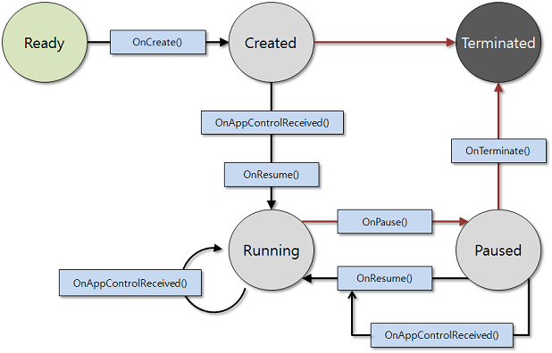
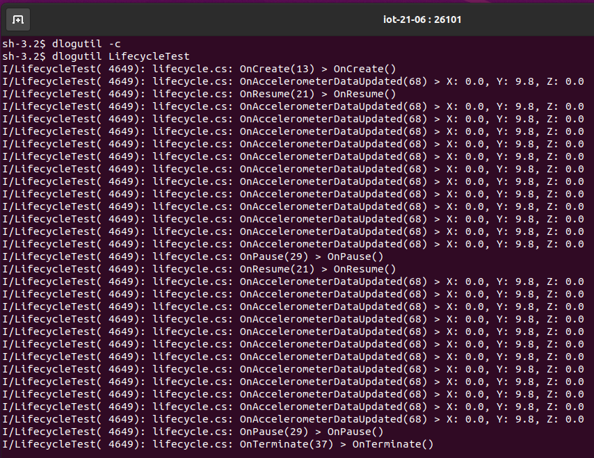

# Application Life Cycle

The Tizen .NET application model handles the application life cycle and system events. The Tizen .NET application life cycle is handled by the [Tizen.Applications](/application/dotnet/api/TizenFX/latest/api/Tizen.Applications.html) namespace.

It provides methods to manage the main event loop, the application state change events, and basic system events. Applications in the same package follow the same installation life cycle, which is handled by the application package manager.
Each application in the package follows its own application life cycle. Each application in an application package can be identified by its ID.

A Tizen .NET application can be in one of several different states.  Typically, the application is launched by the user from the launcher, or by another application. When the application is starting, the `OnCreate()` method is executed and the main event loop starts. The application is normally at the top of the window with a focus status.

When the application loses the focus status, the `OnPause()` method is invoked. The application can go into the pause state, which means that your application is not terminated, but continues to run in the background, when the following occurs:

- A new application is launched at the request of your application.
- The user requests to go to the home screen.
- A system event (such as an incoming phone call) occurs, and causes a resident application with a higher priority to become active and temporarily hide your application.
- An alarm is triggered for another application, which becomes the topmost window and hides your application.

The application in the background goes into a suspended state. In the suspended state, the application process is executed with limited CPU resources. In other words, the platform does not allow the running of background applications, except for some exceptional applications (such as Media and Download) that necessarily work in the background. In this case, you can [define a background category in the application manifest file](./ui-app.md#allow_bg), to prevent the application from going into the suspended state.

When your application becomes visible again, the `OnResume()` method is invoked. The visibility returns, when the following occurs:

- Another application requests your application to run (for example, the Task Navigator, which shows all running applications and lets the user select any application to run).
- All applications on top of your application in the window stack finish.
- An alarm is triggered for your application, bringing it to the front and hiding other applications.

When your application starts exiting, the `OnTerminate()` method is invoked. Your application can start the termination process, when the following occurs:

- Your application itself requests to exit by calling the `Exit()` method to terminate the event loop.
- The low memory killer is killing your application in a low memory situation.

The Tizen .NET application can be in one of several application states.

The [Tizen.Applications](/application/dotnet/api/TizenFX/latest/api/Tizen.Applications.html) namespace defines 5 states with corresponding state change methods. A state change method is triggered after each state change: whenever the application is created, starts running, or is paused, resumed, or terminated. The application must react to each state change appropriately.

**Table: Application states**

| State        | Description                              |
|------------|----------------------------------------|
| `READY`      | Application is launched.                 |
| `CREATED`    | Application starts the main loop.        |
| `RUNNING`    | Application is running and visible to the user. |
| `PAUSED`     | Application is running but invisible to the user. |
| `TERMINATED` | Application is terminated.               |

The following figure illustrates the application state transitions.

**Figure: Application state transitions**



<a name="state_change"></a>
## Tizen .NET application state change methods

The following example shows the basic usage of the life cycle events provided by the `NUIApplication` class derived from the `CoreApplication` and `Application`. To use the `NUIApplication` class, `Tizen.NUI` namespace has to be included in the project. In the following example, two additional namespaces are used: `Tizen.NUI.BaseComponents` for the `TextLabel` component and `Tizen.Sensor` for the accelerometer access. The application overrides the `OnPause` and `OnResume` methods according to usage. The app suspends `Accelerometer` update callback to save power in the `Paused` state:

```csharp
using Tizen.NUI;
using Tizen.NUI.BaseComponents;
using Tizen.Sensor;
```

The main class of the application is defined as `Program`. In this case, the `Program` class derives from the `NUIApplication` object. The `Accelerometer` handle is declared in the main class to use it in all life cycle callbacks. The `OnCreate()` method uses `Tizen.Log.Info` to print information in `dlogutil` tool. For more information on logging into system in `Tizen`, see [log viewer](../../../../native/guides/error/system-logs.md#dlogutil). `OnCreate()` method initializes the UI and the `Accelerometer` component:

```csharp
class Program : NUIApplication
{
    private Accelerometer SensorAccelerometer = null;

    protected override void OnCreate()
    {
        Tizen.Log.Info("LifecycleTest", "OnCreate()");
        base.OnCreate();
        InitSensors();
        InitUI();
    }
}
```

The following code snippet is responsible for initializing `Accelerometer` sensor. The function setups the event handler for data update, and sets the update interval for one second. After setup, the `SensorAccelerometer.Start()` is called to start the measurements:

```csharp
void InitSensors()
{
    SensorAccelerometer = new Accelerometer();
    SensorAccelerometer.Interval = 1000;
    SensorAccelerometer.DataUpdated += OnAccelerometer;
    SensorAccelerometer.Start();
}
```

The UI setup is based on the basic template. A single `TextLabel` component is used to show the application UI and its running state:

```csharp
void InitUI()
{
    Window.Instance.KeyEvent += OnKeyEvent;

    TextLabel test = new TextLabel("Lifecycle test...")
    {
        HorizontalAlignment = HorizontalAlignment.Center,
        VerticalAlignment = VerticalAlignment.Center,
        TextColor = Color.Blue,
        PointSize = 12.0f,
        HeightResizePolicy = ResizePolicyType.FillToParent,
        WidthResizePolicy = ResizePolicyType.FillToParent
    };

    Window.Instance.GetDefaultLayer().Add(test);
}
```

The `OnTerminate()` method logs information about the application termination:

```csharp
protected override void OnTerminate()
{
    Tizen.Log.Info("LifecycleTest", "OnTerminate()");
    base.OnTerminate();
}
```

The `OnPause()` method is called when the application is suspended, but not killed. Then, it goes into the `Paused` state. To stop reading data from the `Accelerometer`, the `SensorAccelerometer.Stop()` method is used. Now, the application reduces resource usage. The main application window goes into the background now. The UI events are not received, but the data event handler has to be stopped manually:

```csharp
protected override void OnPause()
{
    Tizen.Log.Info("LifecycleTest", "OnPause()");
    base.OnPause();

    if (SensorAccelerometer != null) SensorAccelerometer.Stop();
}
```

The Tizen operating system may resume `Lifecycle` application, if it was not terminated. The data updating is restored using the `SensorAccelerometer.Start()` method. The application main window should be visible now:

```csharp
protected override void OnResume()
{
    Tizen.Log.Info("LifecycleTest", "OnResume()");
    base.OnResume();

    if (SensorAccelerometer != null) SensorAccelerometer.Start();
}
```

The callback setup in `InitSensors()` function is called every second. It prints debug information about a measured data from `Accelerometer` sensor. In the emulator case, this value can be changed using `Control Panel` tool. To observe changes you can use the [log viewer](../../../../native/guides/error/system-logs.md#dlogutil):

```csharp
void OnAccelerometer(object sender, AccelerometerDataUpdatedEventArgs args)
{
    Tizen.Log.Info("LifecycleTest", string.Format("X: {0}, Y: {1}, Z: {2}", args.X, args.Y, args.Z));
}
```

To terminate the application, `OnKeyEvent()` handler is implemented. When the back key is pressed, the `Exit()` method is called to terminate the application. To minimize the application, the `Home` button should be pressed, which is handled by the Tizen operating system. Then, the `OnPause()` method is called:

```csharp
public void OnKeyEvent(object sender, Window.KeyEventArgs e)
{
    if (e.Key.State == Key.StateType.Down && (e.Key.KeyPressedName == "XF86Back" || e.Key.KeyPressedName == "Escape"))
    {
        Exit();
    }
}
```

The `Main` function code creates `Program` instance, calls `Run` method to change application state, and calls `OnCreate()` callback:

```csharp
static void Main(string[] args)
{
    var app = new Program();
    app.Run(args);
}
```

The following screenshot presents dump from the `dlogutil` tool. The data reading is stopped when application changes state to `Paused`.

**Figure: Application life cycle logs**



You can check full source code here: [lifecycle sample](source-code/application_lifecycle.cs).

## Related information
- Dependencies
  - Tizen 4.0 and Higher
- API Reference
  - [Tizen.Applications.Application](/application/dotnet/api/TizenFX/latest/api/Tizen.Applications.Application.html) class
  - [Tizen.Applications.CoreApplication](/application/dotnet/api/TizenFX/latest/api/Tizen.Applications.CoreApplication.html) class
  - [Tizen.Applications.CoreUIApplication](/application/dotnet/api/TizenFX/latest/api/Tizen.Applications.CoreUIApplication.html) class
  
