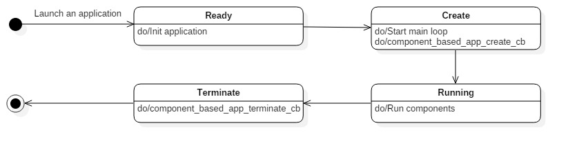
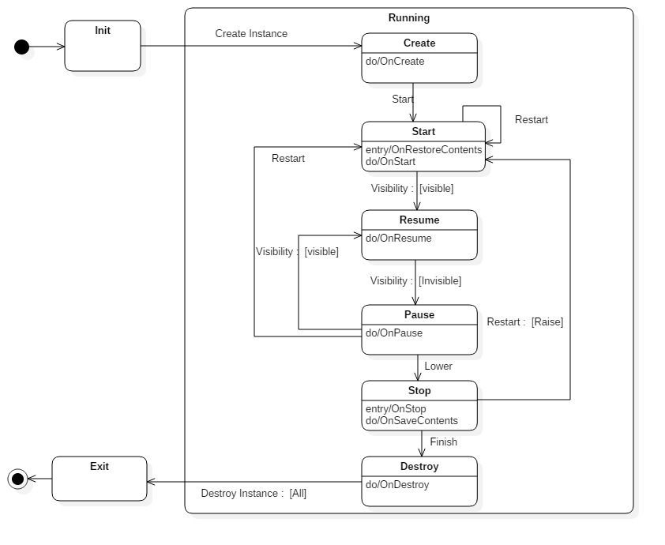
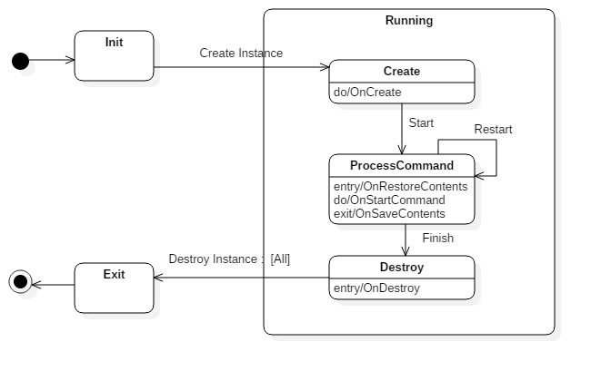
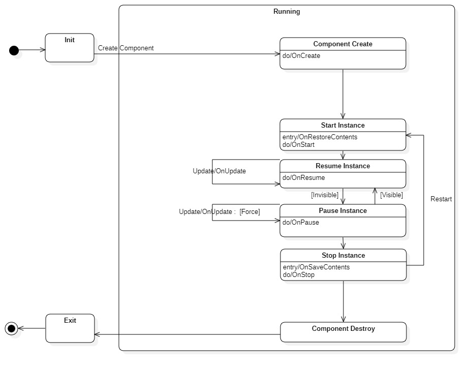

# Component based application


The component based application is one of the Tizen application models. This application model enables you to create an application that provides multiple components in one process.
In the component based application model, there are three types of components. Each component type has its own lifecycle:

- Service component: The service component has a lifecycle for managing services without UI.
- Frame component: The frame component has a lifecycle for managing UI resources.
- Widget component: The widget component has a lifecycle for managing widget resources.

As you create a Tizen project, you can add components to your project. The registered components create instances when the component based application receives a launch request.

The main component based application API features include:

- Application states

  A Tizen dotnet component based application [transitions through various states](#application_states) during its lifecycle.

- Application event callbacks

  The component based application can receive applications state change events. You can register [callbacks for these events](#application_register) to react to them.

- Component's states and event callbacks
  - Frame component states

    A frame component [transitions through various states](#frame_component_states) during its lifecycle.

  - Frame component event callbacks

    The component based application can receive frame component state change events. You can register [callbacks for these events](#frame_component_callbacks) to react to them.

  - Service component states

    A service component [transitions through various states](#service_component_states) during its lifecycle.

  - Service component event callbacks

    The component based application can receive service component state change events. You can register [callbacks for these events](#service_component_callbacks) to react to them.

  - Widget component states

    A widget component [transitions through various states](#widget_component_states) during its lifecycle.

  - Widget component event callbacks

    The component based application can receive widget component state change events. You can register [callbacks for these events](#widget_component_callbacks) to react to them.

- Application behavior attributes

  You can [declare components and its specific attributes](#attribute) in the application manifest file.


<a name="application_states"></a>
## Application states

The following figure and table describe the component based application states:



| State        | Description                         |
|--------------|-------------------------------------|
| `Ready`      | Application is launched.            |
| `Create`     | Application starts the main loop.   |
| `Running`    | Application runs components.        |
| `Terminate`  | Application is terminated.          |

  > [!NOTE]
  > The component based application is created by requesting the creation of the first component and terminates if there are no running instances.
  > In the `Running` state, the component based application creates instances of registered components. The registered component can have multiple instances.


<a name="application_register"></a>
## Application event callbacks

You can control the component based application execution by [managing the application state events](#application_monitoring).

The following table lists the callbacks for the application state events:

| Callback                     | Description                              |
|------------------------------|------------------------------------------|
| `OnInit()`    | Used to take necessary actions before the main event loop starts. Place the initialization code (such as setting up the dbus connection) and add components here.|
| `OnRun()`    | Used to take necessary actions after the main event loop starts. |
| `OnFinished()`    | Used to take necessary actions after the main event loop finish.|
| `OnExit()` | Used to take necessary actions when the application terminates. This callback releases all resources, especially the allocated and shared resources, so that the other running applications can fully use the shared resources. |


## Component's states and event callbacks

Component based API provides state and event callbacks for each components.


<a name="frame_component_states"></a>
### Frame component states

The following figure and table describe the frame component states:



| State        | Description                         |
|--------------|-------------------------------------|
| `Create`     | The frame component instance is created.            |
| `Start`      | The frame component instance is started and is ready to receive visibility events.   |
| `Resume`     | The frame component instance is visible. |
| `Pause`      | The frame component instance is invisible. |
| `Stop`       | The frame component instance is stopped. Therefore, it stops receiving visibility events. |
| `Destroy`    | The frame component instance is destroyed.          |


<a name="frame_component_callbacks"></a>
### Frame component event callbacks

You can control the frame component lifecycle by [managing the frame component state events](#frame_component_monitoring).

The following table lists the callbacks for the frame component state events:

| Callback                     | Description                              |
|------------------------------|------------------------------------------|
| `OnCreate()`    | Used to take necessary actions before the lifecycle of a frame component instance starts. Place the initialization code here. You must create a window at this point. It is called once in the instance's lifecycle. |
| `OnRestoreContents()`    | Used to restore the current state of an instance. The data stored in  `OnSaveContent()` is passed by parameter. |
| `OnStart()`    | Used to start an instance. Requested `AppControl` is passed by parameter. |
| `OnResume()`    | Used to take necessary actions when the application becomes visible. If you have released any resources in the `OnPause()` callback, re-allocate those resources before the application resumes. |
| `OnPause()`    | Used to take necessary actions when the application becomes invisible. For example, release the memory resources so that other applications can use them. |
| `OnStop()`    | Used to take necessary actions when the frame component instance window is lowered. The window is lowered when the frame component window is not activated for a long time. |
| `OnSaveContent()`    | Used to take necessary actions when there is a need to store or restore data for launching the next instance. This callback is called right before `OnDestroy()`. |
| `OnDestroy()` | Used to take necessary actions when the frame component instance is terminating. This callback releases all resources, especially the allocated and shared resources. |

The frame component instance can also receive some basic system events. The following table shows available system events callbacks:

| Callback                               | Description                              |
|----------------------------------------|------------------------------------------|
| `OnLowMemoryCallback`                 | Event type for the callback function that is responsible for saving data from the main memory to a persistent memory or storage to avoid data loss. Data loss can occur if the Tizen platform low memory killer kills your application to free more memory. The callback function must release any cached data in the main memory to secure more free memory. |
| `OnLowBatteryCallback`                | Event type for the callback function that is responsible for saving data from the main memory to a persistent memory or storage to avoid data loss in case of complete power failure. The callback function must also stop heavy CPU consumption or power consumption activities to save the remaining power. |
| `OnDeviceOrientationChangedCallback` | Event type for the callback function that is responsible for changing the display orientation to match the device orientation. |
| `OnLanguageChangedCallback`           | Event type for the callback function that is responsible for refreshing the display into a new language. |
| `OnRegionFormatChangedCallback`      | Event type for the callback function that is responsible for refreshing the display into a new time zone. |
| `OnSuspendedStateCallback`    | Event type for the callback function that is responsible for taking necessary actions before entering the suspended state or after exiting from the state. |


<a name="service_component_states"></a>
### Service component states

The following figure and table describe the service component states:



| State        | Description                         |
|--------------|-------------------------------------|
| `Create`      | The service component instance is created.            |
| `Process Command`    | The service component instance handles the requested command. |
| `Destroy` | The service component instance is destroyed.          |


<a name="service_component_callbacks"></a>
### Service component event callbacks

You can control the service component lifecycle by [managing the service component state events](#service_component_monitoring).

The following table lists the callbacks for the service component state events:

| Callback                     | Description                              |
|------------------------------|------------------------------------------|
| `OnCreate()`    | Used to take necessary actions before the lifecycle of a service component instance starts. Place the initialization code here. It is called once in the instance's lifecycle. |
| `OnRestoreContents()`    | Used to restore the current state of an instance. The data stored in  `OnSaveContent` is passed by parameter. |
| `OnStartCommand()`    | Used to start an instance. Requested `AppControl` is passed by parameter. |
| `OnSaveContent()`    | Used to take necessary actions when there is a need to store or restore data for launching the next instance. This callback is called right before `OnDestroy`. |
| `OnDestroy()` | Used to take necessary actions when the frame component instance is terminating. This callback releases all resources, especially the allocated and shared resources. |

The service component instance can also receive some basic system events. The following table shows available system events callbacks:

| Callback                             | Description                              |
|----------------------------------------|------------------------------------------|
| `OnLowMemoryCallback`                 | Event type for the callback function that is responsible for saving data from the main memory to a persistent memory or storage to avoid data loss. Data loss can occur if the Tizen platform low memory killer kills your application to free more memory. The callback function must release any cached data in the main memory to secure more free memory. |
| `OnLowBatteryCallback`                | Event type for the callback function that is responsible for saving data from the main memory to a persistent memory or storage to avoid data loss in case of complete power failure. The callback function must also stop heavy CPU consumption or power consumption activities to save the remaining power. |
| `OnDeviceOrientationChangedCallback` | Event type for the callback function that is responsible for changing the display orientation to match the device orientation. |
| `OnLanguageChangedCallback`           | Event type for the callback function that is responsible for refreshing the display into a new language. |
| `OnRegionFormatChangedCallback`      | Event type for the callback function that is responsible for refreshing the display into a new time zone. |
| `OnSuspendedStateCallback`    | Event type for the callback function that is responsible for taking necessary actions before entering the suspended state or after exiting from the state. |


<a name="widget_component_states"></a>
### Widget component states

  > [!NOTE]
  > The widget component APIs are supported since Tizen 6.5

The following figure and table describe the widget component states:



| State        | Description                         |
|--------------|-------------------------------------|
| `Create`     | The widget component instance is created.            |
| `Start`      | The widget component instance is started and is ready to receive visibility events.   |
| `Resume`     | The widget component instance is visible. |
| `Pause`      | The widget component instance is invisible. |
| `Stop`       | The widget component instance is stopped. Therefore, it stops receiving visibility events. |
| `Destroy`    | The widget component instance is destroyed.          |


<a name="widget_component_callbacks"></a>
### Widget component event callbacks

  > [!NOTE]
  > The widget component APIs are supported since Tizen 6.5

You can control the widget component lifecycle by [managing the widget component state events](#widget_component_monitoring).

The following table lists the callbacks for the widget component state events:

| Callback                     | Description                              |
|------------------------------|------------------------------------------|
| `OnCreate()`    | Used to take necessary actions before the lifecycle of a widget component instance starts. Place the initialization code here. You must create a window at this point. It is called once in the instance's lifecycle. |
| `OnRestoreContents()`    | Used to restore the current state of an instance. The data stored in  `OnSaveContent` is passed by parameter. |
| `OnStart()`    | Used to start an instance. |
| `OnResume()`    | Used to take necessary actions when the application becomes visible. If you have released any resources in the `OnPause()` callback, re-allocate those resources before the application resumes. |
| `OnPause()`    | Used to take necessary actions when the application becomes invisible. For example, release the memory resources so that other applications can use them. |
| `OnStop()`    | Used to take necessary actions when the widget component instance window is lowered. The window is lowered when the widget component window is not activated for a long time. |
| `OnSaveContent()`    | Used to take necessary actions when there is a need to store or restore data for launching the next instance. This callback is called right before `OnDestroy`. |
| `OnDestroy()` | Used to take necessary actions when the widget component instance is terminating. This callback releases all resources, especially the allocated and shared resources.

The widget component instance can also receive some basic system events. The following table shows available system events callbacks:

| Callback                               | Description                              |
|----------------------------------------|------------------------------------------|
| `OnLowMemoryCallback`                 | Event type for the callback function that is responsible for saving data from the main memory to a persistent memory or storage to avoid data loss. Data loss can occur if the Tizen platform low memory killer kills your application to free more memory. The callback function must release any cached data in the main memory to secure more free memory. |
| `OnLowBatteryCallback`                | Event type for the callback function that is responsible for saving data from the main memory to a persistent memory or storage to avoid data loss in case of complete power failure. The callback function must also stop heavy CPU consumption or power consumption activities to save the remaining power. |
| `OnDeviceOrientationChangedCallback` | Event type for the callback function that is responsible for changing the display orientation to match the device orientation. |
| `OnLanguageChangedCallback`           | Event type for the callback function that is responsible for refreshing the display into a new language. |
| `OnRegionFormatChangedCallback`      | Event type for the callback function that is responsible for refreshing the display into a new time zone. |
| `OnSuspendedStateCallback`    | Event type for the callback function that is responsible for taking necessary actions before entering the suspended state or after exiting from the state. |


<a name="attribute"></a>
## Application attributes

Define your component based application attributes in the manifest file. The attributes determine the application behavior. The following code example illustrates how you can define the attributes:

```xml
<?xml version="1.0" encoding="utf-8"?>
<manifest xmlns="http://tizen.org/ns/packages" api-version="9" package="@PACKAGE_NAME@" install-location="internal-only" version="0.1.1">
    <label>Sample</label>
    <author email="tizenappfw@samsung.com" href="www.samsung.com">Tizen App Framework</author>
    <description>Sample</description>
    <component-based-application appid="org.tizen.base-component" exec="@BINDIR@/base-component" type="dotnet">
        <label>Base-component application</label>
        <icon>@DESKTOP_ICON@</icon>
        <service-component id="base-service" main="false">
            <label>base-service</label>
        </service-component>
        <frame-component id="base-frame" launch_mode="caller" main="true" icon-display="true" taskmanage="true">
            <icon>org.tizen.sample.png</icon>
            <label>base-frame</label>
            <label xml:lang="en-us">base-frame</label>
            <label xml:lang="ko-kr">base-frame[KOR]</label>
        </frame-component>
	<widget-component id="base-widget" main="false" setup-appid="base-widget" update-period=0 max-instance=0>
            <icon>org.tizen.sample.png</icon>
            <label>base-widget</label>
            <label xml:lang="en-us">base-widget</label>
            <label xml:lang="ko-kr">base-widget[KOR]</label>
            <support-size>2x2</support-size>
        </widget-component>
    </component-based-application>
    <privileges>
        <privilege>http://tizen.org/privilege/appmanager.launch</privilege>
    </privileges>
</manifest>
```

Following are the main attributes:

- `id`

  Every component element has an `id` attribute. The attribute ID must be globally unique in a device. If not, the application installation fails. This attribute is also used by other applications to confirm which component must be created.

- `main`

  Component based applications can have multiple components and there is one main component. The main component is the component that is created when the component based application receives a launch request without a specific component ID. To set the main component, set the `main` attribute to `true`.

- `icon-display`

  This attribute is only for the frame component element. If this value is set to `true`, the home application displays an icon on the app tray for the frame components.

- `launch_mode`

  This attribute is only for the frame component element. Application launch mode values are:
  - Single: Launched as the main application.
  - Group: Launched as a sub-application.
  - Caller: Defines the launch mode with `AppControl.SetLaunchMode()`.

- `taskmanage`

  This attribute is only for the frame component element. This attribute indicates whether the application appears in the task manager or not. The available values are `true` and `false`.

- `setup-appid`

  This attribute is only for the widget component element.
  This attribute is app id that used when launch widget component element.

- `max-instance`
  This attribute is only for the widget component element.
  This attribute limits the number of widget instances concurrently executable for a Web application. When omitted or its value is 0, unlimited number of widget instances are supported. The expected value is integer.


## Prerequisites

To use the functions and data types of the component based application API (in [mobile](../../api/mobile/latest/group__COMPONENT__BASED__APPLICATION__MODULE.html) and [wearable](../../api/wearable/latest/group__COMPONENT__BASED__APPLICATION__MODULE.html) applications), include the `Tizen.Applications.ComponentBased.Common` module in your application:

```C#
using Tizen.Applications.componentbased.common
using Tizen.Applications.componentbased.default  // if you want to use ELFComponentBasedApplication
```

<a name="application_monitoring"></a>
## Start component based application

To start a component based application, you must register the component based application callbacks and start a main event loop as shown in the following code:

```C#
namespace CompBasedCsharp
{
    internal class App : EFLComponentBasedApplication
    {
        App(IDictionary<Type, string> typeInfo) : base(typeInfo)
        {
        }

        static void Main(string[] args)
        {
            Elementary.Initialize();
            Elementary.ThemeOverlay();
            IDictionary<Type, string> typeInfo = new Dictionary<Type, string>();
            typeInfo.Add(typeof(FrameComp), "csharp_frame");
            typeInfo.Add(typeof(ServiceComp), "csharp_service");
            typeInfo.Add(typeof(WidgetComp), "csharp_widget");
            App app = new App(typeInfo);
            app.Run(args);
        }
    }
}
```

<a name="frame_component_monitoring"></a>
### Manage frame component

To add and manage frame components, you must add a frame component and register the frame component object.

1. Declare a frame component in the manifest file:
    ```xml
    <component-based-application appid="org.tizen.base-component" exec="@BINDIR@/base-component" nodisplay="false" multiple="false" type="dotnet">
        <label>Base-component application</label>
        <icon>@DESKTOP_ICON@</icon>
        <frame-component id="base-frame" launch_mode="caller" main="true" icon-display="false" taskmanage="true">
            <icon>org.tizen.sample.png</icon>
            <label>base-frame</label>
            <label xml:lang="en-us">base-frame</label>
            <label xml:lang="ko-kr">base-frame[KOR]</label>
        </frame-component>
    </component-based-application>
    ```

2. Add a frame component to the component based application:
    ```C#
    public class FrameComp : FrameComponent
    {
        internal static readonly string LogTag = "CompBasedCsharp";
        EFLWindowInfo win_;

        public override IWindowInfo CreateWindowInfo()
        {
            Window window = new Window("base-frame");
            win_ = new EFLWindowInfo(window);
            return win_;
        }
        public override bool OnCreate()
        {
            Log.Debug(LogTag, "OnCreate Frame");
            return true;
        }
        public override void OnStart(AppControl control, bool restarted)
        {
            Log.Debug(LogTag, "OnStart Frame");
        }
        public override void OnResume()
        {
            Log.Debug(LogTag, "OnResume Frame");
            base.OnResume();
        }
        public override void OnPause()
        {
            Log.Debug(LogTag, "OnPause Frame");
            base.OnPause();
        }
        public override void OnDestroy()
        {
            Log.Debug(LogTag, "OnDestroy Frame");
            base.OnDestroy();
        }
        public override void OnStop()
        {
            Log.Debug(LogTag, "OnStop Frame");
            base.OnStop();
        }
    }

    namespace CompBasedCsharp
    {
        internal class App : EFLComponentBasedApplication
        {
            internal static readonly string LogTag = "CompBasedCsharp";
            App(IDictionary<Type, string> typeInfo) : base(typeInfo)
            {
            }

            static void Main(string[] args)
            {
                Elementary.Initialize();
                Elementary.ThemeOverlay();
                Log.Error(LogTag, "start");
                IDictionary<Type, string> typeInfo = new Dictionary<Type, string>();
                typeInfo.Add(typeof(FrameComp), "base-frame");
                App app = new App(typeInfo);
                app.Run(args);
            }
        }
    }
    ```


<a name="service_component_monitoring"></a>
### Manage service component
To add and manage service component, you must add a service component and register the service component object.

1. Declare a service component in the manifest file:
    ```xml
    <component-based-application appid="org.tizen.base-component" exec="@BINDIR@/base-component" nodisplay="false" multiple="false" type="dotnet">
        <label>Base-component application</label>
        <icon>@DESKTOP_ICON@</icon>
        <service-component id="base-service" launch_mode="caller" main="false" icon-display="false" taskmanage="true">
            <icon>org.tizen.sample.png</icon>
            <label>base-service</label>
            <label xml:lang="en-us">base-service</label>
            <label xml:lang="ko-kr">base-service[KOR]</label>
        </service-component>
    </component-based-application>
    ```

2. Add a service component to the component based application:
    ```C#
    public class ServiceComp : ServiceComponent
    {
        internal static readonly string LogTag = "CompBasedCsharp";
        public override bool OnCreate()
        {
            Log.Debug(LogTag, "OnCreate Service");
            return true;
        }
        public override void OnStartCommand(AppControl control, bool restarted)
        {
            Log.Debug(LogTag, "OnStartCommand Service");
        }
        public override void OnDestroy()
        {
            Log.Debug(LogTag, "OnDestroy Service");
            base.OnDestroy();
        }
    }

    namespace CompBasedCsharp
    {
        internal class App : EFLComponentBasedApplication
        {
            internal static readonly string LogTag = "CompBasedCsharp";
            App(IDictionary<Type, string> typeInfo) : base(typeInfo)
            {
            }

            static void Main(string[] args)
            {
                Elementary.Initialize();
                Elementary.ThemeOverlay();
                Log.Error(LogTag, "start");
                IDictionary<Type, string> typeInfo = new Dictionary<Type, string>();
                typeInfo.Add(typeof(ServiceComp), "base-service");
                App app = new App(typeInfo);
                app.Run(args);
            }
        }
    }
    ```


<a name="widget_component_monitoring"></a>
### Manage widget component

  > [!NOTE]
  > The widget component APIs are supported since Tizen 6.5

To add and manage widget components, you must add a widget component and register the widget component object.

1. Declare a widget component in the manifest file:
    ```xml
    <component-based-application appid="org.tizen.base-component" exec="@BINDIR@/base-component" nodisplay="false" multiple="false" type="dotnet">
        <label>Base-component application</label>
        <icon>@DESKTOP_ICON@</icon>
        <widget-component id="base-widget" setup-appid="base-widget" max-instance=0>
            <icon>org.tizen.sample.png</icon>
            <label>base-widget</label>
            <label xml:lang="en-us">base-widget</label>
            <label xml:lang="ko-kr">base-widget[KOR]</label>
            <support-size>2x2</support-size>
        </widget-component>
    </component-based-application>
    ```

2. Add a widget component to the component based application:
    ```C#
    public class WidgetComp : WidgetComponent
    {
        internal static readonly string LogTag = "CompBasedCsharp";
        MyWindowProxy win_;

        public override IWindowProxy CreateWindowInfo(int width, int height)
        {
            Window window = new Window("base-widget");
            win_ = new MyWindowProxy(window);
            return win_;
        }
        public override bool OnCreate(int width, int height)
        {
            Log.Debug(LogTag, "OnCreate Widget");
            return true;
        }
        public override void OnStart(bool restarted)
        {
            Log.Debug(LogTag, "OnStart Widget");
        }
        public override void OnResume()
        {
            Log.Debug(LogTag, "OnResume Widget");
            base.OnResume();
        }
        public override void OnPause()
        {
            Log.Debug(LogTag, "OnPause Widget");
            base.OnPause();
        }
        public override void OnDestroy(bool permanent)
        {
            Log.Debug(LogTag, "OnDestroy Widget");
            base.OnDestroy(permanent);
        }
        public override void OnStop()
        {
            Log.Debug(LogTag, "OnStop Widget");
            base.OnStop();
        }
    }

    namespace CompBasedCsharp
    {
        internal class App : EFLComponentBasedApplication
        {
            internal static readonly string LogTag = "CompBasedCsharp";
            App(IDictionary<Type, string> typeInfo) : base(typeInfo)
            {
            }

            static void Main(string[] args)
            {
                Elementary.Initialize();
                Elementary.ThemeOverlay();
                Log.Error(LogTag, "start");
                IDictionary<Type, string> typeInfo = new Dictionary<Type, string>();
                typeInfo.Add(typeof(WidgetComp), "base-widget");
                App app = new App(typeInfo);
                app.Run(args);
            }
        }
    }
    ```


<a name="launch_application"></a>
## Launch component based application

To launch a component based application:

1. Declare the launch privilege in the manifest file:
    ```xml
    <?xml version="1.0" encoding="utf-8"?>
    <manifest xmlns="http://tizen.org/ns/packages" api-version="9" package="@PACKAGE_NAME@" install-location="internal-only" version="0.1.1">
        <label>Sample</label>
        <author email="tizenappfw@tizen.com" href="www.tizen.org">Tizen App Framework</author>
        <description>Sample</description>
        <ui-application appid="org.tizen.sample" exec="@BINDIR@/sample" nodisplay="false" multiple="false" type="dotnet" taskmanage="true" launch_mode="caller">
            <label>Sample</label>
            <icon>@DESKTOP_ICON@</icon>
        </ui-application>
        <privileges>
            <privilege>http://tizen.org/privilege/appmanager.launch</privilege>
        </privileges>
    </manifest>
    ```

2.  Send launch request.

    You can send a launch request using `AppControl`. `AppControl` contains the component based application's ID and the component ID. The component ID is optional. If you do not set the component ID, the main component instance is created.

    You can launch a component based application as shown in the following code:
    ```C#
    private void ButtonClickedCallback(object sender, EventArgs e)
    {
        AppControl control = new AppControl();
        control.ApplicationId = "org.tizen.example.CompBasedCsharp";
        control.ComponentId = "base-frame";
        control.LaunchMode = AppControlLaunchMode.Group;
        AppControl.SendLaunchRequestAsync(control, null);
    }
    ```


## Related information
- Dependencies
  - Tizen 5.5 and Higher