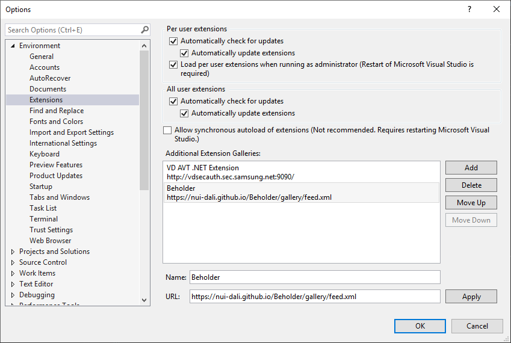
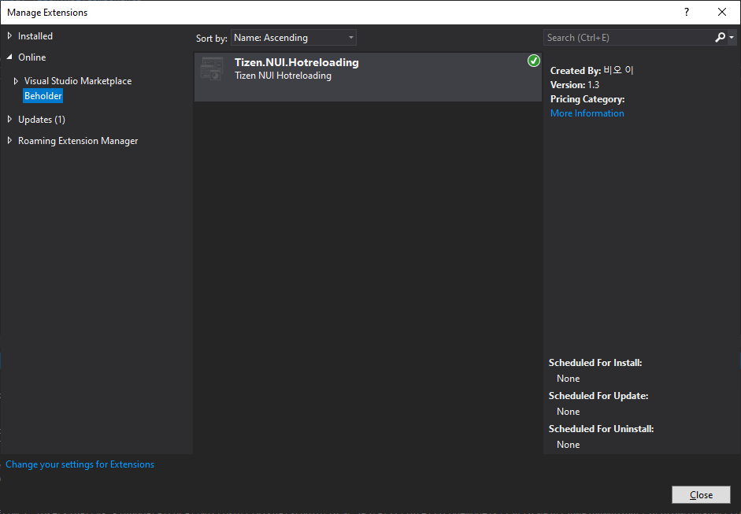
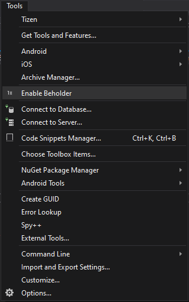
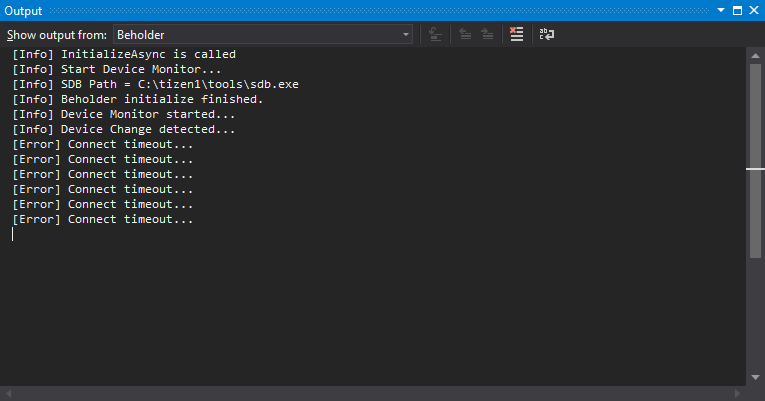

# Hot Reloading

Hot reloading feature allows you to inject newly edited files at runtime without stopping the app. This way, you do not lose the state of the app that is especially useful when editing the UI.

The following video demonstrates hot reloading an app at runtime on Tizen TV emulator:

## Beholder

Beholder is a hot reloading support tool for programs using Tizen.NET's NUI.

Hot reloading refreshes the files that were changed, without losing the state of the app.

After launching the application on the emulator or real device, you can apply the changed file without stopping the application.

If there are several stages in the screen, you can update the screen without taking a step back, changes gets applied to all the files.

## Enable hot reload

### Install beholder with private feed

Add the feed to your VS extension private gallery: https://nui-dali.github.io/Beholder/gallery/feed.xml{:target="_blank"}

### Add a private gallery to extensions and updates

To add a private gallery to extensions and updates, perform following steps:

1. On the menu bar, select **Tools > Options**.
2. In the **Environment** node, select **Extensions**.
3. Select the **Add** button.
4. In the **Name** field, enter a name for the beholder.
5. In the **URL** field, enter the URL.

### Install extensions from a private gallery

To search for and install extensions from a private gallery, perform following steps:

1. On the menu bar, select **Extensions > Manage Extensions**.
2. In the left pane, select **Online** Extensions, and then select **Beholder**.
3. In the right pane, select **Tizen.NUI.Hotreloading**, and then select the **Download** button.

You can learn more about how to install your personal gallery in this [MS article](https://docs.microsoft.com/en-us/visualstudio/extensibility/private-galleries?view=vs-2019){:target="_blank"}.

### Beholder usage

1. Open your NUI project.
2. On the menu bar, select  **Tools > Enable Beholder**.
3. On the menu bar, select  **Debug > Run without Debug**.
4. Open and edit the xaml file.
5. Save the xaml file.

Now beholder is still in alpha test, you can see more information in the output window of Visual Studio.

> [!NOTE]
> There is a delay of several seconds during the first hot reloading.
> Highest working Tizen.NET version is 9.0.0.16507.
> Highest working Tizen.NUI.XamlBuild version is 1.0.11.

## Related information
* Dependencies
  -   Tizen 6.5 and Higher 
